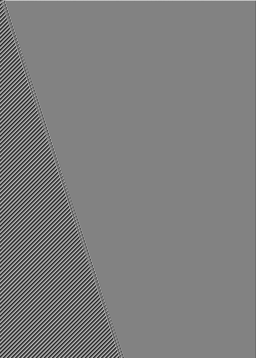
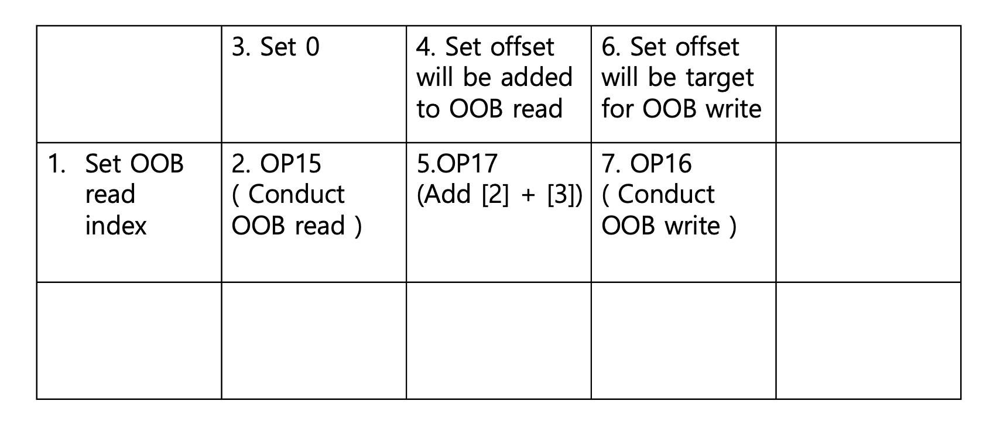
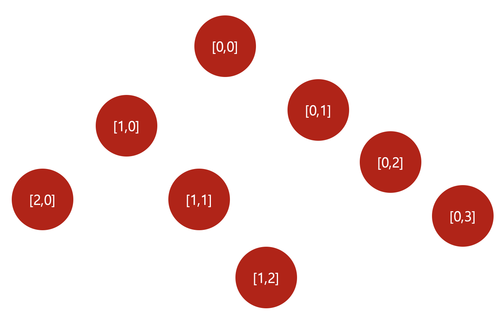

Written By **[Jinheon Lee](https://x.com/howdays1)**
<hr>
Hello! 👋, I'm Jinheon Lee (`howdays`) and I participated [DEFCON33 Quals](https://nautilus.institute/) as HypeBoy. (I failed to obtain the qualifcation for the final 😭, but Cykor did it! 😊)  
Blog: [https://howdays.blog/](https://howdays.blog/)  
X: [@howdays1](https://x.com/howdays1)  
LinkedIn: [https://www.linkedin.com/in/jinheon-lee-4319b2249/](https://www.linkedin.com/in/jinheon-lee-4319b2249/)

I'm gonna write down the jxl4fun2 (pwn), which I took the initiative to solve and I was very impressed by.
<hr>
# What is JPEG-XL?
[JPEG-XL](https://jpegxl.info/) is an image format which provides state-of-the-art encoding and decoding future.    
Almost image formats facilitate compression by predicting pixels. For instance, AV1 format features various prediction mode for next pixel block.  
Link: [https://github.com/QuPengfei/Technical-Overview-Of-AV1-Spec/blob/master/README.md#intra-prediction](https://github.com/QuPengfei/Technical-Overview-Of-AV1-Spec/blob/master/README.md#intra-prediction)  

In terms of image prediction, the interesting thing of JPEG-XL is that it uses MA tree-model for prediction and provides assorted predictors.  
The challenge especially required the understanding of the tree model for generating perfect and reliable exploit.  
I give the explanation breifly. If you want, you can check it at JPEG XL’s [Modular Mode Explained](https://cloudinary.com/blog/jpeg-xls-modular-mode-explained).

## MA Tree


source: [https://res.cloudinary.com/cloudinary-marketing/images/f_auto,q_auto/v1728924066/Web_Assets/blog/blog-JPEG-XLs-modular-mode-explained-4/](https://res.cloudinary.com/cloudinary-marketing/images/f_auto,q_auto/v1728924066/Web_Assets/blog/blog-JPEG-XLs-modular-mode-explained-4/)

MA(Modular) tree is binary tree of which elements has predict-condition like right-side image. The leaf node is the final-decision point and determines the pixel with the decision.
The variables for the condition of each splits is such as `cc, g, y, x, |N|, |W|, W, W+N-NW ....`.  
JPEG-XL can predict residuals and compute real pixel with these kinds of way.  

## JXL ART

The MA tree can be described with programming-like-langugage. 
For example,
```
Width 32
Height 64

if y > 0
  if W > 200
    - Set 5
    - N 30
  - W 20
```
The above code generates the below JPEG-XL image.  


These way is called **JXL ART**, with the JXL ART code, the [jxl_from_tree](https://github.com/libjxl/libjxl/blob/main/tools/jxl_from_tree.cc) tool translates the code and generate the JXL-format image file. You can test it at [https://jxl-art.surma.technology/](https://jxl-art.surma.technology/) handily.  

The vulnerabilties of this challenge is intended to be exploited by using this code. For exploit, I made the exploit code which computes binary tree and generates JXL art code automatically. What I thought crucially was an each pixel has to hold only one distinct condition. If not, not only the `jxl_from_tree` emits error but the JXL main binary can't translate invalid format and emits error too.

<hr>
# JXL4FUN

## Vulnerability
This challange was given only binary and the description which presents the libjxl.so.0.12 had been patched but didn't let players know the patch diff. Therefore what I had to was pointing the patched code. My teammate found it out the patched point.


```c++
//content_predict.h
JXL_INLINE pixel_type_w PredictOne(Predictor p, pixel_type_w left,
                                   pixel_type_w top, pixel_type_w toptop,
                                   pixel_type_w topleft, pixel_type_w topright,
                                   pixel_type_w leftleft,
                                   pixel_type_w toprightright,
                                   pixel_type_w wp_pred) {
  switch (p) {
    case Predictor::Zero:
      return pixel_type_w{0};
    case Predictor::Left:
      return left;
    case Predictor::Top:
      return top;
    case Predictor::Select:
      return Select(left, top, topleft);
    case Predictor::Weighted:
      return wp_pred;
    case Predictor::Gradient:
      return pixel_type_w{ClampedGradient(left, top, topleft)};
    case Predictor::TopLeft:
      return topleft;
    case Predictor::TopRight:
      return topright;
    case Predictor::LeftLeft:
      return leftleft;
    case Predictor::Average0:
      return (left + top) / 2;
    case Predictor::Average1:
      return (left + topleft) / 2;
    case Predictor::Average2:
      return (topleft + top) / 2;
    case Predictor::Average3:
      return (top + topright) / 2;
    case Predictor::Average4: // <- 13
      return (6 * top - 2 * toptop + 7 * left + 1 * leftleft +
              1 * toprightright + 3 * topright + 8) /
             16;
    default:
      return pixel_type_w{0};
  }
}
```

The `PredictOne` function matches the predictors and calcautes the prediction. However, the cases of the switch were more varied in the provided library like below.

```c++
case 14:                             
    v25 = (unsigned __int8)top;
    break;
case 15:
    v25 = *(unsigned __int16 *)(jxl::detail::Predict<0>(omitted..)::g_pallet
                            + 2 * left);
    break;
case 16:
    *(_WORD *)(jxl::detail::Predict<0>(omitted..)::g_pallet
            + 2 * top) = left;
    v25 = left;
    break;
case 17:
    top = left + top - top_left;
    goto LABEL_58;
case 18:
    top *= left;
LABEL_58:
    v25 = top;
    break;
case 19:
    v25 = v23;
    break;
case 20:
    v25 = v24 != 0;
    break;
default:
    break;
```


The `Predictor::Average4` of orignal jxl code is 13, which is the end of enum variable practically. In contrast, the binary provides more predictors, from 14 to 20. Moreever, the 14 and 15 case look like Out Of Bound vulnerability.  

The `g_pallet` variable contains allocated heap with fixed 0x200 size.  
```c++
jxl::detail::Predict<0>(omitted..)::g_pallet = (__int64)malloc(0x200uLL);
```

In light of this, we were sure that it is intended vulnerable point and we got ready to plan how to exploit it. 

## Exploit

What we only can do is sending image without any further I/O, so we have to get shell without leak. This is kinda similar to [NSO Zero-Click](https://googleprojectzero.blogspot.com/2021/12/a-deep-dive-into-nso-zero-click.html) or [libwebp exploit](https://googleprojectzero.blogspot.com/2025/03/blasting-past-webp.html). (I think this challenged had been inspired from these kinds of ITW exploit).  

The first step of exploit is modifying `jxl_from_tree` to facilitate using the additional predictors. The `jxl_from_tree` code is kinda straightforward, so it is easy to modify.  
Thanks to my teammate's fast modifying, I can use these predictors with custom codes, `OP16`~`OP20`.

Afterward, I thought the full-exploit plan. What I can control OOB scope is heap and there are many vtables which are used in libjxl.  
The exploit goal is overwritting the vtable also full-controlling rdi(first argument) register to run arbitrary commands.

I made the exploit with only creating a single pattern exploit, OOB read, Add offset(pos/neg), OOB write at once.
For that, I had to create precise code which let the pattern run repeatly. I wrote the python code which generate runnables(technically, generatable to JXL image) jxl art code.


### Exploit Plan


**Please read down along with while referring the above picuture.**

To implement the oob pattern, I reserved 2x4 pixels in an each operation. I explain it step by step.
1. With the `Set` predictor, set its pixel to Out Of Bound index which you want **read** in the 32bit range.
2. The `OP15` predictor multiplies its left value by 2 and use it as read index and save it its pixel.
3. With the `Set` predictor, set its pixel to `0`. It will be used at [5].
4. With the `Set` predictor, set its pixel with the offset as much as you want to add it to [2]\(OOB read\).
5. The `OP17` predictor adds `[2](left)+[4](top)-[5](top left)`. To make exploit easily, I set [3] to zero.
6. With the `Set` predictor, set its pixel to Out Of Bound index which you want **write** in the 32bit range.
7. Finally, The `OP16` predictor runs `((uint16_t*)g_pallet) + [6] = [5];`

### Generate JXL code

However, It is kinda complex to write the patterns with iterating (y,x) coordinates as JXL code by hand.
To resolve the complexity, What I devised is implementing binary Tree with [y, x] key with JXL data and visiting the node when generating the JXL code.



When inserting [y,x] element, if `y` is bigger than current, insert it left side if not right side.  (*In my implementation, almost [y, x] are inserted and the graph always grows linearly. Therefore I didn't consider this kind of situation because Sudden insertion doesn't occur.*)  
It is very crucial to understand the `if` scope and `else` scope in JXL code. Because the JXL code doesn't support `== (eq)` statement but it only features `>` statemnt, we have to fully imaginate the boundary of pixels. (*The JXL code can't be described "ELSE" word explicitly. It's kinda to hard to get it*)  
For example, If you want to insert conditions into (0,2) and (0,3) respectively, you have to write down JXL code like the below one. 
```
if y > 0
    SET 4  // y > 0
if x > 2 // ELSE OF y > 0 --> (y == 0)
    if x > 3 
        SET 3 // y == 0, x > 3
    SET 2  // ELSE OF x > 3 --> y == 0, x == 3
Set 1 // ELSE OF x>3, x <= 2
```


After writing exploit, when generating the JXL code, the graph visits each nodes, adds `if` statement into the result JXL code if it visits spilts and also adds its data of each nodes.

Thanks to its implementation, I could write down the exploit code very easily.  

### Exploit

The exploit process is so easy, comparing with the generating JXL code process.

1. Leak heap & main area respectively and save them into `g_pallet` area.
2. Calculate system@libc and create reverse shell command.
3. Choose a class expected to call its destructor, afterward, Overwrite its vtable and its area passed to rdi register with the created addresses by [1] and [2].
4. GET SHELL!!

<hr>
# Conclusion

The exploit code was uploaded in [my github](https://github.com/JinsBurger/CTF/tree/master/2025/DEFCON_Quals/jxl4fun-pwn).  
Thanks for reading.