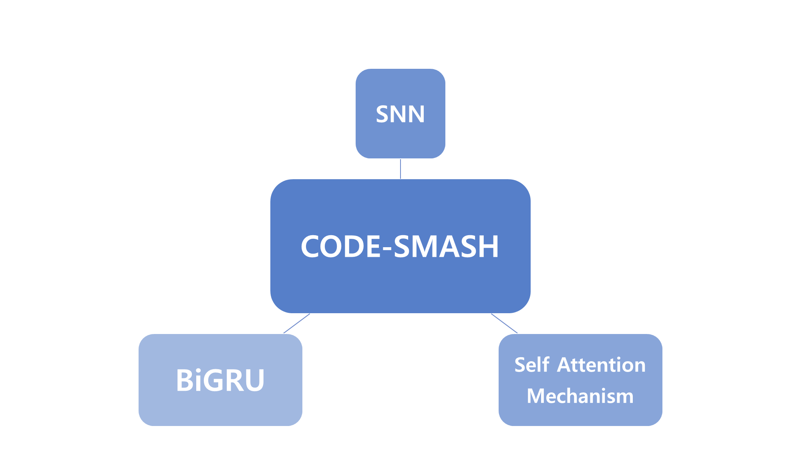
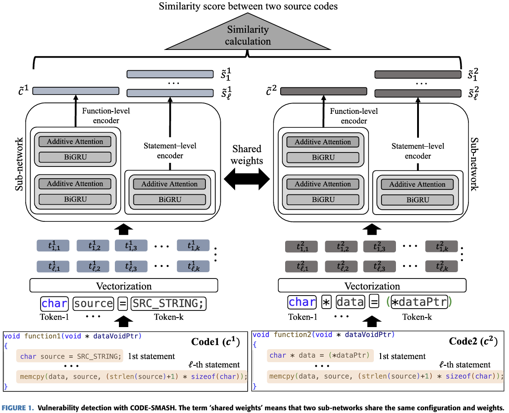
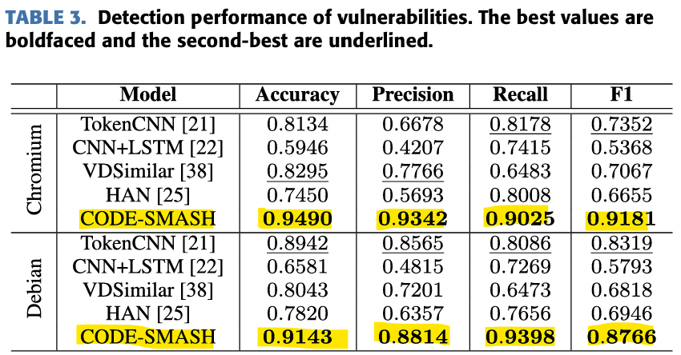
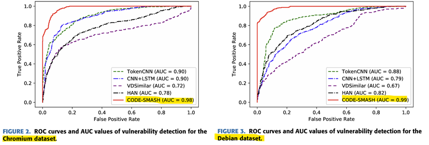
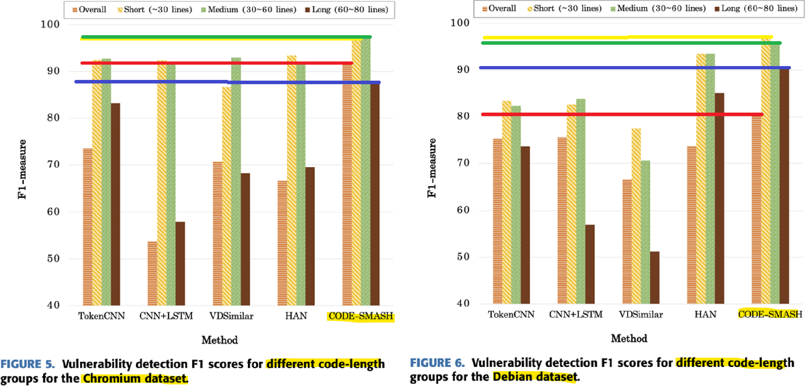
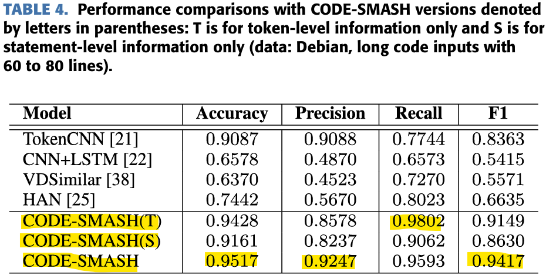
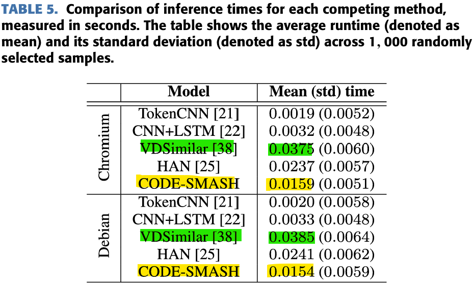

**Written by [Jinkyung Bae](https://www.linkedin.com/in/%EC%A7%84%EA%B2%BD-%EB%B0%B0-a6a2ab287/)**
 
This is a review on the study of an automated vulnerability sensing model called CODE-SMASH.

[CODE-SMASH: Source-Code Vulnerability Detection Using Siamese and Multi-Level Neural Architecture](https://ieeexplore.ieee.org/document/10606264)

## 1. Introduction

This paper proposes a source code vulnerability detection model called CODE-SMASH.

Existing vulnerability detection methods often rely on known vulnerabilities and were not effective for zero-day attacks. As a result, a number of methods using deep learning have also been proposed, of which Similarity-Based Methods dealt with the situation most flexibly. However, modern software's code was more complicated, diverse in format, and long, so even this was not enough. 

Therefore, this paper proposes a new vulnerability sensing model called CODE-SMASH using the Siamese Neural Network (SNN), Bidirectional GRU (BiGRU), and Self-Attention mechanisms. CODE-SMASH not only uses Similarity-Based Methods, but also adds another core approach. The code is analyzed by dividing it into two parts: Statement-Level and Function-Level. Statement-Level can find fragmented code vulnerabilities, while Function-Level can find vulnerabilities in overall code flow. CODE-SMASH actually showed better performance than conventional models.

## 2.Method

The CODE-SMASH algorithm is largely divided into code pair generation and similarity calculation.

The reason for describing it as a code pair is that it requires two codes in one input. SNN extracts embeds in the same network for two inputs, respectively. A distance between the embedded vectors is outputted by a similarity value. 

Source: CODE-SMASH: Source-Code Vulnerability Detection Using Siamese and Multi-Level Neural Architecture

### Code Pair Generation

1. Comment Removal

   Annotations are removed because they have nothing to do with code vulnerabilities and rather have a negative impact on vulnerability analysis. 

   

2. Tokenization

   Using Camelcase, tokenization is promoted based on meaning. Existing tokenization methods cannot store the meaning of the code because tokenization has progressed on a spacing basis. However, meaning-based tokenization can generate more meaningful tokens.

   

3. Vectorization

   We will proceed with vectorization with Word2vec. Vectorization is needed because quantification is required in advance to be used as an input in deep learning.

   $$
   p(w_O|w_I) = \frac{\exp(v_{w_O}^T v_{w_I})}{\sum_{w=1}^W \exp(v_w^T v_{w_I})}
   $$
   
   $$w_O$$: Center Word

   $$w_I$$: Surrounding Word

   $$
   p(w_O|w_I)
   $$: probability of discovering $$w_O$$ from $$w_I$$

   $$v_{w_O}^T v_{w_I}$$: similarity between $$w_O$$ and $$w_I$$

   

   The probability of finding $$w_O$$ in $$w_I$$ is calculated by dividing the similarity between the two words into the overall similarity.

   

4. Code Pair Generation

   To train the model, they mixed the vulnerable and non-vulnerable code to form a pair, but only the <vulnerable, vulnerable> pair should be labelled as 1 and the rest should be labelled as 0. When detecting the vulnerability, the code that you want to test should be paired with the code that its vulnerability is already known.

    

### Similarity Calculation

The similarity calculation uses two encoders. They are Statement-Level and Function-Level, respectively.

The following is a preliminary arrangement of the symbols used in the formula.

$$\{c^n\}_{n=1}^2$$: $$c^n$$ indicates each code and two codes are used in one input

$$c^n := \{s_i^n\}_{i=1}^{\ell}$$: Each code has $$l$$ statements

$$s_i^n := \{t_{i,j}^n\}_{j=1}^k$$: Each statement has $$k$$ tokens.

1. Statement-Level

   A hidden state in two directions is generated using BiGRU. Each hidden state indicates contextual information. A hidden state in two directions is connected into one pair, and each hidden state and weight are calculated through the additive self-attention layer to calculate the score of the final statement.

   $$\{\overrightarrow{ {h}_{i,1}^n}, \ldots, \overrightarrow{ {h}_{i,k}^n}\} $$
   
   : Forward direction hidden state for $$\{t_{i,j}^n\}$$ 

   $$\{\overleftarrow{ {h}_{i,1}^n}, \ldots, \overleftarrow{ {h}_{i,k}^n}\}$$
   
   : Reverse direction hidden state for $$\{t_{i,j}^n\}$$

   Since not all hidden states are equally important, add the importance of each hidden state to the calculation results through additive-self attention mechanism. At this time, hidden states in the positive and opposite directions are combined to generate one hidden state.

   $$
   {h}_{i,j}^n = [\overrightarrow{ {h}_{i,1}^n};\overleftarrow{ {h}_{i,1}^n}]
   $$

   $$
   v_j = tanh(W^T{h}_{i,j}^n+b)
   $$

   $$W$$: First layer's weight

   $$b$$: First layer's bias

   $$v_j$$: Output of the first fully connected layer
   $$
   \alpha_j = \frac{\exp(v_{j}^T q)}{\sum_{j} \exp(v_{j}^T q)}
   $$
   $$q$$: Second layer's weight

   $$\alpha_j$$: Attention score (represents $${h}_{i,j}^n$$'s importance)

   

   The reason for calculating the attention score through the two layers is to increase the ability to distinguish complex patterns. If you use only one layer, it will be expressed as follows.

   
   $$
   α_j = softmax(W^T h_{i,j}^n + b)
   $$

   

   In this case, the operation will be easier and the time will be shorter, but if the context is important or the code becomes complicated, there is a possibility that its performance will be reduced.

   

   $$
   \tilde{s}_i^n = \sum_{j=1}^{k} \alpha_j h_{i,j}^n
   $$

   $$\tilde{s}_i^n$$: Statement-level code feature

   A previously obtained attachment score and hidden state are multiplied to store information of the statement.

   

2. Function-Level

   Unlike Statement-Level, Function-Level uses a total of two BiGRUs and an additive self-attention layer. And it's largely divided into two stages.

   In the first stage, statement-level is extracted, and in the second stage, function-level is extracted. Other processes are the same as Statement-Level.

   
   $$
   {h}_{i}^n = [\overrightarrow{ {h}_{i}^n};\overleftarrow{ {h}_{i}^n}]
   $$
   
   $${h}_{i}^n$$: $$\hat{s}_i^n$$ (statement information)'s hidden state

   

   $$
   \hat{v_i} = tanh(\hat{W^T}\hat{ {h}_{i}^n}+\hat{b})
   $$

$$
   \hat{\alpha_i} = \frac{\exp(\hat{v_{i}}^T \hat{q})}{\sum_{i} \exp(\hat{v_{i}}^T \hat{q})}
$$

$$
   \tilde{c}^n = \sum_{i=1}^{l} \hat{\alpha_i} \hat{h_{i}^n}
$$

   $$\tilde{c}^n$$: Functional-level code feature

   

3. Similarity Calculation

   Similarity is calculated through ReLU activation function. If the arithmetic value is greater than the threshold, it is determined that the code is vulnerable.
   
   
   $$
   \sigma(f'(ReLU(f(x)))) > \tau
   $$
   
   $$\tau$$: Threshold

​    

## 3. Experiment

Experiments are conducted on TokenCNN, CNN+LSTM, VDSimilar, HAN, and CODE-SMASH. The Chromium, and Debian datasets are used.

The following table and graph of the experimental results are all from the paper

The experimental results are evaluated on a total of five criteria.

1. Vulnerability Sensing Performance (A, P, R, F1)

   It showed excellent performance in all Chromium and Debian datasets.

   

      
 
2. ROC, AUC

   The ROC can check the tradeoff between sensitivity (true positive rate) and specificity (1-false positive rate). AUC means the area under the ROC graph, and the higher the performance of the model, the better. CODE-SMASH has the largest AUC value and proved excellent performance.

   In addition, the ROC graph shows that the true positive rate remains high even if the false positive rate is close to 0, which means that the vulnerability can be accurately determined.

   

      
 
3. Code length

   The proportion of long codes is also quite high in the datasets. In this experiment, the length of the code was divided into short (~30), medium (30~60), and long (60~80). CODE-SMASH achieved the best results for all lengths. This shows that CODE-SMASH can actually produce accurate results even in real vulnerable code sensing situations.

   

     
 
4. Effects of Siamese, Hierarchical Structure

   The experiment was designed to examine the effectiveness of each structure, so CODE-SMASH(T) using only token-level information and CODE-SMASH(S) using only statement-level information were also conducted. As a result of the experiment, CODE-SMASHs were almost excellent. Through this, it can be seen that models that combine SNN and multiple hierarchical levels can understand complex and long codes well.

   

      
 
5. Computation time

   Calculate how long it will take to process 1000 samples. CODE-SMASH is not the best, but considering its sensing performance, and the fact that it is 2.43 times faster than VDSimilar, which has the second best performance, so it seems fine with processing time.
   
   
   
   
   
   
 
## 4. Conclusion

This paper proposed CODE-SMASH, a model that senses weaknesses through the hierarchical structure and similarity of code. Which is showing better performance than the previous models. In addition to the model, a source code processing method that increases the efficiency of code analysis such as annotation removal, tokenization, and vectorization were proposed.

In modern society, an automated vulnerability detection system is essential because the type, length, and amount of code will increase. Therefore, the use and development of CODE-SMASH will greatly contribute to software security.

 
## 5. Limitation

CODE-SMASH is a good model, but as mentioned in the paper, there are still many things to be improved.

1. Depends on the training set.

   As with most deep learning models, the results vary depending on what data they learn. In this experiment, only two datasets, Chromium and Debian, are trained, and it is not known what changes occur when more diverse types of codes are encountered in the actual environment. In addition, in the case of SNN, the data set has the advantage of being able to learn at least, but the amount of data required may increase because input must be included in a pair.

2. Arithmetic time

   Compared to the performance, it is an excellent operation time, but it is not the best, so there is still room for more development.

Nevertheless, it presented a new direction to the automated vulnerability detection system, and the results were good, so I think it is a very meaningful paper.

Thank you for reading.
