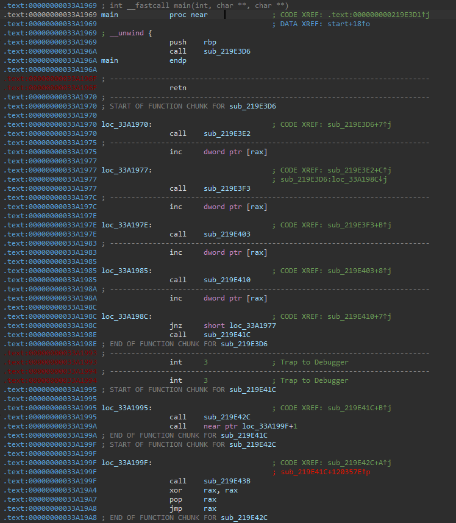
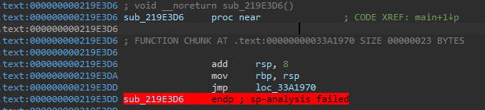

Written By **[Jimin Jeong](https://x.com/mini_chip02)**
<hr>

This challenge is a yet another flagchecker, but layout obfuscated. To analyze the binary, I had to deobfuscate it.

---

## Deobfuscate

When I opened the binary with IDA, I could see two types of subroutines: the first type forms the backbone of the entire program, while the second consists of small code snippets. **Below** is a part of `main()` which is the backbone of the binary.



Second type (small code snippet) looks like below.



The snippet subroutines consist of an `add rsp, 8` instruction for stack frame cleanup, a single assembly instruction that constitutes part of the main binary routine, and a final `jmp` instruction. They don’t `ret`, but their `jmp` targets are always caller. So, I could write a deobfuscator script to gathering core assembly instruction of the snippet subroutines and backbone subroutines.

However, I still had to examine the deobfuscated code in assembly. To address this, I implemented a deobfuscator that improves **readability** by labeling addresses related to `jmp` instructions and adding comments showing the referenced strings for assembly instructions that access string data. This is the coolest feature of my deobfuscator.
Without those features, it would have been very difficult to figure out where each `jmp` instruction was jumping to, and  it would have been hard to make use of string information in the deobfuscated code.

**Below** is my deobfuscator script. If you append backbone subroutine address in `funcs` list, the script will deobfuscate it.

```python
from capstone import *
from elftools.elf.elffile import ELFFile
import re

class Disassembler:
    def __init__(self, elf_path):
        self.elf_path = elf_path
        self._load_elf()
    
    def _load_elf(self):
        with open(self.elf_path, "rb") as f:
            self.elf = ELFFile(f)
            self.text_section = self.elf.get_section_by_name('.text')
            if not self.text_section:
                raise Exception(".text section not found")

            self.text_addr = self.text_section['sh_addr']
            self.text_offset = self.text_section['sh_offset']
            self.text_data = self.text_section.data()
        
        self.md = Cs(CS_ARCH_X86, CS_MODE_64)
    
    def disasm_at(self, vaddr, count=3):
        if not (self.text_addr <= vaddr < self.text_addr + len(self.text_data)):
            raise Exception(f"address 0x{vaddr:x} not in .text section")
    
        offset = vaddr - self.text_addr
        code = self.text_data[offset:offset+0x200]
        result = []
        last_insn_end = vaddr
        for i, insn in enumerate(self.md.disasm(code, vaddr)):           
            result.append({"addr": insn.address, "mnemonic": insn.mnemonic, "op_str": insn.op_str, "size": insn.size})
            last_insn_end = insn.address + insn.size
            if i + 1 == count:
                break
        return result, last_insn_end

def deof_func(d: Disassembler, start, end=0):
    MAIN_START = start

    result = []
    label = []
    cur_addr = MAIN_START
    while True:
        if end != 0:
            if cur_addr > end:
                break
        legacy_cur = cur_addr
        asm, cur_addr = d.disasm_at(cur_addr, count=1)
        # call 명령어가 아니면 실제 실행되는 assembly
        if asm[0]["mnemonic"] != "call":
            result.append((asm[0], legacy_cur))
            try:
                label.append(int(asm[0]["op_str"], 0))
            except:
                pass
        # call 명령어라면 3줄짜리 subroutine assembly 가져오기
        elif asm[0]["mnemonic"] == "call":
            sub_vaddr= int(asm[0]["op_str"], 0)
            subroutine, _ = d.disasm_at(sub_vaddr)
            if subroutine[0]["mnemonic"] != "add" or subroutine[0]["op_str"] != "rsp, 8":
                raise Exception(f"subroutine 0x{sub_vaddr:x} stack frame is weird")
            if subroutine[1]["mnemonic"] == "ret":
                result.append((subroutine[1], legacy_cur))
                break
            if subroutine[1]["mnemonic"] == "jmp":
                label.append(int(subroutine[1]["op_str"], 0))
            if subroutine[2]["mnemonic"] != "jmp":
                raise Exception(f"subroutine 0x{sub_vaddr:x} do not jmp")
            cur_addr = int(subroutine[2]["op_str"], 0)
            result.append((subroutine[1], legacy_cur))
    
    return result, label

def extract_rip_val(s):
    pattern = r"\[rip \+ (0x[0-9a-fA-F]+|\d+)\]"
    matches = re.findall(pattern, s)
    return [int(m, 0) for m in matches]

def get_dicval(d, key):
    for k in d:
        if int(k, 0) == key:
            return d[k]
    return None
    
def gen_deof_file(file, deof, label):
    func_table = [
        "free",
        "strcpy",
        "puts",
        "fread",
        "fclose",
        "strlen",
        "__stack_chk_fail",
        "printf",
        "memset",
        "memcmp",
        "malloc",
        "fopen"
    ]

    str_table = {
        "0x33A5008": 'Usage: %s <license file>',
        "0x33A5025": 'Failed to open license file.',
        "0x33A5048": 'Your license file seems to be blank.',
        "0x33A5080": 'Congratulations! The flag is %s.',
        "0x33A50A2": 'Incorrect hash :(',
        "0x33A50B4": 'Incorrect :('
    }

    with open(file, "w") as f:
        for elem in deof:
            asm = elem[0]
            if elem[1] in label:
                f.write(f"0x{elem[1]:x}" + "\n")
            addr = asm["addr"]
            mnem = asm["mnemonic"]
            op = asm["op_str"]
            if mnem == "call" and int(op, 0) >= 0x1030 and int(op, 0) <= 0x10e0:
                op = func_table[(int(op, 0) - 0x1030) // 0x10]
            ref_list = extract_rip_val(op)
            if len(ref_list) > 0:
                assert len(ref_list) == 1
                ref_addr = ref_list[0] + asm["addr"] + asm["size"]
                comments = get_dicval(str_table, ref_addr)
                if comments != None:
                    op += " # " + comments
            f.write(f"0x{addr:x}: \t{mnem}\t{op}" + "\n")

    return

if __name__ == "__main__":
    elf_path = "./tiniii"
    d = Disassembler(elf_path)
    
    MAIN = 0x33A1969
    funcs = [0x219ee00, 0x33A1969, 0x219EAFB, 0x33a4154, 0x33a352a]
    for func in funcs:
        res, label = deof_func(d, func)
        if func == MAIN:
            gen_deof_file("main.asm", res, label)
        else:
            gen_deof_file(f"func_{hex(func)[2:]}.asm", res, label)
```

---

## Analyzing `main` subroutine

Now that the deobfuscator is complete, it’s time to dive into analyzing the binary routines. Let’s start by examining the `main` subroutine. **Below** is the deobfuscated code generated by my deobfuscator.

```nasm
0x33a1969: 	push	rbp
0x219e3da: 	mov	rbp, rsp
0x219e3e6: 	lea	r11, [rsp - 0x61e000]
0x33a1977
0x219e3f7: 	sub	rsp, 0x1000
0x219e407: 	or	dword ptr [rsp], 0
0x219e414: 	cmp	rsp, r11
0x33a198c: 	jne	0x33a1977
0x219e420: 	sub	rsp, 0x6c0
0x219e430: 	mov	dword ptr [rbp - 0x61e6b4], edi
0x219e43f: 	mov	qword ptr [rbp - 0x61e6c0], rsi
0x219e44f: 	mov	rax, qword ptr fs:[0x28]
0x219e461: 	mov	qword ptr [rbp - 8], rax
0x219e46e: 	xor	eax, eax
0x219e479: 	lea	rax, [rbp - 0x61a820]
0x219e489: 	mov	edx, 0x61a800
0x219e497: 	mov	esi, 0
0x219e4a5: 	mov	rdi, rax
0x219e4b1: 	call	memset
0x219e4bf: 	lea	rdx, [rbp - 0x61e6a0]
0x219e4cf: 	mov	eax, 0
0x219e4dd: 	mov	ecx, 0x3e8
0x219e4eb: 	mov	rdi, rdx
0x219e4f7: 	rep stosq	qword ptr [rdi], rax
0x219e503: 	lea	rdx, [rbp - 0x61c760]
0x219e513: 	mov	eax, 0
0x219e521: 	mov	ecx, 0x3e8
0x219e52f: 	mov	rdi, rdx
0x219e53b: 	rep stosq	qword ptr [rdi], rax
0x219e547: 	lea	rax, [rbp - 0x61a820]
0x219e557: 	mov	rdi, rax
0x219e563: 	call	0x219f0c0
0x219e571: 	lea	rax, [rbp - 0x61e6a0]
0x219e581: 	mov	rdi, rax
0x219e58d: 	call	0x339bd66
0x219e59b: 	cmp	dword ptr [rbp - 0x61e6b4], 1
0x33a1a69: 	jg	0x33a1ab9
0x219e5ab: 	mov	rax, qword ptr [rbp - 0x61e6c0]
0x219e5bb: 	mov	rax, qword ptr [rax]
0x219e5c7: 	mov	rsi, rax
0x219e5d3: 	lea	rax, [rip + 0x1206a2e] # Usage: %s <license file>
0x219e5e3: 	mov	rdi, rax
0x219e5ef: 	mov	eax, 0
0x219e5fd: 	call	printf
0x219e60b: 	mov	eax, 1
0x219e619: 	jmp	0x33a1d56
0x33a1ab9
0x219e627: 	mov	rax, qword ptr [rbp - 0x61e6c0]
0x219e637: 	add	rax, 8
0x219e644: 	mov	rax, qword ptr [rax]
0x219e650: 	lea	rdx, [rip + 0x12069cb]
0x219e660: 	mov	rsi, rdx
0x219e66c: 	mov	rdi, rax
0x219e678: 	call	fopen
0x219e686: 	mov	qword ptr [rbp - 0x61e6a8], rax
0x219e696: 	cmp	qword ptr [rbp - 0x61e6a8], 0
0x33a1b07: 	jne	0x33a1b2d
0x219e6a7: 	lea	rax, [rip + 0x1206977] # Failed to open license file.
0x219e6b7: 	mov	rdi, rax
0x219e6c3: 	call	puts
0x219e6d1: 	mov	eax, 1
0x219e6df: 	jmp	0x33a1d56
0x33a1b2d
0x219e6ed: 	mov	rdx, qword ptr [rbp - 0x61e6a8]
0x219e6fd: 	lea	rax, [rbp - 0x61c760]
0x219e70d: 	mov	rcx, rdx
0x219e719: 	mov	edx, 0x3e8
0x219e727: 	mov	esi, 8
0x219e735: 	mov	rdi, rax
0x219e741: 	call	fread
0x219e74f: 	mov	rax, qword ptr [rbp - 0x61e6a8]
0x219e75f: 	mov	rdi, rax
0x219e76b: 	call	fclose
0x219e779: 	mov	dword ptr [rbp - 0x61e6b0], 0
0x219e78c: 	mov	dword ptr [rbp - 0x61e6ac], 0
0x219e79f: 	jmp	0x33a1bdf
0x33a1b98
0x219e7ad: 	mov	eax, dword ptr [rbp - 0x61e6ac]
0x219e7bc: 	cdqe	
0x219e7c7: 	mov	eax, dword ptr [rbp + rax*8 - 0x61c760]
0x219e7d7: 	test	eax, eax
0x33a1bb2: 	jne	0x33a1bd1
0x219e7e2: 	mov	eax, dword ptr [rbp - 0x61e6ac]
0x219e7f1: 	cdqe	
0x219e7fc: 	mov	eax, dword ptr [rbp + rax*8 - 0x61c75c]
0x219e80c: 	test	eax, eax
0x33a1bcf: 	je	0x33a1bd8
0x33a1bd1
0x219e817: 	add	dword ptr [rbp - 0x61e6b0], 1
0x33a1bd8
0x219e827: 	add	dword ptr [rbp - 0x61e6ac], 1
0x33a1bdf
0x219e837: 	cmp	dword ptr [rbp - 0x61e6ac], 0x3e7
0x33a1bea: 	jle	0x33a1b98
0x219e84a: 	cmp	dword ptr [rbp - 0x61e6b0], 0
0x33a1bf6: 	jne	0x33a1c1d
0x219e85a: 	lea	rax, [rip + 0x12067e7] # Your license file seems to be blank.
0x219e86a: 	mov	rdi, rax
0x219e876: 	call	puts
0x219e884: 	mov	eax, 1
0x219e892: 	jmp	0x33a1d56
0x33a1c1d
0x219e8a0: 	lea	rdx, [rbp - 0x61c760]
0x219e8b0: 	lea	rcx, [rbp - 0x61e6a0]
0x219e8c0: 	lea	rax, [rbp - 0x61a820]
0x219e8d0: 	mov	rsi, rcx
0x219e8dc: 	mov	rdi, rax
0x219e8e8: 	call	0x219ee00
0x219e8f6: 	test	eax, eax
0x33a1c5b: 	je	0x33a1d3b
0x219e901: 	mov	qword ptr [rbp - 0x20], 0
0x219e912: 	mov	qword ptr [rbp - 0x18], 0
0x219e923: 	lea	rax, [rbp - 0x61c760]
0x219e933: 	mov	rdi, rax
0x219e93f: 	call	0x219eafb
0x219e94d: 	lea	rax, [rbp - 0x20]
0x219e95a: 	mov	rsi, rax
0x219e966: 	lea	rax, [rip + 0x1208913]
0x219e976: 	mov	rdi, rax
0x219e982: 	call	0x33a4154
0x219e990: 	lea	rax, [rbp - 0x20]
0x219e99d: 	mov	edx, 0x10
0x219e9ab: 	lea	rcx, [rip + 0x12066bb]
0x219e9bb: 	mov	rsi, rcx
0x219e9c7: 	mov	rdi, rax
0x219e9d3: 	call	memcmp
0x219e9e1: 	test	eax, eax
0x33a1ce7: 	jne	0x33a1d1f
0x219e9ec: 	lea	rax, [rip + 0x120888d]
0x219e9fc: 	mov	rsi, rax
0x219ea08: 	lea	rax, [rip + 0x1206671] # Congratulations! The flag is %s.
0x219ea18: 	mov	rdi, rax
0x219ea24: 	mov	eax, 0
0x219ea32: 	call	printf
0x219ea40: 	jmp	0x33a1d4f
0x33a1d1f
0x219ea4e: 	lea	rax, [rip + 0x120664d] # Incorrect hash :(
0x219ea5e: 	mov	rdi, rax
0x219ea6a: 	call	puts
0x219ea78: 	jmp	0x33a1d4f
0x33a1d3b
0x219ea86: 	lea	rax, [rip + 0x1206627] # Incorrect :(
0x219ea96: 	mov	rdi, rax
0x219eaa2: 	call	puts
0x33a1d4f
0x219eab0: 	mov	eax, 0
0x33a1d56
0x219eabe: 	mov	rdx, qword ptr [rbp - 8]
0x219eacb: 	sub	rdx, qword ptr fs:[0x28]
0x33a1d64: 	je	0x33a1d70
0x219eadd: 	call	__stack_chk_fail
0x33a1d70
0x219eaeb: 	leave	
0x219eaf5: 	ret	
```

Our main focus is on understanding what operations are perfomed on the binary’s input (the license file) and how the validation routine works. Therefore, **I ignored the routines that execute before the binary receives its input** (`0x219e741: 	call	fread`). If information about those routines is ever needed, it can be resolved through debugging. After ignoring some routines, I could figure out which subroutines I had to analyze: `0x219ee00`, `0x219eafb`, `0x33a4154`.

In case of the subroutine `0x33a4154`, it was easy to notice that it computes an **MD5 hash** (it contained numerous constants related to MD5, and throughout the main routine, there were many strings associated with hashing). Given the presence of both the strings “Incorrect” and “Incorrect hash”, it is likely that **multiple inputs can pass the verify**, but only one producing a matching hash are actually related to the flag. Therefore, the hash routine merely indicates that there may be multiple valid inputs, and the routine itself is not of particular interest to us.

Now, let's dive into what truly matters to us: the routines at `0x219ee00` and `0x219eafb`.

---

## Analyzing subroutine at `0x219ee00`

```nasm
0x219ee00: 	push	rbp
0x173f: 	mov	rbp, rsp
0x174b: 	sub	rsp, 0x48
0x1758: 	mov	qword ptr [rbp - 0x38], rdi
0x1765: 	mov	qword ptr [rbp - 0x40], rsi
0x1772: 	mov	qword ptr [rbp - 0x48], rdx
0x177f: 	mov	dword ptr [rbp - 0x2c], 0
0x178f: 	jmp	0x219f09f
0x219ee36
0x179d: 	mov	eax, dword ptr [rbp - 0x2c]
0x17a9: 	movsxd	rdx, eax
0x17b5: 	imul	rdx, rdx, 0x10624dd3
0x17c5: 	shr	rdx, 0x20
0x17d2: 	sar	edx, 6
0x17de: 	mov	ecx, eax
0x17e9: 	sar	ecx, 0x1f
0x17f5: 	sub	edx, ecx
0x1800: 	imul	ecx, edx, 0x3e8
0x180f: 	sub	eax, ecx
0x181a: 	mov	edx, eax
0x1825: 	movsxd	rax, edx
0x1831: 	lea	rdx, [rax*8]
0x1842: 	mov	rax, qword ptr [rbp - 0x40]
0x184f: 	add	rax, rdx
0x185b: 	mov	rax, qword ptr [rax]
0x1867: 	mov	qword ptr [rbp - 0x10], rax
0x1874: 	mov	qword ptr [rbp - 0x20], 0
0x1885: 	mov	qword ptr [rbp - 0x18], 0
0x1896: 	mov	eax, dword ptr [rbp - 0x2c]
0x18a2: 	movsxd	rdx, eax
0x18ae: 	imul	rdx, rdx, 0x10624dd3
0x18be: 	shr	rdx, 0x20
0x18cb: 	sar	edx, 6
0x18d7: 	mov	ecx, eax
0x18e2: 	sar	ecx, 0x1f
0x18ee: 	sub	edx, ecx
0x18f9: 	imul	ecx, edx, 0x3e8
0x1908: 	sub	eax, ecx
0x1913: 	mov	edx, eax
0x191e: 	movsxd	rax, edx
0x192a: 	lea	rdx, [rax*8]
0x193b: 	mov	rax, qword ptr [rbp - 0x48]
0x1948: 	add	rax, rdx
0x1954: 	mov	rax, qword ptr [rax]
0x1960: 	mov	qword ptr [rbp - 8], rax
0x196d: 	mov	eax, dword ptr [rbp - 8]
0x1979: 	cmp	eax, 0xc34ff
0x219ef5b: 	ja	0x219ef6d
0x1987: 	mov	eax, dword ptr [rbp - 4]
0x1993: 	cmp	eax, 0xc34ff
0x219ef6b: 	jbe	0x219ef7e
0x219ef6d
0x19a1: 	mov	eax, 0
0x19af: 	jmp	0x219f0b2
0x219ef7e
0x19bd: 	mov	dword ptr [rbp - 0x28], 0
0x19cd: 	jmp	0x219efc6
0x219ef8c
0x19db: 	mov	eax, dword ptr [rbp - 0x28]
0x19e7: 	cdqe	
0x19f2: 	lea	rdx, [rax*8]
0x1a03: 	mov	rax, qword ptr [rbp - 0x38]
0x1a10: 	add	rax, rdx
0x1a1c: 	mov	rax, qword ptr [rax]
0x1a28: 	add	qword ptr [rbp - 0x20], rax
0x1a35: 	add	dword ptr [rbp - 0x28], 1
0x219efc6
0x1a42: 	mov	edx, dword ptr [rbp - 8]
0x1a4e: 	mov	eax, dword ptr [rbp - 0x28]
0x1a5a: 	cmp	edx, eax
0x219efde: 	ja	0x219ef8c
0x1a65: 	mov	dword ptr [rbp - 0x24], 0xc34ff
0x1a75: 	jmp	0x219f02c
0x219eff2
0x1a83: 	mov	eax, dword ptr [rbp - 0x24]
0x1a8f: 	cdqe	
0x1a9a: 	lea	rdx, [rax*8]
0x1aab: 	mov	rax, qword ptr [rbp - 0x38]
0x1ab8: 	add	rax, rdx
0x1ac4: 	mov	rax, qword ptr [rax]
0x1ad0: 	add	qword ptr [rbp - 0x18], rax
0x1add: 	sub	dword ptr [rbp - 0x24], 1
0x219f02c
0x1aea: 	mov	eax, dword ptr [rbp - 4]
0x1af6: 	mov	edx, 0xc3500
0x1b04: 	sub	edx, eax
0x1b0f: 	mov	eax, dword ptr [rbp - 0x24]
0x1b1b: 	cmp	edx, eax
0x219f050: 	jbe	0x219eff2
0x1b26: 	cmp	qword ptr [rbp - 0x20], 0
0x219f05c: 	je	0x219f098
0x1b34: 	cmp	qword ptr [rbp - 0x18], 0
0x219f064: 	je	0x219f098
0x1b42: 	mov	rdx, qword ptr [rbp - 0x20]
0x1b4f: 	mov	rax, qword ptr [rbp - 0x18]
0x1b5c: 	add	rax, rdx
0x1b68: 	cmp	qword ptr [rbp - 0x10], rax
0x219f089: 	je	0x219f098
0x1b75: 	mov	eax, 0
0x1b83: 	jmp	0x219f0b2
0x219f098
0x1b91: 	add	dword ptr [rbp - 0x2c], 1
0x219f09f
0x1b9e: 	cmp	dword ptr [rbp - 0x2c], 0x4e1f
0x219f0a6: 	jle	0x219ee36
0x1bae: 	mov	eax, 1
0x219f0b2
0x1bbc: 	leave	
0x1bc6: 	ret	
```

I ported the above routine to Python. The result is as **follows**:

```python
def func_219ee00(rdi, rsi, user_input):
    for counter in range(0x4e20):
        remainder = counter % 1000
        
        expected = rsi[remainder]
        countValue = (user_input[remainder] >> 32) & 0xffffffff
        limitVal = (user_input[remainder] & 0xffffffff)
        
        if countValue > 0xc34ff or limitVal > 0xc34ff:
            return 0

        sum1 = sum(rdi[:countValue])

        start = 0xc3500 - limitVal
        end = 0xc34ff + 1  
        sum2 = sum(rdi[start:end])

        if sum1 == 0 or sum2 == 0 or (sum1 + sum2 != expected):
            return 0

    return 1
```

`rdi` and `rsi` values are initialized value, so it can be obtained by debugging. Since the purpose of the routine is to return `1`, it can be used to impose a condition on the input. While it’s certainly possible to find inputs that satisfy this condition, the number of such input is likely very large. Given that the remaining routine at `0x219eafb` is relatively short, let’s hold off on solving this for now and finishing analyzing the rest routine.

---

## Analyzing subroutine at `0x219eafb`

```nasm
0x219eafb: 	push	rbp
0x11ed: 	mov	rbp, rsp
0x11f9: 	sub	rsp, 0xc0
0x1209: 	mov	qword ptr [rbp - 0xb8], rdi
0x1219: 	mov	rax, qword ptr fs:[0x28]
0x122b: 	mov	qword ptr [rbp - 8], rax
0x1238: 	xor	eax, eax
0x1243: 	mov	qword ptr [rbp - 0x90], 0
0x1257: 	mov	qword ptr [rbp - 0x88], 0
0x126b: 	mov	qword ptr [rbp - 0x80], 0
0x127c: 	mov	qword ptr [rbp - 0x78], 0
0x128d: 	mov	qword ptr [rbp - 0x70], 0
0x129e: 	mov	qword ptr [rbp - 0x68], 0
0x12af: 	mov	qword ptr [rbp - 0x60], 0
0x12c0: 	mov	qword ptr [rbp - 0x58], 0
0x12d1: 	mov	qword ptr [rbp - 0x50], 0
0x12e2: 	mov	qword ptr [rbp - 0x48], 0
0x12f3: 	mov	qword ptr [rbp - 0x40], 0
0x1304: 	mov	qword ptr [rbp - 0x38], 0
0x1315: 	mov	qword ptr [rbp - 0x30], 0
0x1326: 	mov	qword ptr [rbp - 0x28], 0
0x1337: 	mov	qword ptr [rbp - 0x20], 0
0x1348: 	mov	dword ptr [rbp - 0x18], 0
0x1358: 	mov	byte ptr [rbp - 0x14], 0
0x1365: 	mov	dword ptr [rbp - 0xa8], 0
0x1378: 	mov	dword ptr [rbp - 0xa4], 0
0x138b: 	mov	dword ptr [rbp - 0xa0], 0
0x139e: 	mov	dword ptr [rbp - 0x9c], 0
0x13b1: 	jmp	0x219eca5
0x219ebdd
0x13bf: 	mov	eax, dword ptr [rbp - 0x9c]
0x13ce: 	cdqe	
0x13d9: 	lea	rdx, [rax*8]
0x13ea: 	mov	rax, qword ptr [rbp - 0xb8]
0x13fa: 	add	rax, rdx
0x1406: 	mov	rax, qword ptr [rax]
0x1412: 	mov	qword ptr [rbp - 0x98], rax
0x1422: 	shl	dword ptr [rbp - 0xa4], 1
0x1431: 	mov	eax, dword ptr [rbp - 0x98]
0x1440: 	test	eax, eax
0x219ec2c: 	jne	0x219ec42
0x144b: 	mov	eax, dword ptr [rbp - 0x94]
0x145a: 	test	eax, eax
0x219ec40: 	je	0x219ec49
0x219ec42
0x1465: 	or	dword ptr [rbp - 0xa4], 1
0x219ec49
0x1475: 	add	dword ptr [rbp - 0xa0], 1
0x1485: 	cmp	dword ptr [rbp - 0xa0], 8
0x219ec56: 	jne	0x219ec9e
0x1495: 	mov	eax, dword ptr [rbp - 0xa4]
0x14a4: 	mov	edx, eax
0x14af: 	mov	eax, dword ptr [rbp - 0xa8]
0x14be: 	cdqe	
0x14c9: 	mov	byte ptr [rbp + rax - 0x90], dl
0x14d9: 	add	dword ptr [rbp - 0xa8], 1
0x14e9: 	mov	dword ptr [rbp - 0xa4], 0
0x14fc: 	mov	dword ptr [rbp - 0xa0], 0
0x219ec9e
0x150f: 	add	dword ptr [rbp - 0x9c], 1
0x219eca5
0x151f: 	cmp	dword ptr [rbp - 0x9c], 0x3e7
0x219ecac: 	jle	0x219ebdd
0x1532: 	lea	rax, [rbp - 0x90]
0x1542: 	mov	rsi, rax
0x154e: 	lea	rax, [rip + 0x33a5d2b]
0x155e: 	mov	rdi, rax
0x156a: 	call	strcpy
0x1578: 	nop	
0x1582: 	mov	rdx, qword ptr [rbp - 8]
0x158f: 	sub	rdx, qword ptr fs:[0x28]
0x219eceb: 	je	0x219ecf4
0x15a1: 	call	__stack_chk_fail
0x219ecf4
0x15af: 	leave	
0x15b9: 	ret	
```

Similary, we ported the assembly into C-style pseudocode:

```c
fun_219eafb(a1)
{
    var_a0 = 0;
    var_a4 = 0;
    var_a8 = 0;
    for (int i=0; i<= 999; i++) {
        var_a4 << 1;
        if (a1[i] != 0) {
            var_a4 |= 1;
        }
        var_a0 += 1;
        if (var_a0 == 8) {
            var_90[var_a8] = var_a4;
            var_a4 = 0;
            var_a9 = 0;
        }
    }
    strcpy(0x33a7280, var_90);
}
```

The subroutine takes the binary’s input as its parameter, and upon examining the routine, there’s something particularly interesting: **not all parts** of the input that satisfy the previous routine’s conditions and produce the correct hash are actually used in the flag computation.

More precisely, by simply determining which indices in the input have valid solutions according to the previous routine, we can fully reconstruct the flag.

---

## Get the flag

**Below** is the solver code that reconstructs the flag by checking, for each index, whether there exists a solution that satisfies the `0x219ee00` subroutine. **Using a prefix sum** makes the computation straightforward.

```python
from const import const, const2

sums_front = [0]
for i in range(800000):
	assert const[i] > 0
	sums_front.append(sums_front[-1] + const[i])

sums_back = [0]
for i in range(800000):
	sums_back.append(sums_back[-1] + const[799999 - i])

sb = {}
for i in range(800000):
	sb[sums_back[i]] = i

chk = []
from tqdm import tqdm
for idx, e in tqdm(enumerate(const2)):
	roots = []
	for i in range(800000):
		s = sums_front[i]
		ss = e - s

		if ss < 0:
			break

		if ss in sb:
			root = [i, sb[ss]]
			assert i + sb[ss] < 800000

			roots.append(root)

	chk.append(int(len(roots) > 0))

assert len(chk) % 8 == 0
byte_values = [
	int("".join(str(b) for b in chk[i:i+8]), 2)
	for i in range(0, len(chk), 8)
]

print(bytes(byte_values))
```

```bash
$ python3 solve.py
1000it [00:26, 38.03it/s]
b'flag{stick_t0_0ne_thing_until_y0u_get_there_just_like_a_stamp!!!!!!}
\x00\x00\x00\x00\x00\x00\x00\x00\x00\x00\x00\x00\x00\x00\x00\x00\x00\x00
\x00\x00\x00\x00\x00\x00\x00\x00\x00\x00\x00\x00\x00\x00\x00\x00\x00\x00
\x00\x00\x00\x00\x00\x00\x00\x00\x00\x00\x00\x00\x00\x00\x00\x00\x00\x00
\x00\x00\x00'
```

flag : `flag{stick_t0_0ne_thing_until_y0u_get_there_just_like_a_stamp!!!!!!}`