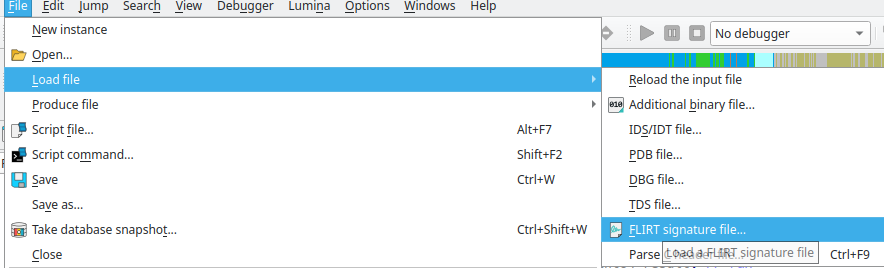
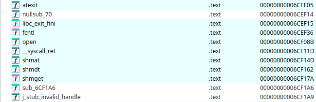
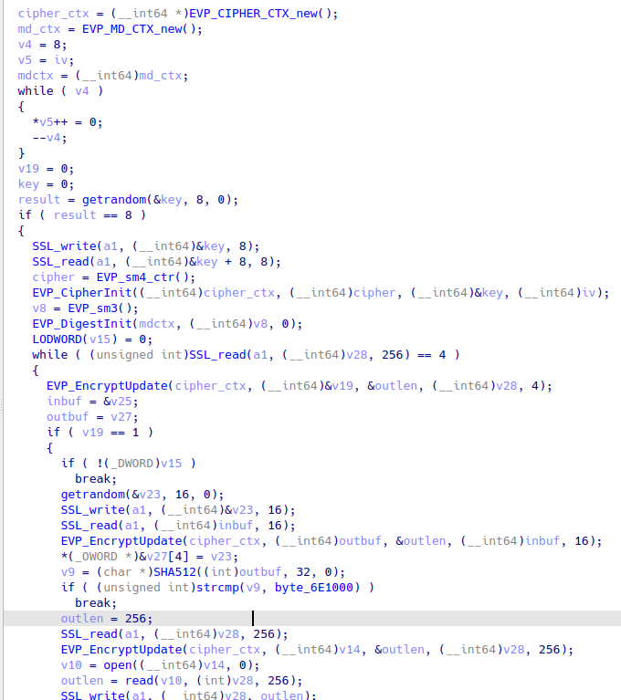
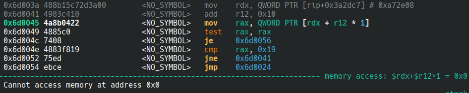

**Written by [Junhyun Song](https://x.com/wlswotmd)**
<br>
<br>
# dialects

## Reverse First!

statically linked, stripped binary 🤮

```bash
> file ctf                  
ctf: ELF 64-bit LSB executable, x86-64, version 1 (SYSV), statically linked, stripped
````

Let's start by repairing the stripped symbols.

### FLIRT

The author also gave us libc.a and libstdc++.a with the challenge. Couldn't we just extract the symbols from this files and apply them? Yes, you can with FLIRT.

So, what is FLIRT and how does it work? FLIRT was created by Hex-Rays to separate library functions from programs. To solve this problem, Hex-Rays first creates a signature of the function from the library. It then compares the signature of the function you use in your program with the signature of the pre-created library function. If the two signatures are the same, we can assume that the two functions are also the same. For a more detailed explanation, see the [official documentation](https://docs.hex-rays.com/user-guide/signatures/flirt)

btw, how do I create a signature file and apply it to my program?

Try these:

```bash
# create signature files
/path/to/IDA/tools/flair/pelf libc.a libc.pat
/path/to/IDA/tools/flair/makesig libc.pat libc.sig
# fix libc.exc 
/path/to/IDA/tools/flair/makesig libc.pat libc.sig
```

Load the signature file from `File > Load file > FLIRT signature file...`


Now we have recovered the libc symbol!


The signature for the other library was obtained by my teammate `howdays` using lib{ssl,crypto}.so. Looks even better!


### So how do I get the flag 😅

It easy to understand what the program is doing. The program uses stdio to communicate over the SSL protocol.

```c
int __fastcall main(int argc, const char **argv, const char **envp)
{
  __int64 v3; // rbp
  _DWORD *v4; // rbp

  signal(0xDu, 1);
  v3 = sub_400676(13);
  sub_4006A4(v3);
  alarm(0xAu);
  v4 = (_DWORD *)SSL_new(v3);
  SSL_set_rfd(v4, 0);
  SSL_set_wfd(v4, 1);
  if ( (int)SSL_accept((__int64)v4) > 0 )
    return sub_40027D((__int64)v4);
  else
    return sub_4A00C6(0xA6E340);
}
```

And the core of the program is implemented in `sub_40027D`.

1 . The execution flow depends on taking a 4-byte input and encrypting it with an SM4 cipher.

2-1. if the result of sm4 encryption is 1, check that we gave the correct input in 2-2. and check if the result of `strcmp(SHA512(sm4_encrypt(ctx, random 16 bytes | user input 16 bytes), byte_6E1000))` is true. If it is true, we can read the random file.

2-2. if the result of sm4 encryption is 2, check if the result of `memcmp(sm3_digest(ctx, sm4_encrypt(ctx, random 16 bytes | user input 16 bytes), 32), “\x00\x00\x00”, 3)` is true.

So we can solve 2-2 first, and then 2-1 to read `/flag`, right?

```c
__int64 __fastcall sub_40027D(__int64 a1)
{
 // ... 

  cipher_ctx = (__int64 *)EVP_CIPHER_CTX_new();
  md_ctx = EVP_MD_CTX_new();
  v4 = 8;
  v5 = iv;
  mdctx = (__int64)md_ctx;
  while ( v4 )
  {
    *v5++ = 0;
    --v4;
  }
  v19 = 0;
  key = 0;
  result = getrandom(&key, 8, 0);
  if ( result == 8 )
  {
    SSL_write(a1, (__int64)&key, 8);
    SSL_read(a1, (__int64)&key + 8, 8);
    cipher = EVP_sm4_ctr();
    EVP_CipherInit((__int64)cipher_ctx, (__int64)cipher, (__int64)&key, (__int64)iv);
    v8 = EVP_sm3();
    EVP_DigestInit(mdctx, (__int64)v8, 0);
    LODWORD(v15) = 0;
    while ( (unsigned int)SSL_read(a1, (__int64)v28, 256) == 4 )
    {
      EVP_EncryptUpdate(cipher_ctx, (__int64)&v19, &outlen, (__int64)v28, 4);
      inbuf = &v25;
      outbuf = v27;
      if ( v19 == 1 ) 
      {
        if ( !(_DWORD)v15 )
          break;
        getrandom(&v23, 16, 0);
        SSL_write(a1, (__int64)&v23, 16);
        SSL_read(a1, (__int64)inbuf, 16);
        EVP_EncryptUpdate(cipher_ctx, (__int64)outbuf, &outlen, (__int64)inbuf, 16);
        *(_OWORD *)&v27[4] = v23;
        v9 = (char *)SHA512((int)outbuf, 32, 0);
        if ( (unsigned int)strcmp(v9, byte_6E1000) )
          break;
        outlen = 256;
        SSL_read(a1, (__int64)v28, 256);
        EVP_EncryptUpdate(cipher_ctx, (__int64)v14, &outlen, (__int64)v28, 256);
        v10 = open((__int64)v14, 0);
        outlen = read(v10, (int)v28, 256);
        SSL_write(a1, (__int64)v28, outlen);
      }
      else
      {
        if ( v19 != 2 )
          break;
        v11 = outbuf;
        for ( i = 16; i; --i )
          *v11++ = 0;
        v15 = &v22;
        getrandom(&v22, 16, 0);
        SSL_write(a1, (__int64)v15, 16);
        v23 = 0;
        SSL_read(a1, (__int64)&v23, 16);
        v26 = v22;
        EVP_EncryptUpdate(cipher_ctx, (__int64)inbuf, &outlen, (__int64)&v23, 16);
        EVP_DigestUpdate(mdctx, inbuf, 32);
        EVP_DigestFinal_ex(mdctx, outbuf, 0);
        if ( BYTE2(v27[0]) | (unsigned __int8)(BYTE1(v27[0]) | LOBYTE(v27[0])) )
        {
          v13 = 2;
          goto LABEL_19;
        }
      }
      LODWORD(v15) = 1;
    }
    v13 = 0;
LABEL_19:
    exit(v13);
  }
  return result;
}
```

## Custom cipher?

I thought it would be easy to just code using the openssl library, but the implementation of sm3 and sm4 was a bit weird. However, I don't know how much the author changed anything, so instead of trying to find all the differences, I decided to use the author's implementations of SM3 and SM4.

Since it's a statically linked binary, you can use the functions in the binary as is, as long as you map the addresses correctly.

Here is an example.
```c
#define PROB_PATH "./ctf"
#define PROB_BASE (void *)(0x400000)
#define PROB_DATA_BASE (void *)(0xa67000)

void *(*SHA512)(void *, int, int) = (typeof(SHA512))(0x4DC76A);

void hexdump(void *mem, unsigned int len);
void fatal(const char *msg);

void *map_prob(void)
{
    int fd;
    size_t prob_size;
    void *prob_base;
    void *prob_data_base;

    fd = open(PROB_PATH, O_RDONLY);
    if (fd < 0)
        fatal("open");
    
    prob_size = lseek(fd, 0, SEEK_END);
    lseek(fd, 0, SEEK_SET);

    prob_base = mmap(PROB_BASE, prob_size, PROT_READ | PROT_WRITE | PROT_EXEC, MAP_PRIVATE | MAP_FIXED_NOREPLACE, fd, 0);
    if (prob_base == MAP_FAILED)
        fatal("mmap");

    prob_data_base = mmap(PROB_DATA_BASE, 0xc000, PROT_READ | PROT_WRITE, MAP_PRIVATE | MAP_FIXED_NOREPLACE | MAP_ANON, -1, 0);
    if (prob_data_base == MAP_FAILED)
        fatal("mmap");

    memcpy((char *)prob_data_base + 0x1000, (char *)prob_base + 0x468000, 0x6558);

    close(fd);

    return prob_base;
}

void test(void)
{
    char *sha512_out;
    char hash_input[0x20];

    memset(hash_input, 'A', 0x20);

    sha512_out = SHA512(hash_input, 0x20, 0);

    hexdump(sha512_out, 0x20);
}

int main(int argc, char *argv[], char *envp[])
{
    void *prob_base;

    setbuf(stdin, NULL);
    setbuf(stdout, NULL);
    setbuf(stderr, NULL);

    prob_base = map_prob();

    test();

    return 0;
}
```

segmentation fault? What's wrong?

```bash
> ./test
[2]    1547625 segmentation fault (core dumped)  ./test
```

Looks like we need to fill 0xa72e08 with the correct value.


and that correct value is the end address of the envp.
```c
__int64 __fastcall _init_libc(__int64 envp, __int64 a2)
{
  v2 = 0;
  qword_A72AF8 = envp;
  memset(v14, 0, 0x130u);
  while ( *(_QWORD *)(envp + 8 * v2++) )
    ;
  v4 = (unsigned __int64 *)(envp + 8 * v2);
  qword_A72E08 = (__int64)v4;

  // ...
}
```

Now it's working great!
```bash
> ./test
0x000000: ac 80 04 71 de 52 f7 4e 8d 32 32 37 b1 b9 13 ca ...q.R.N.227....
0x000010: 28 bc 0f 46 f2 6b 88 f8 b2 5e 25 e7 33 c1 a6 08 (..F.k...^%.3...
```

So now all we need to do is implement it and we get the flag

### Solve 2-2.

1. sm4_decrypt `\x02\x00\x00\x00` with the key we got from the problem server, so we can change the execution flow to 2-2.

2. find the N where the result of sm3_digest(N) is `\x00\x00\x00\x??...` using brute-force, and sm4_decrypt the value to solve 2-2.

### Solve 2-1.

1. sm4_decrypt `\x01\x00\x00\x00` with the key we got from the problem server, so we can change the execution flow to 2-1.

2. find the N where the result of SHA512(N) is `\x8d\x36\x00\x??...` using brute-force, and sm4_decrypt the value to solve 2-1. (because byte_6E1000 is `\x8d\x36\x00...`)

## Here's the complete code I used

```c
// gcc -o test test.c
#include <stdio.h>
#include <unistd.h>
#include <fcntl.h>
#include <stdlib.h>
#include <ctype.h>
#include <string.h>
#include <sys/mman.h>

#define PROB_PATH "./ctf"
#define PROB_BASE (void *)(0x400000)
#define PROB_DATA_BASE (void *)(0xa67000)
 
#ifndef HEXDUMP_COLS
#define HEXDUMP_COLS 16
#endif

void *(*EVP_MD_CTX_new)(void) = (typeof(EVP_MD_CTX_new))(0x4A1B50);
void *(*EVP_CIPHER_CTX_new)(void) = (typeof(EVP_CIPHER_CTX_new))(0x4A3932);
void (*EVP_EncryptInit)(void *, void *, void *, void *) = (typeof(EVP_EncryptInit))(0x4A619D);
void (*EVP_EncryptUpdate)(void *, void *, void *, void *, int) = (typeof(EVP_EncryptUpdate))(0x4A3DDA);
void (*EVP_DecryptInit)(void *, void *, void *, void *) = (typeof(EVP_DecryptInit))(0x4A61A5);
void (*EVP_DecryptUpdate)(void *, void *, void *, void *, int) = (typeof(EVP_DecryptUpdate))(0x4A413A);
void (*EVP_DigestInit_ex)(void *, void *, int) = (typeof(EVP_DigestInit_ex))(0x4A2AE1);
void (*EVP_DigestUpdate)(void *, void *, int) = (typeof(EVP_DigestUpdate))(0x4A1BD1);
void (*EVP_DigestFinal_ex)(void *, void *, int) = (typeof(EVP_DigestFinal_ex))(0x4A1CAE);
void *(*EVP_sm4_ctr)(void) = (typeof(EVP_sm4_ctr))(0x4A37E4);
void *(*EVP_sm3)(void) = (typeof(EVP_sm3))(0x4DDB2D);
void *(*SHA512)(void *, int, int) = (typeof(SHA512))(0x4DC76A);

void fatal(const char *msg)
{
    perror(msg);
    exit(EXIT_FAILURE);
}

void hexdump(void *mem, unsigned int len)
{
    unsigned int i, j;
    
    for (i = 0; i < len + ((len % HEXDUMP_COLS) ? (HEXDUMP_COLS - len % HEXDUMP_COLS) : 0); i++) {
        /* print offset */
        if (i % HEXDUMP_COLS == 0)
            printf("0x%06x: ", i);

        /* print hex data */
        if (i < len)
            printf("%02x ", 0xFF & ((char*)mem)[i]);
        else /* end of block, just aligning for ASCII dump */
            printf("   ");
        
        /* print ASCII dump */
        if (i % HEXDUMP_COLS == (HEXDUMP_COLS - 1)) {
            for(j = i - (HEXDUMP_COLS - 1); j <= i; j++) {
                if(j >= len) /* end of block, not really printing */
                    putchar(' ');
                else if(isprint(((char*)mem)[j])) /* printable char */
                    putchar(0xFF & ((char*)mem)[j]);
                else /* other char */
                    putchar('.');
            }
            putchar('\n');
        }
    }
}

void *map_prob(void)
{
    int fd;
    size_t prob_size;
    void *prob_base;
    void *prob_data_base;

    fd = open(PROB_PATH, O_RDONLY);
    if (fd < 0)
        fatal("open");
    
    prob_size = lseek(fd, 0, SEEK_END);
    lseek(fd, 0, SEEK_SET);

    prob_base = mmap(PROB_BASE, prob_size, PROT_READ | PROT_WRITE | PROT_EXEC, MAP_PRIVATE | MAP_FIXED_NOREPLACE, fd, 0);
    if (prob_base == MAP_FAILED)
        fatal("mmap");

    prob_data_base = mmap(PROB_DATA_BASE, 0xc000, PROT_READ | PROT_WRITE, MAP_PRIVATE | MAP_FIXED_NOREPLACE | MAP_ANON, -1, 0);
    if (prob_data_base == MAP_FAILED)
        fatal("mmap");

    memcpy((char *)prob_data_base + 0x1000, (char *)prob_base + 0x468000, 0x6558);

    close(fd);

    return prob_base;
}

void solve_main(void)
{
    void *md_ctx;
    void *cipher_ctx;
    char key[16];
    char iv[16];
    char ciphertext[0x100];
    char plaintext[0x100];
    int out_num;

    cipher_ctx = EVP_CIPHER_CTX_new();

    puts("[+] round 1");

    printf("key: ");
    read(STDIN_FILENO, key, sizeof(key));
    memset(iv, 0, sizeof(iv));
    EVP_DecryptInit(cipher_ctx, EVP_sm4_ctr(), key, iv);
    
    memset(ciphertext, 0, sizeof(ciphertext));
    *(int *)ciphertext = 2;
    EVP_DecryptUpdate(cipher_ctx, plaintext, &out_num, ciphertext, 4);
    printf("answer: ");
    write(STDOUT_FILENO, plaintext, 4);
    puts("");

    puts("[+] round 2");
    printf("input_16: ");
    char input_16[0x10];

    read(STDIN_FILENO, input_16, sizeof(input_16));

    size_t i;
    char hash_input[0x20];
    char hash_output[0x20];
    memset(hash_input, 0, sizeof(hash_input));
    memcpy(hash_input + 0x10, input_16, sizeof(input_16));
    while (1) {
        md_ctx = EVP_MD_CTX_new();
        EVP_DigestInit_ex(md_ctx, EVP_sm3(), 0);

        *(size_t *)hash_input = i;

        EVP_DigestUpdate(md_ctx, hash_input, 0x20);
        EVP_DigestFinal_ex(md_ctx, hash_output, 0);
        if (!(hash_output[0] | hash_output[1] | hash_output[2]))
            break;

        i++;
    }

    printf("hash_input: %ld\n", i);

    memset(ciphertext, 0, sizeof(ciphertext));
    *(size_t *)ciphertext = i;
    EVP_DecryptUpdate(cipher_ctx, plaintext, &out_num, ciphertext, 0x10);
    printf("answer: ");
    write(STDOUT_FILENO, plaintext, 0x10);
    puts("");

    puts("[+] round 3");
    memset(ciphertext, 0, sizeof(ciphertext));
    *(int *)ciphertext = 1;
    EVP_DecryptUpdate(cipher_ctx, plaintext, &out_num, ciphertext, 4);
    printf("answer: ");
    write(STDOUT_FILENO, plaintext, 4);
    puts("");

    puts("[+] round 4");
    printf("input_16: ");

    read(STDIN_FILENO, input_16, sizeof(input_16));

    i = 0;

    memset(hash_input, 0, sizeof(hash_input));
    memcpy(hash_input + 0x10, input_16, sizeof(input_16));

    char *sha512_out;
    while (1) {
        *(size_t *)hash_input = i;

        sha512_out = SHA512(hash_input, 0x20, 0);

        if (!memcmp(sha512_out, "\x8d\x36\x00", 3))
            break;

        i++;
    }

    printf("hash_input: %ld\n", i);

    memset(ciphertext, 0, sizeof(ciphertext));
    *(size_t *)ciphertext = i;
    EVP_DecryptUpdate(cipher_ctx, plaintext, &out_num, ciphertext, 0x10);
    printf("answer: ");
    write(STDOUT_FILENO, plaintext, 0x10);
    puts("");

    puts("[+] round 5");
    memset(ciphertext, 0, sizeof(ciphertext));
    strcpy(ciphertext, "/flag");

    EVP_DecryptUpdate(cipher_ctx, plaintext, &out_num, ciphertext, 256);
    printf("answer: ");
    write(STDOUT_FILENO, plaintext, 256);
    puts("");
}

void test(void)
{
    char *sha512_out;
    char hash_input[0x20];

    memset(hash_input, 'A', 0x20);

    sha512_out = SHA512(hash_input, 0x20, 0);

    hexdump(sha512_out, 0x20);
}

int main(int argc, char *argv[], char *envp[])
{
    void *prob_base;

    setbuf(stdin, NULL);
    setbuf(stdout, NULL);
    setbuf(stderr, NULL);

    prob_base = map_prob();

    int count = 0;
    while ( envp[count++])
        ;
    *(unsigned long *)(0xA72E08) = (unsigned long)&envp[count];

    solve_main();
    
    _exit(0);

    return 0;
}
```

```python
import socket
import ssl
from pwn import *
import os

context.arch = "amd64"
context.terminal = ["sudo", "konsole", "-e", "zsh", "-c"]

if args.REMOTE:
    HOST = "dialects-7qpig3ofzdmyi.shellweplayaga.me"
    PORT = 4433 
    TICKET = "ticket{~~~}"
else:
    HOST = "localhost"
    PORT = 8080 
    os.system("sudo pkill ctf")
    os.system("pkill socat")
    os.system("socat TCP-LISTEN:8080,reuseaddr,fork EXEC:./ctf,stderr &")

p = process("./test")

context = ssl.SSLContext(ssl.PROTOCOL_TLS_CLIENT)
context.minimum_version = ssl.TLSVersion.TLSv1_3
context.maximum_version = ssl.TLSVersion.TLSv1_3

context.check_hostname = False
context.verify_mode = ssl.CERT_NONE

with socket.create_connection((HOST, PORT)) as sock:
    if args.REMOTE:
        sock.recv(15)
        sock.send(TICKET.encode() + b"\n")

    with context.wrap_socket(sock, server_hostname=HOST) as ssock:
        key = ssock.recv(8)
        
        ssock.send(b'a'*8) 

        final_key = key + b'a'*8

        log.info("final_key: %s", final_key.hex())
        p.sendafter(b"key: ", final_key)
        p.recvuntil(b"answer: ")
        answer = p.recvn(4)
        ssock.send(answer)

        input_16 = ssock.recv(16)
        log.info("input_16: %s", input_16.hex())

        p.sendafter(b"input_16: ", input_16)

        p.recvuntil(b"answer: ")
        answer = p.recvn(16)
        ssock.send(answer)

        p.recvuntil(b"answer: ")
        answer = p.recvn(4)
        ssock.send(answer)

        input_16 = ssock.recv(16)
        log.info("input_16: %s", input_16.hex())

        p.sendafter(b"input_16: ", input_16)

        p.recvuntil(b"answer: ")
        answer = p.recvn(16)
        ssock.send(answer)

        p.recvuntil(b"answer: ")
        answer = p.recvn(256)
        ssock.send(answer)

        flag = ssock.recv(256)
        log.info("flag: %s", flag.decode())

        p.interactive()

```