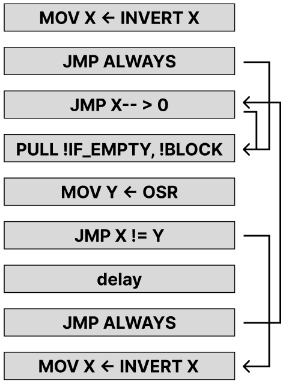

Hello, I'm Seohyun Jang, also known as **[d1n0](https://x.com/am_i_dino)**.
<br>
In this post I'll share my write‑up for the **`im‑pio‑sible`** challenge, one of the challenges I solved in this year's DEFCON CTF qualifiers.

# terms

The challenge is based on a custom PIO system written by the authors.
To make the explanation clearer, I'll start by summarizing a few key terms of this PIO model.

- `State Machines` execute the instruction at their PC every tick, one after another.
- The supported instructions are `Jmp`, `Wait`, `In`, `Out`, `Pull`, `Push`, `Mov`, `Irq`, and `Set`.  
  Each instruction can include a `sideset` field that either inserts an extra delay or sets a value on a GPIO pins.
- Every State Machine owns these memory areas:
  - **Output Shift Register (OSR)**  
    Filled by `Out` and `Pull`; also accessible with `Mov` or `Set`.  
    The **`out_shiftdir`** flag selects the shift‑in direction for `Out`.
  - **Input Shift Register (ISR)**  
    Filled by `In` and `Push`; likewise accessible with `Mov` or `Set`.  
    The **`in_shiftdir`** flag selects the shift‑in direction for `In`.
  - **Shift Counters (OSC / ISC)**  
    Count the number of bits shifted through OSR/ISR and are mainly used to trigger `autopull` or `autopush`.
  - **Scratch X, Scratch Y**: general temporary registers, also used as loop counters by `Jmp`.
  - **TX FIFO**: values written by `Push` are placed here.
  - **RX FIFO**: `Pull` reads values from here.
- **GPIO**  
  Can be used by `In`, `Out`, `Mov`, or via **`sideset`**.  
  If `share_pins` is `true`, all State Machines share the same GPIO pins.

For details not covered here, please consult the Swift source code shipped with the problem.

# im‑pio‑sible

The challenge provided a single **transmitter** State Machine.  
Our task is to build a **receiver** State Machine that runs concurrently, recovers each value the transmitter pops from its TX queue, and then pushes that value to *our* TX queue.

The transmitter's TX FIFO is wired to the receiver's RX FIFO. And the receiver may also watch any GPIO activity driven by the transmitter if `share_pins` option is true.

There are three transmitter variants—**level 1**, **level 2**, and **level 3**—but during the CTF I only implemented a receiver for **level 3**.  
Special thanks to the `Cold Fusion` members **deayzl** and **Aplace**, who solved levels 1 and 2 and explained the challenge in detail.

Because this write‑up aims to be complete, I will still present solutions for levels 1 and 2.
I have cleaned up the explanations slightly, so they may differ from the code we actually ran during the contest.

## Level 1

```text
gpio_pins: 2
gpio_pindir: 2
out_shiftdir: true
pull_thresh: 32
auto_pull: false
out_base: 0
side_base: 1
sideset_count: 2
side_en: true
share_pins: true

PULL if_empty=0, block=1; sideset=31;
SET dest=1, data=15; sideset=23;
OUT GPIO (1); sideset=30;
JMP X-- > 0 ? 2; sideset=17;
```

**level1.json** performs these steps:

0. `Pull` one word from TX FIFO.  
1. Load `15` into scratch `X`.  
2. Shift one bit from OSR out to GPIO.  
3. If `X` > 0, jump back to step 2; otherwise, jump to step 0. `X` is decremented just before the jump.

When the transmitter executes the `Out`, the receiver must execute an `In`, but only *after* the `Out` fires.  
Because `Out` is issued with **sideset 30**, GPIO shows `1 1 [out‑bit]` right after the instruction.  
By first clearing GPIO and waiting until pin 1 goes high, the receiver can detect that exact moment.

After the transmitter finishes its loop it restarts from the beginning.  
To stay in sync, the receiver waits until the transmitter runs its `Jmp` (sideset 17 clears pin 1).

With `push_thresh = 16` and `autopush = true`, the receiver's OSC hits the threshold at the end of each inner loop, automatically pushing the reconstructed word.

```text
share_pins: true
in_shiftdir: true
autopush: true
push_thresh: 16

SET dest=0, data=0; sideset=0;
WAIT idx=1, src=0, pol=1; sideset=0;
SET dest=1, data=15; sideset=0;
SET dest=0, data=0; sideset=0;
WAIT idx=1, src=0, pol=1; sideset=0;
GPIO |> ISR (1); sideset=0;
JMP X-- > 0 ? 3; sideset=0;
WAIT idx=1, src=0, pol=0; sideset=0;
JMP TRUE ? 0; sideset=0;
```

## Level 2

```text
push_thresh: 32
set_base: 14
share_pins: true

PULL if_empty=0, block=1; sideset=0;
MOV X <- OSR; sideset=0;
MOV ISR <- OSR; sideset=0;
PUSH if_full=0, block=0; sideset=0;
PULL if_empty=0, block=1; sideset=0;
MOV Y <- OSR; sideset=0;
JMP TRUE ? 8; sideset=0;
JMP X-- > 0 ? 8; sideset=0;
JMP Y-- > 0 ? 7; sideset=0;
MOV INVERT ISR <- X; sideset=0;
PUSH if_full=0, block=0; sideset=0;
SET dest=0, data=1; sideset=0;
WAIT idx=14, src=0, pol=0; sideset=0;
```

**level2.json** does the following:

0. `Pull` word `A`.  
1. Copy OSR into scratch `X`.  
2. Copy OSR into ISR.  
3. `Push` ISR (→ sends `A`).  
4. `Pull` word `B` into OSR.  
5. Store OSR in scratch `Y`.  
6. Jump to step 8.  
7. If `X != 0`, decrement `X` and jump to step 8.  
8. If `Y != 0`, decrement `Y` and jump to step 7.  
9. Store `~X` in ISR.  
10. Push ISR (→ sends `~(A − B)`).  
11. Using `set_base = 14`, set GPIO 14 high (stop bit).  
12. Wait until GPIO 14 returns to 0.

Thus the transmitter reads `A, B` and outputs `A` followed by `~(A − B)`.

Given `A` and `~(A − B)`, the receiver can recover both numbers.  
By exploiting the same `Jmp X--`/`Jmp Y--` trick used by the transmitter—compute `(A‑B) − A − 1`, invert—we recover `B`.

After both pushes, the receiver clears GPIO 14 so that the transmitter can continue.

```text
set_base: 14
share_pins: true

PULL if_empty=0, block=1; sideset=0;
MOV X <- OSR; sideset=0;
PULL if_empty=0, block=1; sideset=0;
MOV Y <- OSR; sideset=0;

MOV ISR <- X; sideset=0;
PUSH if_full=0, block=0; sideset=0;

MOV INVERT Y <- Y; sideset=0;
JMP Y-- > 0 ? 8; sideset=0;
JMP X-- > 0 ? 7; sideset=0;
MOV INVERT ISR <- Y; sideset=0;
PUSH if_full=0, block=0; sideset=0;
SET dest=0, data=0; sideset=0;
```

## Level 3

```text
in_shiftdir: false
out_shiftdir: false
set_base: 29

PULL if_empty=0, block=1; sideset=0;
OUT GPIO (32); sideset=0;
GPIO |> ISR (2); sideset=0;
MOV Y <- ISR; sideset=0;
JMP Y-- > 0 ? 4; sideset=5;
SET dest=0, data=0; sideset=0;
GPIO |> ISR (32); sideset=0;
MOV GPIO <- 0; sideset=0;
PUSH if_full=0, block=1; sideset=10;
```

**level3.json** works as follows:

0. `Pull` one word from TX FIFO.  
1. Drive all 32 bits onto GPIO.  
2. Read the lower two GPIO bits into ISR.  
3. Copy ISR into scratch `Y`.  
4. While `Y > 0`, loop here, decrementing `Y` each time.  
   Because the instruction has **sideset 5**, each iteration waits 5 ticks  
   (`side_en` defaults to `false`, so every instruction outputs its sideset).  
5. Clear the lower two GPIO bits (`set_base = 29`).  
6. Read 32 bits from GPIO into ISR.  
7. Clear GPIO pins.  
8. `Push` ISR into RX FIFO.

The big difference from previous levels is that **`share_pins` is off**, so the receiver cannot directly read transmitter's GPIO pins.  
The transmitter zeroes the two LSBs of every word before sending; those bits affect only the loop length in step 4.  
This allows a **timing attack**: a larger 2‑bit value means the transmitter waits longer before its next `Push`.

The receiver sets `block = 0` on its own `Pull` and counts cycles while the TX FIFO is empty to recover those two bits.

Since there is no instruction that *adds* 1, we recycle the trick from level 2: invert, subtract 1 via `Jmp X--`, then invert again effectively adds 1.

The diagram below shows the flow:



---

Next we need to recombine the recovered 2 bits with the remaining 30 bits.  
Because the level 2's loop‑counter trick changes the number of executed instructions, we want a reconstruction method whose instruction count is **constant**.  
Using `In` and `Out` fits perfectly:

1. Set `in_shiftdir = 0` and `out_shiftdir = 1`.  
2. `Pull` word `Y` into ISR.  
3. `Out` the lower two bits; ISR now holds `Y >> 2`.  
4. Shift the recovered two bits into ISR with `In`; ISR becomes  
   `(Y & ~0b11) | (X & 0b11)`—exactly the original word.

The complete receiver for level 3 is:

```text
in_shiftdir: false
out_shiftdir: true

SET dest=1, data=0; sideset=0;
SET dest=2, data=0; sideset=0;
MOV ISR <- X; sideset=0;
MOV OSR <- X; sideset=0;
OUT GPIO (32); sideset=0;
MOV X <- X; sideset=6;

MOV INVERT X <- X; sideset=0;
JMP TRUE ? 9; sideset=0;
JMP X-- > 0 ? 9; sideset=0;
PULL if_empty=0, block=0; sideset=0;
MOV Y <- OSR; sideset=0;
JMP X != Y ? 14; sideset=0;
MOV X <- X; sideset=0;
JMP TRUE ? 8; sideset=0;
MOV INVERT X <- X; sideset=0;

MOV OSR <- Y; sideset=0;
OUT GPIO (2); sideset=0;
MOV ISR <- OSR; sideset=0;
X |> ISR (2); sideset=0;

PUSH if_full=0, block=1; sideset=0;
JMP TRUE ? 0; sideset=0;
```

## Conclusion

You can find the solution script below:

```python
def Jmp(addr: int, mode: int, sideset: int = 0) -> tuple[int, int]:
    return (addr & 0x1F) | (mode << 5), (0 << 5)

def Wait(index: int, source: int, pol: int, sideset: int = 0) -> tuple[int, int]:
    assert source < 4
    assert pol < 2
    return ((index & 0x1F) | (source << 5) | (pol << 7), (1 << 5) | (sideset & 0x1F))

def In(src: int, bitcount: int, sideset: int = 0) -> tuple[int, int]:
    assert src <= 7
    return (src << 5) | (bitcount & 0x1F), (2 << 5) | (sideset & 0x1F)

def Out(dest: int, bitcount: int, sideset: int = 0) -> tuple[int, int]:
    assert dest <= 7
    return (dest << 5) | (bitcount & 0x1F), (3 << 5) | (sideset & 0x1F)

def Pull(if_empty: int, block: int, sideset: int = 0) -> tuple[int, int]:
    assert if_empty < 2 and block < 2
    return (if_empty << 6) | (block << 5) | (1 << 7), (4 << 5) | (sideset & 0x1F)

def Push(if_full: int, block: int, sideset: int = 0) -> tuple[int, int]:
    assert if_full < 2 and block < 2
    return (if_full << 6) | (block << 5), (4 << 5) | (sideset & 0x1F)

def Mov(src: int, cal: int, dest: int, sideset: int = 0) -> tuple[int, int]:
    assert src <= 7
    assert cal <= 3
    assert dest <= 7
    return src | (cal << 3) | (dest << 5), (5 << 5) | (sideset & 0x1F)

def Irq(clr: int, wait: int, index: int, sideset: int = 0) -> tuple[int, int]:
    return (clr << 6) | (wait << 5) | (index & 0x1F), (6 << 5) | (sideset & 0x1F)

def Set(dest: int, data: int, sideset: int = 0) -> tuple[int, int]:
    return (dest << 5) | (data & 0x1F), (7 << 5) | (sideset & 0x1F)

from pwn import *

# r = remote('localhost', 1337)
# r.sendlineafter(b": ", b"ticket{TICKET}")

r = process("./challenge", env={"LD_LIBRARY_PATH":"./lib/"})

inst = [
    *Set(0, 0),
    *Wait(1, 0, 1),
    *Set(1, 15),
    *Set(0, 0),
    *Wait(1, 0, 1),
    *In(0, 1),
    *Jmp(3, 2),
    *Wait(1, 0, 0),
    *Jmp(0, 0),
]
payload_1 = '{"sh":1,"isd":1,"as":1,"ps": 16,'+f'"i":{inst}'+'}'
r.sendlineafter(b"level 1", payload_1.encode())

inst = [
    *Pull(0, 1),
    *Mov(7, 0, 1),
    *Pull(0, 1),
    *Mov(7, 0, 2),

    *Mov(1, 0, 6),
    *Push(0, 0),

    *Mov(2, 1, 2),
    *Jmp(8, 4, 0),
    *Jmp(7, 2, 0),
    *Mov(2, 1, 6),
    *Push(0, 0),
    *Set(0, 0),
]
payload_2 = '{"seb":14,"sh":1,'+f'"i":{inst}'+'}'
r.sendlineafter(b"level 2", payload_2.encode())

inst = [
    *Set(1, 0),
    *Set(2, 0),
    *Mov(1, 0, 6),
    *Mov(1, 0, 7),
    *Out(0, 0),
    *Mov(1, 0, 1, 6),

    *Mov(1, 1, 1),
    *Jmp(9, 0),
    *Jmp(9, 2),
    *Pull(0, 0),
    *Mov(7, 0, 2),
    *Jmp(14, 5, 2),
    *Mov(1, 0, 1),
    *Jmp(8, 0),
    *Mov(1, 1, 1),

    *Mov(2, 0, 7),
    *Out(0, 2),
    *Mov(7, 0, 6),
    *In(1, 2),

    *Push(0, 1),
    *Jmp(0, 0),
]
payload_3 = '{"isd":0,"osd":1,'+f'"i":{inst}'+'}'
r.sendlineafter(b"level 3", payload_3.encode())

r.interactive()
```

