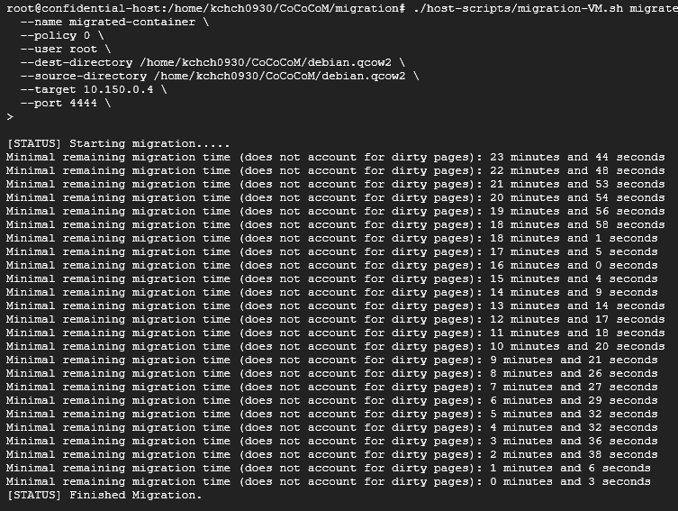
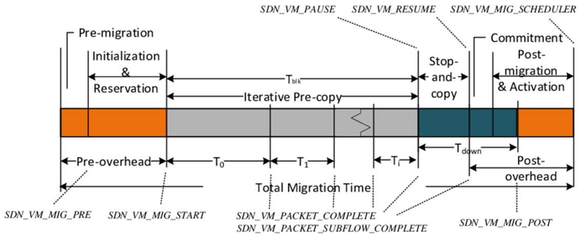
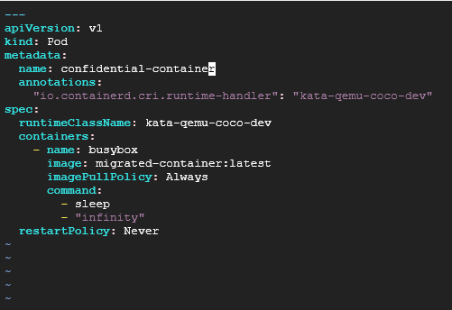
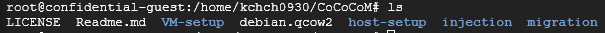

Written by [Chungyhyun Kang](https://www.linkedin.com/in/chunghyunkang)

This contains the content of paper: Chunghyun Kang (2025) “Secure Container Live Migration: A Lightweight Approach to Performance Bottlenecks in Confidential VM Migration”. Hosted by Kungliga Tekniska högskolan, [Canarybit](https://www.canarybit.eu/). 

# Abstract
<hr/>
## Background

Live migration of Confidential Virtual Machines (CVMs), as implemented and supported by major hardware vendors (AMD, Intel, ARM), offers strong confidentiality and integrity guarantees but remains fundamentally dependent on secure hardware platforms.

While these protections are essential, they introduce significant performance overheads during migration. Secure processors must re-encrypt and transfer the entire guest VM state which results in long migration times and extended service downtime.

Recent research has sought to address these issues by refining migration protocols, introducing hardware accelerators, or applying advanced cryptographic techniques such as homomorphic encryption. However, these approaches have shown only modest improvements.

## Claim

This thesis proposes a shift in strategy: **instead of optimizing the migration of full CVMs, the focus should be on migrating only the containers within a CVM.** 
Containers encapsulate application state in a lightweight, isolated environment, substantially reducing the volume of sensitive data that must be transferred while preserving confidentiality guarantees.

## What I did

Building on the state-of-the-art method described in “Live Migration of Operating System Containers in Encrypted Virtual Machines” (Pecholt et al., CCSW 2021), this work adapts the approach for use in a Google Cloud Platform environment with Kubernetes orchestration. 

Due to the incompatibility of nested virtualization and hardware-backed CVMs in GCP, a confidential container runtime class (kata-qemu-coco-dev) was employed to emulate a secure execution environment while preserving the softwarelevel confidentiality processes. The system was implemented and validated on Ubuntu 22.04 LTS.

## Result and Conclusion

Experimental results demonstrate successful secure container migration of **2 GB container images** between cloud-based confidential environments, with migration times of approximately **23 minutes**. While the approach achieves strong confidentiality, the time costs remain significant. 



These findings confirm both the feasibility of the method in real cloud environments and the need for further research into reducing migration time, particularly through containerfocused optimization strategies, such as CRIU Method. (Container Checkpoint/Restore In Userspace)

# Problem Clarification
<hr/>
Live Migration of Confidential VM introduces significant performance overheads. Since it has to offer strong confidentiality and integrity guarantees while maintaining the service normally. 

This chapter seeks to explain why such a problem arises.

## Live Migration Mechanism : Pre-Post Copy

Live migration enables a running virtual machine (VM) to move from one physical host to another with minimal service interruption. 

Current Approach of Live Migration is mostly focused on Pre-Post Copy Mechanism.



1. Pre-Copy: Migrate the Images except Dirty Page (Currently Used Memory by running VM)
2. Iterate until the amount of Dirty Page reaches to Specific rate (Downtime rate)
3. Post-Copy: Stop the VM and Migrate the rest of Dirty Pages
4. Resume the Migrated VM

As you can see, the Speed of Live Migration critically depends on how much memory is consumed while service can be normally running.

## Necessity of Hardware Support to Confidential Migration

Confidential VMs (CVMs) aim to protect the confidentiality and integrity of guest workloads from a potentially untrusted cloud provider, includes the platform owner, host, and Hypervisor of the hardware. 

AMD’s SEV and Intel’s TDX fortify virtualized environments by encrypting VM memory with unique hardware-managed key called as VMK (VM Master Key). 

And this unique key must be only stored in Secure Hardware or Firmware, according to the concept of CVM.


This means 

- Only Secure Processor could help to run services of CVM
- Only Secure Processor could help to migrate CVM

Since the CVM memories are encrypted by VMK.

Furthermore, unlike traditional migration, CVM migration now requires collaboration between the source secure processor(SP), the destination SP, and a secure key migration protocol, including Validation and Key Exchange (Uses Diffie-Hellman Currently).

## Decrypt–Encrypt Loop: A New Migration Overhead

In standard live migration, page transfer is just a byte copy operation. 
Under AMD SEV, however, memory pages exist only in encrypted form within DRAM. 

This is why the Migration mechanism must contain the encryption and decryption.


1. Prepare the Migration Session Key(MSK) which already exchanged between src and dest. (via Diffie-Hellman)
2. The source SP decrypts each page with the existing VMK, and get the Plaintext of the Memory.
3. The Source SP encrypts the plaintext with the exchanged MSK.
4. The encrypted page is sent through a channel : Pre-Copy
5. After Migrating all pages, Src sends VMK encrypted with MSK to Dest : Post-Copy
6. The destination SP re-encrypts the page using a VMK Src sent.

### Why not send directly encrypted CVM Memory?

You could ask why the Src has to perform decrypt-encrypt task, though CVM Memory is already encrypted with the unique VMK which the Hypervisor can’t figure out.

But we should remind that the CVM must go through the host’s hardware to reach the Network.


If the host commits the Tampering Attack of Migrating Pages, there is no way to check its Integrity. 

Even though, it would be useless data if the tampered data decrypts, migrating process could not be successed after such attack.

This decrypt–encrypt loop introduces computational workload into the datapath of migration. Migration time becomes a direct function of secure processor throughput.

## Secure Processor: Only Designed for Security

SEV’s SP was initially designed to enforce memory encryption and manage key derivation, not to perform sustained, high-throughput cryptographic operations. 

As an example, AMD EPYC 7002 series Processors (Rome), which are released in Aug 2019, Processors itself is known as powerful. However, in contrast, its Security Processor could only support 32-bit processing. There’s no explicit information that AMD provides how fast the SP could perform, but considering the design, the processor is bound to be significantly slower compared to a typical one.

## Explicit Data: 2000 times more cost

In USENIX ATC ’24 "CPC: Flexible, Secure, and Efficient CVM Maintenance with Confidential Procedure Calls“, Researchers experimented the speed compare between Normal Live Migration and Confidential Live Migration using AMD EPYC(128 core), vCPU 1, 2GB DRAM.

The Result was 1.02(s) vs 33.7(min), which was 1986 times bigger.

# Recent Approaches to resolve
<hr/>
## Optimizing Protocols

### Adapting KVM Optimization Method

There’s several Method developed in KVM for optimizing the traditional VM migration.

- Parallel Migration: Use Several threads to transmit via Network
- Post-Copy Migration: Transmit Only Essential Memories. if not sufficient, Dest will request

But those methods have a severe problem : Both method requires that the Hypervisor must look up the information of CVM, which is constrast to the concept.

To migrate via multithread, Hypervisor needs to acknowledge the code dependency and Memory Allocation. Similarly, it is very hard for VM Applications to know whether the data is needed or not for itself. To overcome this, Hypervisor aid is needed.

### CPC (Confidential Procedure Calls)

The paper USENIX 2024'CPC: Flexible, Secure, and Efficient CVM Maintenance with Confidential Procedure Calls’ suggests the new architecture: SVSM (Secure VM Service Module)

SVSM is the small OS stored in CVM memories.
When some issues include Migration happens, SVSM code is decrypted and called (CPC).

However, unlike other CVM operation, SVSM decrypts the CVM data on Normal CPU core, not on SP.

- How is it possible? Isn’t it not confidential?

Before the SVSM code executes, SP checks the code integrity of SVSM to make sure it’s not manipulated by Hypervisor.
Furthermore, Hypervisor cannot open memory dump of SVSM since SVSM uses the Memory of CVM, and AMD-SEV SNP products prevent the Hypervisor to access to any page of CVM.

- But isn’t the plaintext eventually showed on the processor core?

Yes. But in this thesis, they concluded it’s in the trust boundary. Since there’s much method to restrict Hypervisor to look inside of the CPU core. (e.g. GHCB/VMEXIT Restriction, PSP)


Though this method is still [States-of-the-Art](./assets/2025-08-24-Secure-Container-Live-Migration/https://github.com/coconut-svsm/svsm), it is believed to be most practical option until now, which can make the CVM Live Migraton faster up to 138 times.

## Homomorphic Encryption for Live Migration

There’s several experiment to adapt the prominent FHE to CVM Live Migration, to make the performance faster. 

  For encrypted CVM Memories: $$ Mem=Enc_{vmk}(P) $$

Then in current Method of CVM Migration, the sending packets must be

$$
Enc_{msk}(Dec_{vmk}(Mem))
$$

Let’s suppose there’s such crypting method $\phi$(Key, P) , which satisfy,

$$
\phi(msk, Mem * A)= \phi(msk,Mem)* \phi(msk, A)
$$

Then the sending packets doesn’t have to decrypt-encrypt. Since the Destination SP could easily check the packet its integrity using the information A, which is already agreed between src and dest.

This could increasingly reduce the overhead, but still there’s no effective method yet.

# A Lightweight Approach: Migrating Containers
<hr/>
Pecholt et al. suggested the architecture of Secure Migrating Containers in CCSW 21’LIVE MIGRATION OF CONTAINERS IN SECURE ENCRYPTED VIRTUAL MACHINES’.

They figured out it’s a considerable scenario that even if they migrate container inside of CVM, not full VM, the services and OS inside of Container would run correctly.

If it’s possible, another way of Post-Copy Migration is actually possible—even though Hypervisor cannot look inside of CVM—since the services are totally separated in Container unit.


Above figure shows the PKI of suggested architecture.

It seems quite complex at first, the essense is not different from AMD PKI system, but it’s 2-layers.

- HCA key is corresponded with AMD Root Key.
- POCA key is corresponded with Platform Owner Key.
- G, C key is corresponded with VMK
- GO key is corresponded with Guest key

### Why there’s Router?

It’s for not to disturb the service while migrating.


Unlike CVM itself, Container communicates with others via the local network of CVM.

So, it must be same address to run the services even after the container is migrated.

To orchestrate this, Pecholt et al. decided to generate new role(router) to establish the VPN connecting two CVMs, ensuring no downtime.

## Adapting the Architecture with Cloud Environments

I decided to implement the system within Google Cloud Platform (GCP), integrating above state-of- the-art container migration techniques into a real-world cloud infra.

However, the original prototype was designed for a single, local hardware environment and did not address challenges associated with cloud orchestration.

Their environment was:

- Ubuntu18.04
- Local Environment supported by AMD SEV hardware

In GCP, there’s an option to get support of AMD SEV, but there’s a huge problem.

### Incompatibility between CVM and NestedVirt in Cloud Platform

To perform the method, it needs to turn on NestedVirtualization and inside of the VM it has to make confidential VM. So level 1 VM is clean and level 2 VM is confidential. But in cloud platform, it is impossible. 

Cause, if i want to use confidential feature inside of VM, I need to get the hardware support such like AMD Milan's AMD-SEV. But if i want to be supported, the VM itself must be a confidential VM. 

However, according to the concept of Confidential VM, CVM inside of CVM is not possible. 

### kata-qemu-coco-dev: ‘seemingly confidential without TEE’

So, I had to find another option 'kata-qemu-coco-dev', which is supported by Kubernetis pod class. It makes the container executes as seemingly confidential without TEE. 

It's only seemingly cause it is not encrypted by hardware directly. 

However, the software process is actually same as other platforms. So it is considered as a useful option for experimental way. 

### System Topology

As I mentioned, the original framework defines three logical roles in the
migration process: a Sender, a Destination, and a Router.

In adapting this model to the Google Cloud environment, I made these roles map directly onto a Kubernetes cluster topology. Specifically, the Router role was assigned to the Kubernetes master node, while the Sender and Destination roles were each assigned to separate worker nodes.


### Build the Architecture in newer OS

Since their architecture is made on Ubuntu 18.04, there needs several Error Handling such like Use-after-Free and Python incompatibility.

But overally, I followed their [instruction](./assets/2025-08-24-Secure-Container-Live-Migration/https://github.com/Fraunhofer-AISEC/CoCoCoM).

### Deploying via Kubernetes Compose



A Kubernetes YAML configuration file is composed to define the execution parameters of the confidential container. Within this file, the runtimeClassName field was set to kata-qemu-coco-dev, ensuring that the container would be executed under the emulated confidential environment.

### Migrate Result

After deploying build file, I executed the Migration Script.

```bash
./host-scripts/migration-VM.sh migrate \
  --name migrated-container \
  --policy 0 \
  --user root \
  --dest-directory /home/kchch0930/CoCoCoM/debian.qcow2 \
  --source-directory /home/kchch0930/CoCoCoM/debian.qcow2 \
  --target 10.150.0.4 \
  --port 4444 \
```


As you can see, the adapted system successfully completed the migration of the container image in approximately 23 minutes and 15 seconds.



I checked there’s migrated image of Container in Destination Platform.


And it’s successfully executed in Destination Platform within Kubernetes.

| Parameter  | Local Testbed  | Adapted Method (GCP) |
| --- | --- | --- |
| Container Size  | 4 GB | 2 GB |
| Migration Duration  | 45 mins | 23 min15sec |

While the migration time is significantly longer than typical unencrypted container migrations, the result is consistent with the additional confidentiality guarantees.

### Takeaway

I showed that the current States-of-the-Art Method of Migrating Container could be adapted in real Cloud Platforms.

These findings confirm both the feasibility of the method in real cloud environments and the need for
further research into reducing migration time, particularly through container-focused optimization strategies.