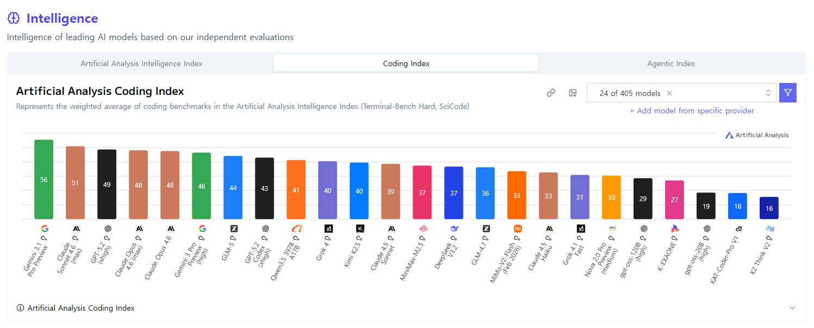
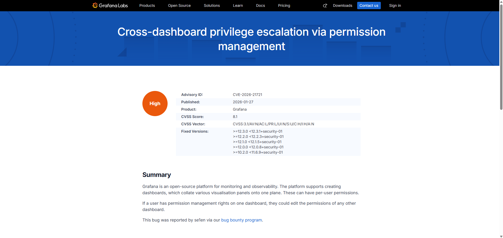

**Written by [Hyunseo Shin](https://se1en.tistory.com/)**
 

# How I Found Open-Source 0-days with an LLM Multi-Agent Workflow

If you would like to see the review written in Korean, please visit [se1en.tistory](https://se1en.tistory.com/6)

## Motivation for Creating the LLM Agent Workflow

Until now, my cybersecurity studies in University were mostly focused on wargames and CTFs. While finding vulnerabilities and successfully exploiting them in a controlled environment was fun, I always had a desire to find vulnerabilities in the "Real World."

Joining the BoB (Best of the Best, South Korea's cybersecurity training program) 14th Vulnerability Analysis Track made me realize that the paradigm of the security industry is shifting. Mentors mentioned that AI is becoming highly capable of hacking and will take over many parts of security in the future, emphasizing that the ability to utilize AI effectively will be a crucial skill for hackers. Seeing the AI Cyber Challenge (AIxCC) further convinced me that "AI for Security" will soon become the mainstream. This belief solidified as AI evolved beyond simple web UI chatbots to CLI-based tools like Claude Code and Codex, the emergence of MCP, and AI models taking first place on bug bounty platforms.

## Target Selection

Initially, I considered memory corruption vulnerabilities and black-box server bug bounties, but I pivoted for practical reasons.

- **Memory Vulnerabilities:** I built a dedicated workflow for memory corruption and found a few OOB (Out-of-Bounds) and Stack Overflow crashes. However, programs like Google's OSS VRP rarely accept simple crashes. They require exploit chaining that completely compromises integrity or confidentiality. Automating this process with AI is currently difficult due to security policies/guidelines. Plus, my background is stronger in web hacking than in binary exploitation (pwn), so I didn't feel I had a competitive edge there.
- **Black-box Server Bug Bounties:** I postponed this because there is a risk that AI might not perform vulnerability scanning safely, potentially crashing or breaking the server by sending aggressive payloads. (Companies like Theori with *Xint* or *xbow* in the US probably have the know-how to do this safely, but I'm not quite there yet.)

Ultimately, I targeted web open-source projects with massive codebases that I am most familiar with, such as Nextcloud, Matomo, and Grafana. Their code is transparently available, they can be easily spun up locally via Docker for reproduction, and I believed LLMs' contextual understanding would shine at finding complex business logic bugs that human eyes often miss.

## Architecture

I experimented with various workflows, but the two I currently use as my main drivers share a common structure: the 'Vulnerability Discovery' and 'False Positive Verification' stages are strictly separated. The core idea is not to use an expensive model for the entire process, but to efficiently route the data to the appropriate models at each stage.

I adopted this architecture inspired by Theori's 'RoboDuck' case from AIxCC. While RoboDuck used fuzzing (which consumes more tokens), seeing that it could cost over $1,000 per hour made me realize that to ensure sustainability, I couldn't just use the absolute best model for everything. I needed to mix and match models based on necessity.

While comparing benchmarks of various low-cost LLMs, I came across an article on GeekNews about the GLM model, which seemed to offer a great balance of performance and price. Among GLM models, the recently released GLM-5 performs about 20% better than GLM-4.7, but consumes three times as many tokens. Since web vulnerabilities often require detecting logic bugs like IDOR rather than highly complex reasoning, I decided that increasing the invocation frequency of a cheaper model would be more effective than using a slightly better one. Thus, I used the affordable GLM-4.7 as my primary workhorse.

*Coding Index benchmarks for each model*
- **Finding (GLM-4.7):** Searches for vulnerability candidates. I created several workflow variations by tweaking the prompt in this finding stage.
- **Semi-Triage (GLM-5):** Filters out obvious false positives from the candidates generated in Step 1 using GLM-5, which performs better than GLM-4.7.
- **Triage (Codex 5.3):** The surviving candidates are handed over to the top-tier model, Codex 5.3, for final verification.

For verified vulnerabilities that make it past the Triage stage, an alert is sent via Discord, and a vulnerability report is uploaded to Notion.

After reviewing the uploaded reports, I always manually reproduce and verify them before submitting a report. Since false positives can still remain even after Codex's verification, the final report is written based strictly on my manual reproduction results.

## Prompt Engineering

In the early days of running the workflow, there were quite a few false positives, so I experimented with and improved various prompts to fix this.

Most false positives occurred because one of the following three elements was flawed. Therefore, I had to force the AI to evaluate these three factors during verification:

1. **Attacker Condition:** What network position (internal/external) the attacker must be in, what privileges (Unauth/Admin/Guest) are required, and what specific inputs must be injected for the attack to succeed.
2. **Server Condition:** Server prerequisites, such as whether a specific plugin must be enabled, what the default configurations are, or if the bug only triggers on a specific OS/environment.
3. **Security Impact:** Not just stating it's "dangerous," but describing based on the CIA triad whether it allows data exfiltration, causes a Denial of Service (DoS), or results in simple information disclosure.

Many people try to solve this by 'asking' the AI in the prompt, like *"Please analyze considering the attacker's permissions"* or *"Keep server configurations in mind."* However, LLMs are fundamentally lazy. Ambiguous commands like 'consider' are easily skipped or glossed over during the reasoning process. By forcing the AI to explicitly output these three elements in its response, it was compelled to systematically analyze them, which drastically reduced false positives caused by these factors.

Once those three issues were resolved, a new type of false positive emerged: bugs that look like vulnerabilities at the source code level, but are actually intended behavior or out-of-scope under the specific open-source project's security model. I updated the prompt to search the project's official security documentation and policies to verify whether it was a true vulnerability or an intended design.

Through this process, the workflow could clearly distinguish between *bugs* and *vulnerabilities*, and the false positive rate of the vulnerability analysis workflow dropped significantly.

## Discovered Vulnerabilities

A personal takeaway from this project is that AI is surprisingly good at finding IDOR and business logic vulnerabilities. Traditional scanners merely trace data flow, but AI understands the 'context'—the purpose of an API and the security model it should operate under.

If a human were to perform this analysis manually, they would have to cross-reference tens of thousands of lines of API routing code with the complex interactions of the permission engine. Not only is it physically time-consuming, but as a human scans through thousands of parameters, their concentration wanes, making it easy to miss the crucial missing check. AI, however, does not get tired and systematically cross-references every API definition against the security model, showing overwhelming performance in catching subtle logical gaps that humans easily overlook.

The most representative case is the Privilege Escalation vulnerability (CVE-2026-21721) I found in Grafana's dashboard permission management API using this LLM workflow.

### Description

Grafana allows setting individual permissions (Read/Write/Admin) for each dashboard. Under a normal security model, a user should only be able to invoke the permission control API for specific dashboards where they are designated as a 'Permission Admin'.

However, the loophole the AI discovered was that Grafana's dashboard permission API (`GET/POST /api/dashboards/uid/<uid>/permissions`) did not validate the Scope of the target dashboard.

- **Root Cause:** When calling the internal permission validation logic `ac.EvalPermission`, it did not pass the target dashboard's UID scope as an argument. It only checked if the user possessed the `dashboards.permissions:read/write` action privilege.  Because of this, if a user has Admin privileges over even a *single* dashboard in the system, they obtain a valid privilege to perform the `dashboards.permissions:write` action. Since the server doesn't check *which* dashboard this privilege is directed at, the attacker can read or modify the permission data of all other dashboards they originally had no access to.

### Impact

This is a critical Privilege Escalation flaw where a user with admin rights over one specific dashboard can arbitrarily hijack the control of other sensitive dashboards within the organization. By assigning themselves as an Admin of other dashboards, the attacker gains full access to previously inaccessible data.

Ultimately, this flaw was assigned CVE-2026-21721 (CVSS 8.1). Questioning *"Why wasn't the UID scope passed as a validation argument here?"* while checking all permissions in a massive codebase is something a human security engineer might accidentally gloss over, but the AI pinpointed this logical inconsistency with the security engine accurately.

### Other 0-days

**Bug Bounty & CVEs**

- CVE-2025-66514 | CVSS 5.4 / XSS in **nextcloud mail** | (Bounty Awarded)
- CVE-2025-66558 | CVSS 3.1 / Improper Authentication in **nextcloud twofactor_webauthn** | (Bounty Awarded)
- CVE-2026-0994 | CVSS 8.2 / DoS in **protobuf**
- CVE-2026-21721 | CVSS 8.1 / Privilege Escalation in **grafana** | (Bounty Awarded)
- CVE-2026-22922 | CVSS 6.5 / Incorrect Use of Privileged APIs in **airflow** | (Bounty Awarded)
- *pending CVEs…*

**Bug Bounty (No CVE issued)**

- **Nextcloud Contacts** (pre-release) | CVSS 6.5 / IDOR in nextcloud contacts | (Bounty Awarded)
- **Matomo** | Security issue reported via HackerOne | (Bounty Awarded)
- **Matomo Official plugins** | Security issue reported via HackerOne | (Bounty Awarded)
- **Matomo Official plugins** | Security issue reported via HackerOne | (Bounty Awarded)
- **Matomo Official plugins** | Security issue reported via HackerOne | (Bounty Awarded)
- **Grafana** | Security issue reported via Intigriti | (Bounty Awarded, pending CVE)
- **Owncloud** | Security issue reported via YesWeHack | (Bounty Awarded, pending CVE)
- **Discourse** | Security issue reported via HackerOne | (8 Bounties Awarded, pending CVEs)

Newly discovered 0-days will be updated in the `About Me` section of my [blog](https://se1en.tistory.com/4).

## Future Outlook

As I searched for vulnerabilities directly using an AI workflow, a deeper question formed in my mind: *"If AI is this good, will there be a place for me in the future?"* I still have more than three years left before I enter the job market, and by then, the world will likely be filled with AI far more advanced than what we have today.

While I don't know everything about the security industry yet, my personal assumption is that simple vulnerability discovery tasks by red teams will decrease significantly. The mainstream flow will likely shift towards AI performing real-time security diagnostics during the development workflow to preemptively block vulnerabilities, alongside AI vulnerability analysis agents actively hunting for bugs. Not all red teams will disappear, but I believe AI will take over a substantial portion of the manual tasks they currently handle.

However, I don't think the role of humans will vanish completely. Strategizing how to fix discovered vulnerabilities to align with business contexts, or establishing and operating a company's unique security policies, are areas where human discussion and decision-making will remain essential, regardless of how advanced AI becomes.

Therefore, I plan to focus my studies in two main directions moving forward:

- **AI for Security:** Learning to design and build AI workflows that hunt for vulnerabilities, just like this project.
- **Blue Team & Security Architecture:** Moving beyond purely offensive (red team) skills to understand real-world corporate security policies and infrastructure.

Of course, this is merely the personal speculation of a student studying security, not an industry veteran. However, rather than resisting the massive wave of AI that is approaching, I believe that the hacker who learns to wield this tool most effectively will hold a significant advantage.
