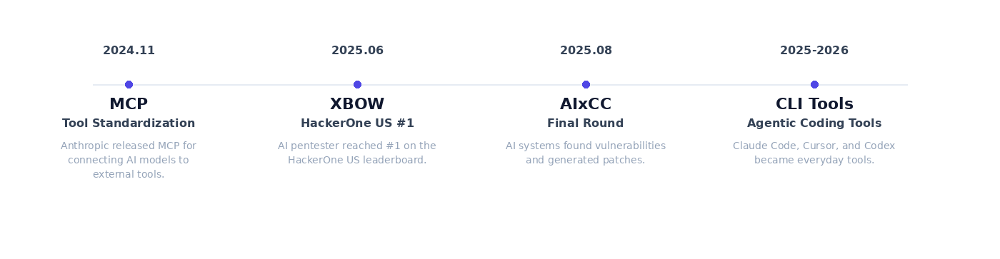
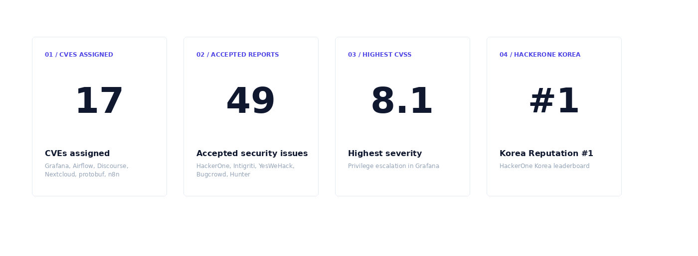
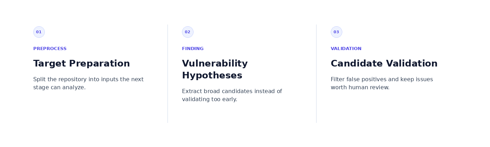
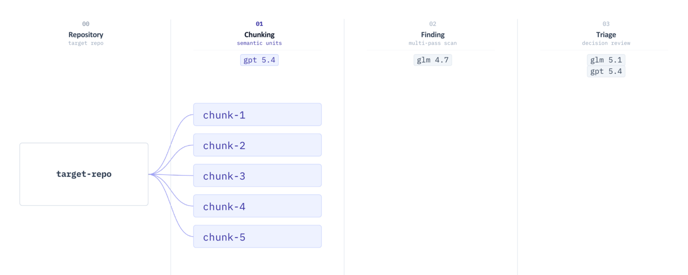
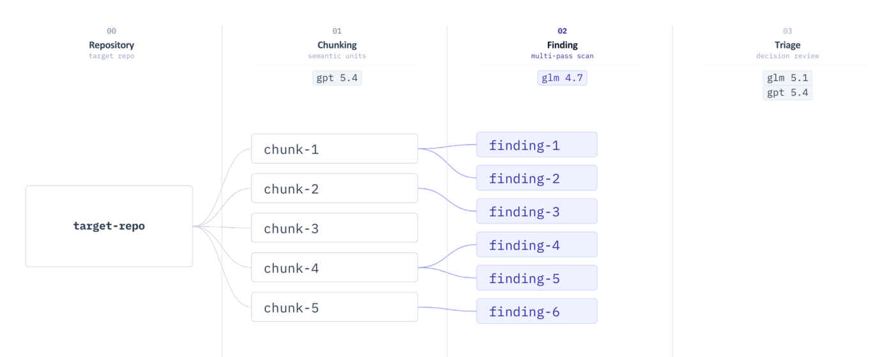
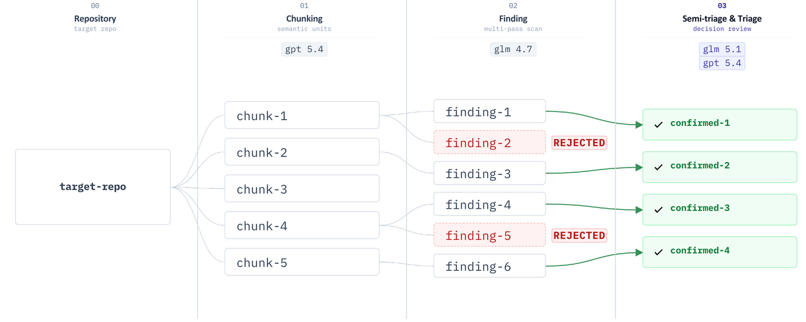

If you would like to read the Korean version, please visit [se1en.tistory](https://se1en.tistory.com/15).

In May 2026, I gave a talk at OWASP Seoul about building an AI-based vulnerability detection workflow. In the talk, I covered how I built and ran the workflow for about half a year, and where its limits started to show.

## It Started With One Question: Can AI Find Real 0-Days?

At first, I was skeptical. Finding a vendor-accepted 0-day with AI in a real, actively maintained open source project felt like a completely different problem.

But over the past year, the AI security landscape had clearly changed. MCP started to standardize how models call external tools. AI pentesters like XBOW began showing visible results on bug bounty platforms. AIxCC showed that AI systems could find vulnerabilities and generate patches. Agent-based CLI tools like Claude Code, Cursor, and Codex also became part of many developers' daily workflow.

Seeing that shift made me want to try using AI for vulnerability research myself. But I did not think opening a repository and asking a model to "find vulnerabilities" would hold up for long. More people would keep using the same tools, so the difference would come from the methodology around how AI is used.

## Results After Half a Year

First, the numbers.

At the time of the talk, 17 issues had been assigned CVEs. The figure of 49 accepted vulnerabilities includes those CVEs as well as security issues accepted through bug bounty platforms or vendor validation.

The full list of vulnerabilities I found is available [here](https://se1en.tistory.com/4).

I was ranked #1 in Korea by HackerOne reputation at the time of the talk.

The highest-impact case was a privilege escalation vulnerability in Grafana. Grafana allows permissions to be configured per dashboard. For example, a user may have admin access to one dashboard while having no access to another.

The problem was in the permission management API. The scope of "the dashboard I have permission for" and "the dashboard I am trying to modify" did not line up correctly. With admin permission on only one dashboard, a user could read or modify permission information for other dashboards.

The attacker did not need high privileges. Administrator permission on a single dashboard was enough to satisfy the attack condition, and it was possible to add oneself as an Admin to a dashboard that was originally inaccessible. The CVSS score was 8.1.

## The Workflow I Built

### The Structure Converged Into Three Stages

After building and discarding several versions of the workflow, it eventually settled into three stages: preprocessing the target, generating vulnerability hypotheses, and validating the candidates.

The structure looks simple, but the results changed significantly depending on how clearly the responsibilities of each stage were separated. The preprocessing stage needs to transform the input into a form that later stages can use effectively. If the candidate generation stage tries to validate too aggressively, it may reduce the number of candidates but also throw away good ones. If the validation stage is weak, false positives pile up until they become too much for a human to review.

### Why I Mixed Models

At the time, I used GLM 4.7, GLM 5.1, and GPT 5.4. Roughly speaking, performance improved in that order, and the cost increased as well.

Using only the strongest model from the start would make the system simpler. The problem is cost. A large open source repository can produce tens or hundreds of chunks. If each chunk triggers multiple LLM calls, a single repository can require hundreds or thousands of calls. Using the most expensive model for every stage quickly becomes hard to justify.

So in my workflow, I used different models depending on the role of each stage. For stages with many calls, I paid more attention to cost. For stages where judgment quality mattered more, I used a stronger model.

From here, I will walk through the workflow I actually used.

### Stage 1: Preprocessing the Target

You cannot put an entire repository into an LLM context as-is. There is too much code, and when the model sees too many files at once, it can miss important flows.

So I split the codebase into chunks based on file size.

If chunks are too large, later stages can miss detailed logic. If chunks are too small, the number of calls explodes. I did not use this stage to judge vulnerabilities. I used it to create input units of a suitable size for the next stage to analyze.

### Stage 2: Generating Vulnerability Hypotheses

Each preprocessed chunk was sent to an LLM to broadly extract potential vulnerability candidates. At this stage, reducing missed candidates mattered more than precision. False positives can be filtered later, but a missed candidate is hard to recover.

I did not ask the model to validate much here. The role was closer to "find as many potentially attackable points as possible" than "decide whether this is a real vulnerability." This stage collected candidates such as missing authorization checks, IDOR, input handling mistakes, and business logic inconsistencies.

I used GLM 4.7 for this stage. It was weaker than GLM 5.1, but much cheaper. In practice, many vulnerability candidates did not require deep reasoning up front. At this stage, it mattered more to scan many chunks quickly without missing suspicious points than to make one difficult judgment perfectly.

### Stage 3: Validating Vulnerability Candidates

The validation stage was the part I changed the most. The output from the candidate generation stage contained many false positives. A piece of code can look vulnerable in isolation, but the attacker condition may not hold, an upper layer may already block it, or the impact may be too ambiguous to treat as a security issue.

So I split validation into two passes. First, GLM 5.1 removed obvious false positives. Only the surviving candidates were reviewed again with GPT 5.4. This meant I did not have to run GPT 5.4 on every candidate, and the final set consisted only of candidates that had passed two rounds of validation.

Even after this stage, a human still had to reproduce and judge the final result.

## Limits of AI-Based Vulnerability Detection

After running this for half a year, I ran into three major limits.

### It Is Still Expensive for Individual Bug Hunters

A large open source repository can produce tens or hundreds of chunks. If each chunk triggers multiple LLM calls, a single repository can require hundreds or thousands of calls.

The problem is that bug bounty rewards are never guaranteed. For many repositories, there is no reward at all. When things go well, it may be a few hundred to around a thousand dollars. But when calculated with API token prices, analyzing a large repository can cost hundreds or thousands of dollars.

I was able to run this workflow because GLM models were extremely cheap at the time I started using them. At today's prices, I probably could not have done it. The ROI may work for companies scanning their own codebases or for B2B security scanning services, but it is still a heavy cost for individual bug hunters.

### The Gray Zone of Vulnerabilities

AI tends to judge risk from code patterns. When it sees patterns related to SSRF, XSS, IDOR, or RCE, it often classifies them as vulnerabilities without enough policy context.

In practice, however, whether something is a vulnerability can be decided by policy rather than code alone.

Consider a SaaS product with a per-user AI token limit. A user has already consumed 99% of the monthly token budget, then sends a large request. The service processes the request to completion, causing the user to exceed the limit.

In practice, GPT tends to finish an in-progress request even after a limit is exceeded, while Claude stops mid-request when the limit is reached. Many SaaS products built on AI APIs behave similarly and allow the last in-progress request to complete. In other words, this behavior may be an intentional policy.

From code alone, this can look like a "token limit bypass." But if the service policy says "in-progress requests are allowed to finish," then it is intended behavior. If that policy is not documented, the code alone is not enough to decide whether it is a vulnerability.

A human looks for the policy document first. If the behavior is documented, it is intended. If it is not documented, the team has to discuss it. LLMs struggle with this kind of judgment. Even when policy documents exist, they often do not describe these edge cases, and the model may not conclude that the team needs to decide.

### Responsibility Boundaries

An LLM usually analyzes one repository. Real services, however, are made of multiple connected components. Because the model cannot see code outside the repository being analyzed, it is difficult to decide which component is responsible for a security control.

Take a SaaS product that sends emails. The structure is simple: the SaaS creates the email content and sends a delivery request, the mail server relays it to the recipient, and the mail client renders the HTML. Notification emails and password reset emails often follow this structure.

If the SaaS inserts user input into the email body without escaping it, the SaaS code alone can look like XSS.

How would a human judge it? They would look at the full service structure. In practice, most mail clients apply strong HTML sanitization, so even if the SaaS does not escape the value, the client may block the attack. In many cases, XSS does not actually happen. Even if it does happen in a specific mail client, it can be unclear whether the responsibility belongs to the SaaS or the mail client.

An LLM may only see the SaaS code and conclude, "there is no escaping, so this is vulnerable." Even if another repository is added, it is still hard to decide which component should own the escaping responsibility. As a result, the issue may still be detected as a vulnerability.

I described three limits, but none of them are necessarily impossible to overcome. They are simply problems I often ran into while using AI for vulnerability analysis. Areas that require human context, especially policy judgment, still remain difficult to handle cleanly.

## What's Next

I will keep running the workflow for open-source repositories. At the same time, my attention has started moving to the next step. So far, I have worked in a white-box environment where source code is available. Next, I want to build a workflow for black-box apps and web targets, where I have to reason from behavior without source code. I want to figure out how the approach needs to change by building it myself.

Personally, I also want to attend more conferences and seminars. Preparing this talk made me revisit limitations and ambiguous points that I had usually glossed over, and listening to other people's talks gave me new topics I want to experiment with. If I get more chances to present, I want to keep doing it.
