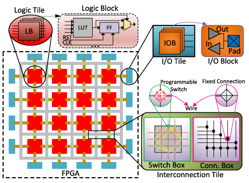
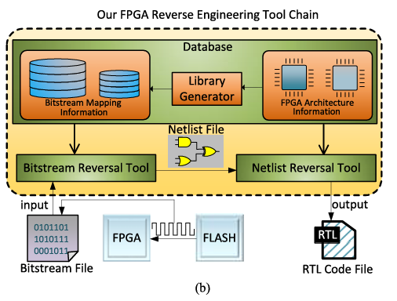
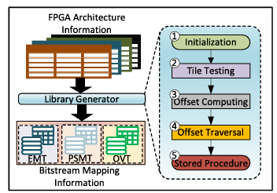
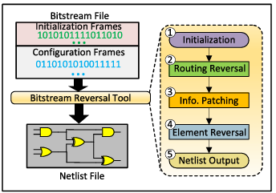
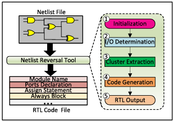
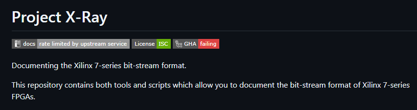

Written by [JinkyungBae](https://www.linkedin.com/in/jinkyung-bae-a6a2ab287?utm_source=share_via&utm_content=profile&utm_medium=member_ios)
 

This post explores the reverse engineering of bitstream files loaded onto FPGA boards. Since it has a slightly different flavor compared to traditional system hacking, software reversing, web, or cryptography, I thought it would be an interesting topic to share. Below are the reference papers and open-source projects covered in this post:

[1] [A Comprehensive FPGA Reverse Engineering Tool-Chain: From Bitstream to RTL Code](https://ieeexplore.ieee.org/document/8653869/)

[2] [Hardware Reverse Engineering: Overview and Open Challenges](https://ieeexplore.ieee.org/document/8031550)

[3] [Reverse Engineering for Xilinx FPGA Chips using ISE Design Tools](https://www.kci.go.kr/kciportal/ci/sereArticleSearch/ciSereArtiView.kci?sereArticleSearchBean.artiId=ART002646262)

[4] [비트스트림 역공학을 활용한 FPGA 하드웨어 악성기능 탐지 기법 연구](https://www.kci.go.kr/kciportal/ci/sereArticleSearch/ciSereArtiView.kci?sereArticleSearchBean.artiId=ART002711182)

[5] [Project X-Ray](https://github.com/f4pga/prjxray)

## 1. Background Knowledge

First, let's briefly go over what an FPGA board and a bitstream actually are.

- FPGA (Field Programmable Gate Array): A semiconductor chip that allows users to program digital circuits as desired after manufacturing.
- Internal Structure: Resources like LUTs (Look-Up Tables), FFs (Flip-Flops), and PIPs (Programmable Interconnect Points) are arranged in a 2D tile format.
- Circuit designs written in Verilog/VHDL go through Synthesis → Placement → Routing processes, ultimately converting into a binary file known as a bitstream.
- When the bitstream is loaded onto the FPGA (in the case of widely used SRAM-based FPGAs), the configuration values are written to the internal SRAM to implement the intended circuit.

In short, a bitstream is a binary containing all the configuration bits (LUT INIT values, FF settings, PIP on/off states, etc.) for the FPGA's internals.

An FPGA is a 2D array of units called "tiles." Among various tiles (CLB, BRAM, DSP, etc.), the CLB (Configurable Logic Block) tile contains functional elements like LUT, FF, MUX, and carry chains. LUTs implement combinational logic, FFs store the state of sequential logic, and MUXes select the output from the LUTs or FFs. The combination of these basic elements forms the CLB.

## 2. Why is Bitstream Reversing Necessary?

According to paper [4], there is a significant risk of Hardware Trojans being injected during the FPGA system development process.

A Hardware Trojan is a malicious circuit inserted intentionally during development. A malicious developer might insert it directly, or it could be injected by overwriting the FPGA with a changed bitstream. These tampered circuits can cause severe damage, such as increased power consumption or information leakage, making early detection crucial.

Besides reverse engineering, malicious functions can also be detected via side-channel analysis and logic testing. Side-channel analysis detects anomalies by observing physical characteristics like power consumption patterns, while logic testing forces hidden circuits to execute by supplying various input vectors. However, malicious features stealthily injected at the bitstream level can bypass these dynamic detection methods. Therefore, inspecting the bitstream itself is essential.

You might wonder, "Can't we just detect this at the Verilog stage?" The reality is that most end-users receive the final binary bitstream, not the Verilog source code. Therefore, verification is required to ensure the bitstream wasn't tampered with during the supply chain process.

## 3. Differences: Verilog → Bitstream vs. C → Binary

This was my biggest question during the research. Most binary files we typically reverse engineer can be decompiled to some extent using tools like IDA Pro or Ghidra. However, this is not the case for bitstream files.

Why is software reversing (Binary → C) possible? The biggest reason is standardized architecture. With public ISAs (Instruction Set Architectures), standardized executable formats (ELF/PE), and a 1:1 mapping between assembly and machine code, tools like IDA and Ghidra can systematically transform binaries into assembly and pseudocode.

Why is hardware reversing (Bitstream → Verilog) so difficult? First, the base format is proprietary. FPGA vendors (like Xilinx/AMD) do not disclose their mapping information. Furthermore, during the synthesis of Verilog code, extensive optimization occurs and default configurations are added, making it difficult to distinguish the original logic from default configurations.

| **Category**                 | **Software (C → Binary)**    | **Hardware (Verilog → Bitstream)**                   |
| ---------------------------- | ---------------------------- | ---------------------------------------------------- |
| **Instruction Architecture** | Public ISAs (x86, ARM, etc.) | Closed / Vendor Proprietary                          |
| **File Format**              | Standardized (ELF, PE)       | Proprietary to each vendor                           |
| **Reversing Tools**          | IDA, Ghidra                  | Lack of universal tools; mostly academic/open-source |
| **Mapping Relation**         | Opcode ↔ Instruction (1:1)   | Bit position ↔ Config meaning (Undisclosed)          |
| **Recovery Level**           | Pseudocode (similar to C)    | Flat Netlist level (Gate-level)                      |

## 4. Bitstream → Verilog Reversing Pipeline

Bitstream reversing generally consists of two phases: Bitstream → Netlist, and Netlist → RTL Code.

The first phase recovers which LUT, FF, and PIP were used. The second phase converts this netlist back into human-readable logical Verilog code. Paper [1] details this pipeline as follows:

### Library Generator

This builds the database, overcoming the biggest hurdle in bitstream reversing. In the Initialization step, an empty netlist is created and converted into a bitstream. In the Tile Testing step, bits are added one by one to generate bitstreams. By comparing these with the initial empty bitstream, the address of each bit is identified. Since identical tiles in an FPGA share the exact same structure, calculating the position difference reveals the offset. With this offset, a single Tile Testing session can uncover all bit addresses for that specific tile type. Data is stored in three main tables:

- EMT (Element Mapping Table): Mapping of elements within baseline logic/IO tiles.
- PSMT (Programmable Switch Mapping Table): Mapping of switches within baseline interconnection tiles.
- OVT (Offset Values Table): Offsets of the tiles relative to the baseline.

### Bitstream Reversal Tool (BRT)

First, the bitstream file and DB are loaded. By combining the bitstream and the PSMT, turned-on programmable switches are identified. Using each ON switch as a starting point, a BFS (Breadth-First Search) is performed to recover the signal net (a set of connections delivering the same signal from one source element to one or more sink elements). The reason simple DB mapping isn't enough is due to MVOE (Multiple Values for One Element). MVOE means that the same config bit values can correspond to multiple working patterns, making it hard to judge based on config bits alone.

### Netlist Reversal Tool (NRT)

This tool converts the netlist structure generated by the BRT into a predefined data structure. IO ports are classified as input or output depending on whether they are used as source ports in the net. A DFS (Depth-First Search) is then executed for each output port to create a signal path cluster (a bundle of paths starting from multiple input ports and reaching a single output port). Finally, transforming each cluster into corresponding RTL code completes the pipeline.

## 5. Open Source Projects

Most of the four reference papers utilized the ISE design suite. However, Vivado is the official toolset for the modern Xilinx 7-Series. Since the XDL/XDLRC files used in earlier research are not supported in Vivado, those academic methods cannot be directly applied to modern FPGAs.

Fortunately, modern FPGAs are not completely uncharted territory. An open-source initiative called Project X-Ray has built a massive mapping DB, and a tool called bit2fasm can convert bitstreams into FASM format. FASM is an intermediate step before the netlist, providing chip coordinates and corresponding values. However, it should be noted that even if converted to a human-readable format, completely restoring this to the original RTL code intended by the developer requires substantial further research.

## 6. Required Information for Bitstream Reversing

If we were to build a bitstream decompiler like IDA, what would we actually need?

Assuming we successfully recovered the bitstream into FASM using bit2fasm, the next step is to reconstruct it by functional blocks. The main functions include CLB, Storage, Routing & CLK Distribution, System & CLK Control, and External I/O.

The hardest part here is Routing Structure Recovery. PIPs (Programmable Interconnect Points) are the core data dictating the circuit's routing paths and ultimately determine the accuracy of the reverse engineering.

The core of logical structure recovery lies in the CLB (LUT, FF, MUX). Let's look at how paper [4] handles LUT recovery:

- LUT Configuration Data Offset Extraction: To reverse LUT information, the configuration data offsets for each LUT are required. Similar to the method used by [1], they designed circuits to insert different values into a specific LUT, generated the bitstreams, and mapped the differences.
- Used Input Pin Reversing: To understand what circuit is implemented in a LUT, we must know where the inputs come from. If a LUT's input pin and the PIP connected to it are active, the input pin is considered "in use."
- INIT Attribute Recovery: The optimization phase during bitstream generation makes reversing extremely tricky. The paper notes the necessity of recovering the INIT attribute values originally entered by the user. By implementing a LUT that stores an INIT attribute with only a single bit set to 1 and extracting the config data from that bitstream, the mapping relationship can be deduced.

## 7. Conclusion

Existing academic research heavily focuses on older ISE-based boards. Therefore, reversing research on modern architectures like the 7-Series and UltraScale is currently driven primarily by the open-source community. Furthermore, in modern SoC FPGAs, the PS (Processing System, i.e., software/ARM cores) and PL (Programmable Logic, i.e., hardware) domains coexist, which calls for additional integrated analysis.

I believe future research should focus on: creating new pipelines based on open-source DBs (without relying on XDL/XDLRC), distinguishing between actual intended structures and arbitrary structures added by optimization in the recovered netlist, and improving the accuracy of Hardware Trojan detection techniques utilizing bitstream reversing.