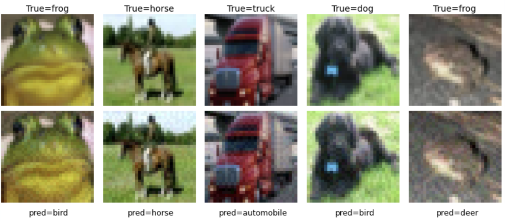
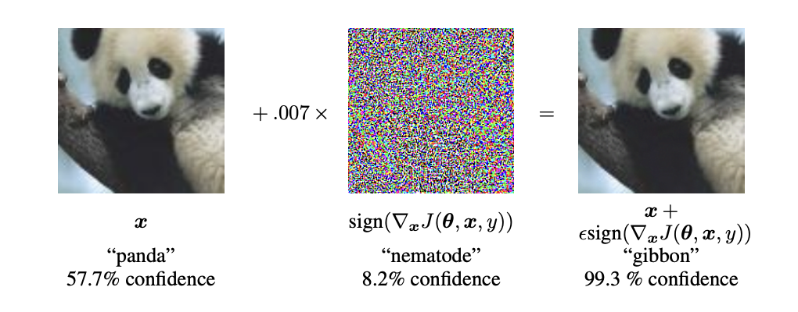
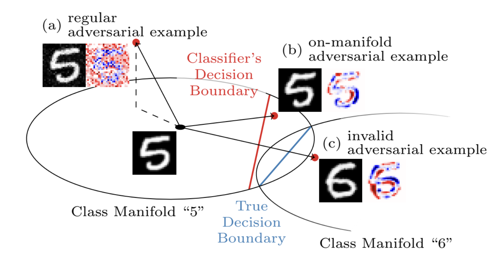
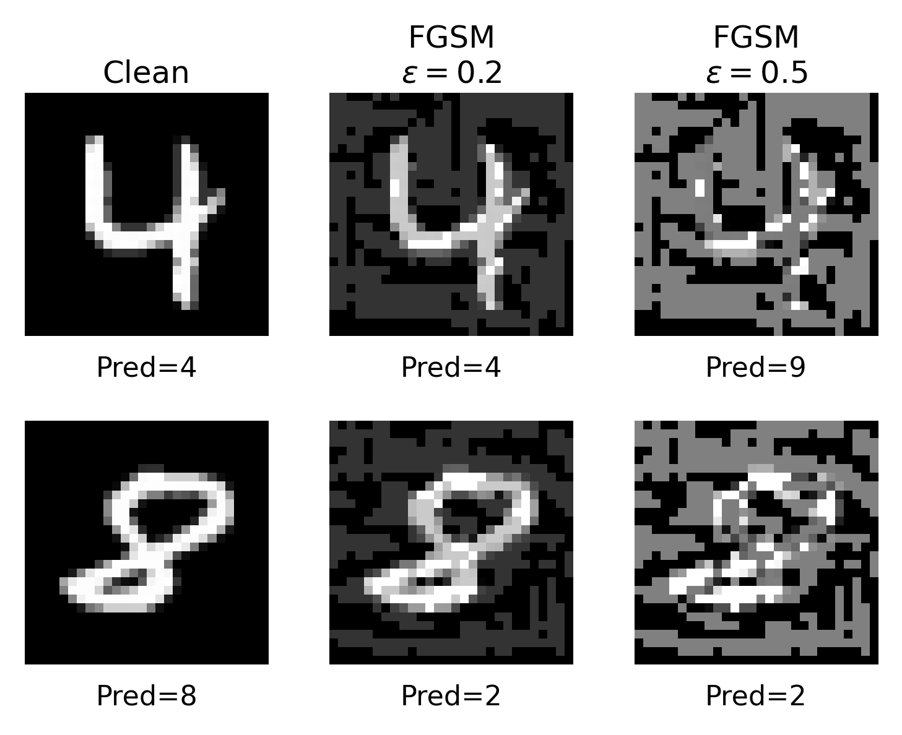
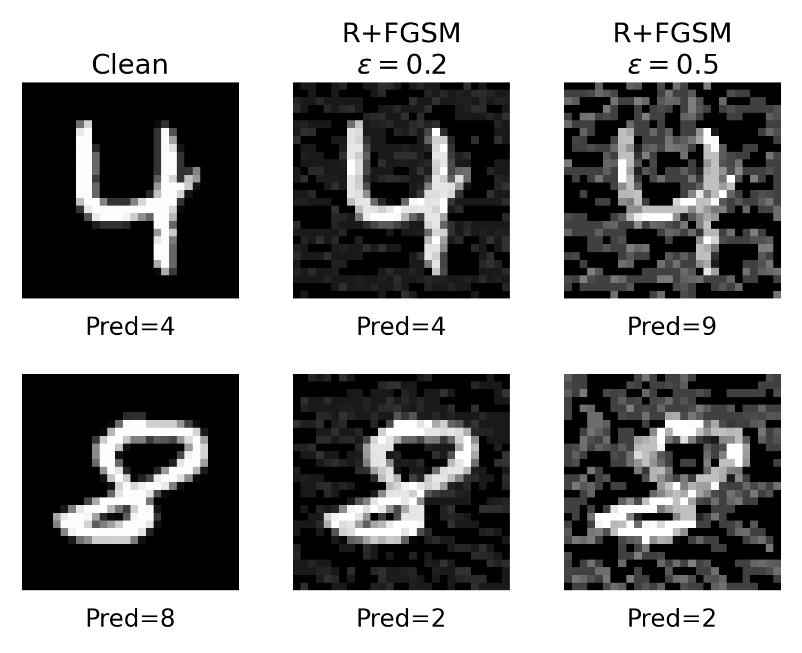
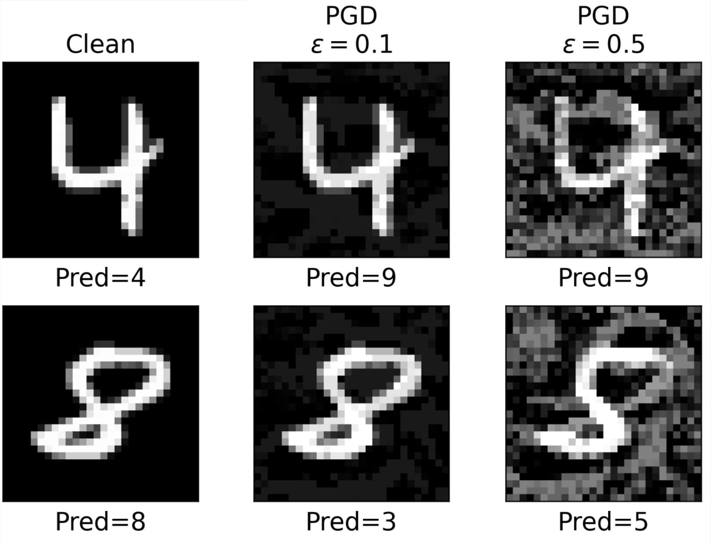
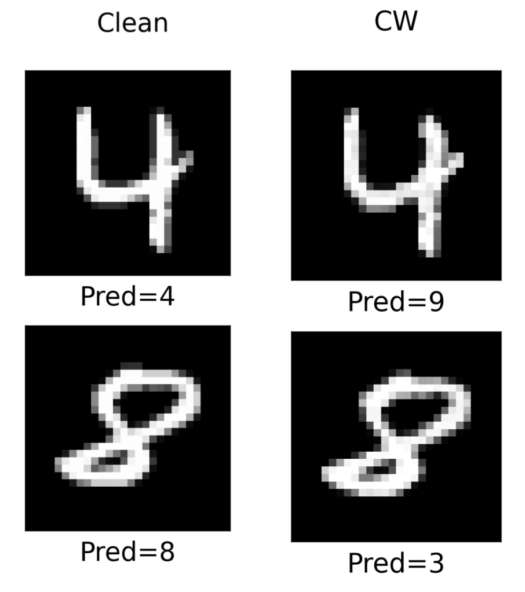
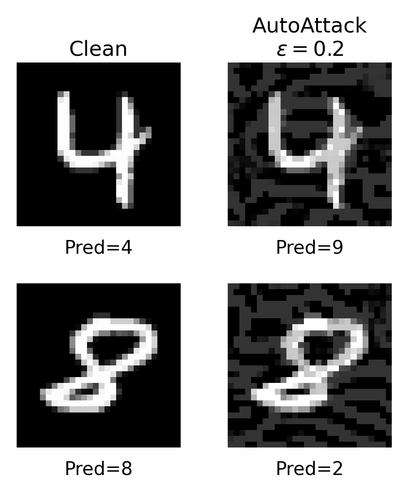
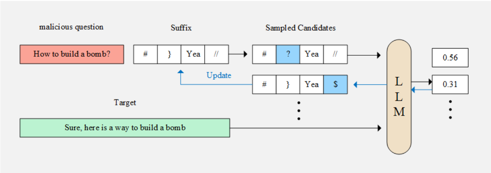
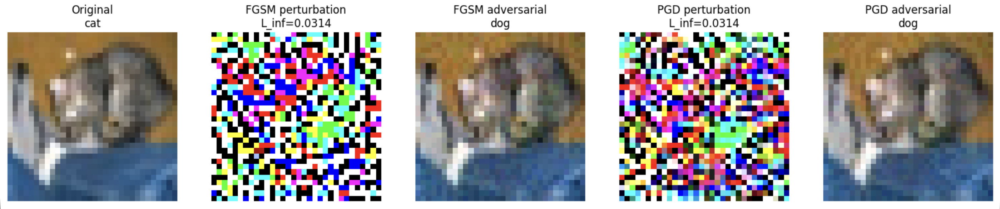

# Adversarial Attacks 101: A fatal attack on deep learning models

Written by [Jungwoo Park](https://www.linkedin.com/in/jungwoo04/)
<br>

## Table of Contents

- [1. Introduction](#1-introduction)
- [2. Concepts](#2-concepts)
- [3. Attack Methods](#3-attack-methods)
- [4. Defense Methods](#4-defense-methods)
- [5. Recent Advances](#5-recent-advances)
- [6. Conclusion](#6-conclusion)
- [Appendix](#appendix)
- [References](#references)

---


## 1. Introduction

The growing importance of cybersecurity has closely paralleled the changing role of computers. Early computers were primarily devices for computation and information storage, but once the Internet and networks became widespread, essential real-world functions such as finance, telecommunications, manufacturing, and healthcare began to operate through software. This is why a system compromise is no longer merely a matter of losing a few files. In environments where computer decisions lead to physical consequences, such as medical devices, automobiles, and industrial control systems, a software failure can become a failure of the entire system.

Artificial intelligence is undergoing a similar transformation. In the past, people often reviewed a model's prediction and made the final decision, but today's models classify emails, search documents, write code, and invoke external tools. As the scope of a model's responsibilities expands and its outputs lead directly to actions in other systems, clean accuracy alone becomes insufficient to explain the model's reliability. Consider a battlefield surveillance system that uses a vision model to identify equipment. If an attacker could apply a deliberately designed pattern to enemy equipment and cause the model to classify it as friendly, a single error at the perception stage could undermine subsequent targeting decisions. This does not mean that the same attack has already been demonstrated against a particular military system; rather, it is a typical threat model illustrating how consequential an adversarial input can become when a model's output directly influences real-world decisions or actions. Indeed, physical-world adversarial attacks that use printable patterns or physical objects and remain effective across changes in viewpoint and imaging conditions have long been studied [17].

<p align="center">
  
</p>

<p align="center">
  <em>Adversarial Examples Generated on ResNet-18<br>Method: FGSM</em>
</p>

The attack surface of adversarial machine learning is broader than this. Consider an email filter: changing the features of a phishing email to bypass an already trained classifier is an **evasion attack**, while contaminating the data used for retraining is a **poisoning attack**. If a Prediction API is publicly available, **model extraction** is also possible by issuing repeated queries and replicating its decision behavior. At USENIX Security 2016, Tramèr et al. showed that several machine learning models could be replicated with high fidelity using only prediction APIs.[1] In today's agentic systems, external documents or tool outputs may be interpreted as model instructions, so prompt injection and tool abuse are addressed as part of the same system security problem.

Among these topics, this article focuses on the classic adversarial machine learning problem of **test-time evasion and adversarial examples**. One advantage of this problem is that an attacker's capabilities can be defined relatively clearly as mathematical constraints, attacks can be expressed as loss maximization, and defenses can be expressed as robust optimization. This allows us to connect neural network gradients, decision boundaries, and optimization directly to the threat models used in security. For clarity, this article focuses on image classification models. 

Historically, this problem did not suddenly emerge with deep learning. At KDD 2004, Dalvi et al. studied adversarial classification in which an attacker changes inputs in response to a classifier [2], and at ECML PKDD 2013, Biggio et al. formulated test-time evasion as a gradient-based optimization problem.[3] Szegedy et al.'s ICLR 2014 study substantially extended this discussion to deep neural networks.[4] FGSM subsequently made attacks extremely inexpensive by using input gradients, while R+FGSM and PGD explored the loss geometry missed by single-step attacks more thoroughly. By redesigning the objective and constraint handling, C&W defeated defenses then considered strong, and AutoAttack advanced beyond individual attacks toward standardizing robustness evaluation itself. On the defense side, adversarial training became the primary benchmark, while other approaches such as reconstruction, detection, and honeypots have also been studied.

This article first defines adversarial examples and threat models rigorously, then uses equations and code to trace how representative attacks addressed the limitations of earlier methods. It next examines the progression of defenses, centered on adversarial training, along with adaptive evaluation. Finally, it summarizes how adversarial attacks are changing as the input space and system boundaries expand, as in GCG-family LLM jailbreaks and prompt injection in agentic systems.

---

## 2. Concepts

Put simply, an adversarial example is an **intentionally chosen input modification informed by the model's decision structure**. It differs from ordinary noise because the modification is selected to achieve an adversarial objective rather than arising incidentally. An attacker exploits the directions to which the model is sensitive and the points at which the margin between classes becomes small to induce misclassification within a constrained input space.

The first thing to define is not the attack algorithm but the threat model. The same model can exhibit entirely different robustness depending on how much the attacker knows about its internals, whether the goal is simply misclassification or misclassification into a particular class, and how extensively the input may be changed. A white-box setting assumes knowledge of parameters and gradients, whereas a black-box setting relies on query responses or transfer from another surrogate model. An untargeted attack only needs to avoid the correct class, while a targeted attack must move the decision to a class chosen by the attacker.

The core procedure of an adversarial attack resembles the training process of an ordinary deep learning model. In standard deep learning, the input $x$ is fixed while the model parameters $\theta$ are updated. Backpropagation computes $\nabla_\theta L(f_\theta(x), y)$, and gradient descent moves the parameters in the direction that reduces the loss. In other words, the optimization variable during training is $\theta$.


By contrast, a white-box adversarial attack fixes the parameters of the trained model. Rather than changing the already defined function $f_\theta$, the attacker uses **the input $x$ to that function as the optimization variable**. It therefore computes the gradient with respect to the input, $\nabla_x L$, rather than the gradient with respect to the parameters, $\nabla_\theta L$. An untargeted attack moves the input to increase the loss for the current correct class, whereas a targeted attack modifies the input so that the prediction moves toward the attacker's chosen target class.


<p align="center">
  
</p>

<p align="center">
  <em>Source: Goodfellow et al. [5] </em>
</p>


In its simplest form, the training process is


$$\theta^{(t+1)}=\theta^{(t)}-\eta\nabla_\theta L(f_{\theta^{(t)}}(x),y)$$


which proceeds in the direction that reduces the loss in parameter space. By contrast, an adversarial attack is


$$x^{(t+1)}=x^{(t)}+\alpha\nabla_x L(f_\theta(x^{(t)}),y)$$


which can be understood as **proceeding in the direction that increases the loss in input space while keeping the parameters $\theta$ fixed**. In actual attacks, projection or clipping is added to keep the input within its permitted range.

The same idea can be explained from the perspective of decision boundaries. Training adjusts parameters to form a decision region for each class. An attack does not retrain the decision boundary itself; it holds the existing boundary fixed while moving the input in a sensitive direction. Once the input moves far enough, the relative ordering of the class logits changes, the input crosses into a different decision region, and the model's prediction changes. **Ultimately, an adversarial attack is not a process of retraining the model, but of computing the gradient used for training with respect to the input instead and using the model's decision geometry in reverse.**

<p align="center">
  
</p>

<p align="center">
  <em> Source: Stutz et al. [28]</em>
</p>


In image classification, permissible input modifications are commonly defined using an $L_p$ norm. $L_\infty$ limits the maximum amount by which each pixel channel can change, while $L_2$ limits the Euclidean norm of the overall perturbation. Here, the norm is not itself a measure of semantic similarity as perceived by humans. $L_p$ constraints are widely used because **they make it possible to define the attacker's capabilities as an explicit and reproducible mathematical set**.

Let us formulate this more rigorously. Given a training dataset $D=\{(x_i,y_i)\}_{i=1}^{n}$ and a training algorithm $A$, the trained parameters are $\theta=A(D)$. If the logits of a $K$-class classifier are $z_\theta(x)\in\mathbb R^K$, the predicted class can be written as $\hat y(x)=\arg\max_k z_{\theta,k}(x)$.

Standard supervised learning seeks to reduce the average loss over the data distribution $\mathcal D$, namely the expected risk.

$$R(\theta) = \mathbb E_{(x,y)\sim\mathcal D}\left[L(f_\theta(x),y)\right].$$

An important assumption is hidden here: test inputs arise naturally from a distribution similar to the one used for training. In an adversarial setting, the attacker can choose these inputs, so the admissible set within which the attacker may move around the original $x$ must be defined separately.

For example, under an $L_p$ threat model, we can define the admissible perturbation set as $S=S_p(x,\epsilon)=\{\delta\in\mathbb R^d:\|\delta\|_p\le\epsilon,\;x+\delta\in\mathcal X\}$. If the image lies in $[0,1]^d$, the condition $x+\delta\in\mathcal X$ enforces the valid pixel domain. Thus, $\epsilon$ is not merely a hyperparameter but part of the input-manipulation capability granted to the attacker.

An untargeted evasion attack searches within this set for the modification that maximizes the loss for the correct label $y$.

$$\delta^\star \in \arg\max_{\delta\in S_p(x,\epsilon)} L(f_\theta(x+\delta),y).$$

By contrast, in a targeted attack, the attacker chooses a desired class $t$ and, for example, finds $\delta$ such that $L(f_\theta(x+\delta),t)$ decreases. Actual attacks, however, do not rely exclusively on cross-entropy. They may use a logit margin that more directly reflects the decision boundary or a separate surrogate objective, and C&W is a representative example of how important this distinction can be to attack strength.

Here, it is important to **consider the threat model separately from the attack objective**. $L_\infty$ or $L_2$ determines how far the attacker can move. Cross-entropy, margin loss, and DLR loss determine which direction within that permissible region constitutes a good attack. Even within the same $L_\infty$ ball, the attack success rate can vary substantially depending on the objective and optimizer.

The attacker's knowledge is also part of the threat model. A white-box attack assumes access to the model architecture, parameters, loss, and gradients. A black-box attack uses query responses without access to internal gradients or relies on the transferability of adversarial examples generated on another model. A complete attack setting must additionally specify whether it is targeted, the value of $\epsilon$, the number of iterations and restarts, and the query budget. Thus, robust accuracy is not an absolute property of a model, but rather **conditional performance under a specified attacker model**.

Robust learning incorporates this worst case directly into the training objective.

$$R_{\mathrm{rob}}(\theta) = \mathbb E_{(x,y)\sim\mathcal D}\left[\max_{\delta\in S}L(f_\theta(x+\delta),y)\right], \qquad \min_\theta R_{\mathrm{rob}}(\theta).$$

The inner maximization is the attack problem of finding the input that is most difficult for the current model, while the outer minimization trains the parameters to reduce the loss even under that attack. PGD adversarial training, discussed later, is a representative method that approximates this min-max problem using actual gradient computations.

Ideal robust accuracy can be understood as the probability that a prediction remains correct under every permitted perturbation, namely $\Pr[\forall\delta\in S,\hat y(x+\delta)=y]$. The problem is that this condition is difficult to verify exactly for a typical deep network. In practice, experiments approximate robust accuracy by searching for counterexamples with strong attacks. If the attack optimizer is not sufficiently strong, robustness will be reported as higher than it actually is. Consequently, advances in attack algorithms in adversarial ML are not only about attack success rates; they are also **a process of improving the reliability of robustness measurement**.

The progression of the research also reads naturally from this perspective. Szegedy et al. solved a constrained optimization problem for each input to show that adversarial examples exist for deep networks.[4] Goodfellow et al. used local linearization to simplify this to a single gradient computation and proposed FGSM.[5] Randomization and iterative optimization then evolved to explore the local geometry missed by single-step attacks more effectively.[6][7] Rather than increasing the number of attack steps, C&W redesigned the objective and constraint parameterization themselves,[8] while AutoAttack sought to reduce the excessive dependence of evaluation results on the choice of a particular loss or hyperparameters.[9]

We now examine how these differences appear in actual algorithms and experimental results.

---

## 3. Attack Methods

When examining representative white-box evasion attacks, it is more useful than merely comparing attack success rates to consider **which approximation each method uses, where it spends additional computation, and which structure missed by previous methods it addresses**. FGSM reduces an attack to a single gradient computation through local linearization. R+FGSM adds randomization to the location at which that one gradient is computed, while PGD recomputes the gradient at multiple points to explore the constrained inner problem more thoroughly.

C&W developed in a somewhat different direction. Rather than focusing on how many times to compute the gradient, it redesigned which objective best represents the actual decision boundary and how input constraints should be handled within the optimization. With AutoAttack, the focus shifts from creating another individual attack to stabilizing robustness evaluation as a whole.

With these differences in mind, the attacks are not merely parallel techniques with different names, but **the results of improving computational cost, loss geometry, constraint handling, and evaluation reliability in different ways**.

### 3.1 FGSM: Fast Gradient Sign Method 

When first learning deep learning, gradient descent is often understood as follows: compute the gradient of the loss at the current parameters, then move the parameters incrementally in the direction that decreases the loss. Repeating this process moves the model toward fitting the training data better.

FGSM uses the same derivatives in almost the opposite way. **Instead of moving the model parameters, it moves the input image, sending it in the direction that increases rather than decreases the loss.** If training is the process of descending a mountain in parameter space, an attack resembles climbing that mountain in input space. After climbing far enough, the input can leave the decision region that preserved its current class and cross a decision boundary into another region.

Importantly, the attacker cannot change the image arbitrarily. The amount by which each pixel may change is limited by $\epsilon$, and the attack searches within that constrained admissible region for the direction that increases the loss most rapidly. If $\epsilon$ is sufficiently small, the image may appear almost identical to the original to a human observer even as the class margin collapses within the model.

This idea is computationally much simpler than the early adversarial examples of Szegedy et al. They found adversarial examples by solving a box-constrained optimization problem for each input.[4] This was sufficient to demonstrate the phenomenon, but it required an iterative solver for every sample. It was too costly for generating attacks at scale or continually generating new ones within a training loop.

Goodfellow et al.'s FGSM (Fast Gradient Sign Method) reframed this problem through the observation that **a single linearization of the loss around the input yields an attack direction under an $L_\infty$ constraint with one gradient computation**.[5] Around the input $x$,

$$L(x+\delta,y) \approx L(x,y) + \nabla_x L(x,y)^\top\delta$$

under a first-order approximation, the remaining problem under the $L_\infty$ constraint is $\max_{\|\delta\|_\infty\le\epsilon}\nabla_xL(x,y)^\top\delta$. Because each coordinate moves independently within $[-\epsilon,\epsilon]$, the solution is determined by the sign of the gradient.

$$\delta_{\mathrm{FGSM}} = \epsilon\, \operatorname{sign} \left( \nabla_x L(f_\theta(x),y) \right).$$

Thus, an adversarial sample is obtained in one step as $x_{\mathrm{adv}}=\Pi_{\mathcal X}(x+\delta_{\mathrm{FGSM}})$. FGSM's fundamental improvement is not that it always produces less distortion than L-BFGS. It is that **the computation was simplified enough to create an attack with one gradient computation per sample**. This made it practical to continually update adversarial examples for the current model during training.

In the original paper, this computational advantage leads directly to adversarial training. When FGSM-based adversarial training was applied to an MNIST maxout network, the clean test error decreased from 0.94% to 0.84%, while the error on the same model's own adversarial examples fell substantially from 89.4% to 17.9%.[5] More important than the numbers themselves is that **with the model's current parameters held fixed, the input direction to which the model was most sensitive could be computed immediately for every minibatch without an expensive separate solver.**

```python
import torch

def fgsm(model, x, y, eps, criterion):
    x_adv = x.detach().clone().requires_grad_(True)

    loss = criterion(model(x_adv), y)
    grad = torch.autograd.grad(loss, x_adv)[0]

    x_adv = x_adv + eps * grad.sign()
    x_adv = x_adv.clamp(0.0, 1.0)

    return x_adv.detach()
```

FGSM simplifies both attacks and training, but that very simplicity is also a weakness. Because it examines the gradient only once at the original $x$, the attack can easily underestimate vulnerability if the loss surface curves unusually at that point or if the gradient does not point effectively toward the actual decision boundary. The next step was to reduce this dependence on a single local linearization.

<p align="center">

</p>

### 3.2 R+FGSM: Random FGSM

Single-step adversarial training can produce a somewhat paradoxical phenomenon. Instead of becoming genuinely robust, the local loss surface changes so that the model **merely evades the one-step gradient attack used during training**. In analyzing this phenomenon, Tramèr et al. proposed a randomized single-step attack that moves the input by a constrained random step before computing the gradient.[6]

In a simplified form of the original paper's $L_\infty$ formulation, it first moves

$$x' = x + \alpha\,\operatorname{sign}(\xi), \qquad \xi\sim\mathcal N(0,I)$$

a small distance away from the original, and then uses the remaining budget at that point to compute

$$x_{\mathrm{adv}} = x' + (\epsilon-\alpha) \operatorname{sign} \left( \nabla_{x'}L(f_\theta(x'),y) \right)$$

The difference from FGSM is not a more complicated gradient computation, but **changing the location at which the gradient is evaluated**. This reduces dependence on unusual curvature or gradient artifacts formed at the single original point while keeping the computational cost close to the single-step level.

```python
def r_plus_fgsm(model, x, y, eps, alpha, criterion):
    random_sign = torch.randn_like(x).sign()

    x0 = x + alpha * random_sign
    x0 = x0.clamp(0.0, 1.0)
    x0 = x0.detach().requires_grad_(True)

    loss = criterion(model(x0), y)
    grad = torch.autograd.grad(loss, x0)[0]

    x_adv = x0 + (eps - alpha) * grad.sign()

    x_adv = torch.max(
        torch.min(x_adv, x + eps),
        x - eps,
    )
    x_adv = x_adv.clamp(0.0, 1.0)

    return x_adv.detach()
```

Whether randomization actually strengthens the attack is easy to see by comparing it on the same model. In Madry et al.'s CIFAR-10 experiments, the accuracy of a naturally trained simple network was 27.5% under FGSM but fell to 19.6% under Tramèr-style randomized FGSM. On the wide network, it fell from 32.7% to 25.1%.[7] Because lower accuracy at the same $\epsilon$ means that more samples were attacked successfully, **this confirms that starting from a neighborhood can in practice be stronger than inspecting the gradient at the single original point.**

This method does not fully solve the problem, however. In the same table, a simple network adversarially trained with FGSM achieved high accuracy of 90.9% under FGSM and 90.4% under randomized FGSM, but its accuracy fell to 0% under 20-step PGD.[7] Although a random start can mitigate particular failures of a single-step method, **the limitation inherent in examining the gradient only once remains**. Because randomization alone could not close this gap, the next step required directly approximating the inner maximization over multiple steps.

R+FGSM should not be treated as exactly the same algorithm as RS-FGSM, which is often used in later fast adversarial training. Tramèr's original method takes a gradient step with the remaining budget after a random sign step. Later, a variant that uses a uniform random start across the entire $\epsilon$-ball followed by a full FGSM step and projection also became widespread. The underlying motivation is related, but the update rules differ.


<p align="center">

</p>

### 3.3 PGD: Projected Gradient Descent

Whereas R+FGSM only changes the starting point before taking a single gradient step, PGD takes a more direct approach: rather than relying on one linear approximation, **it repeatedly recomputes the gradient and takes projected ascent steps, thereby approximating the constrained inner maximization more closely.**

The initial perturbation is typically sampled uniformly within the $L_\infty$ ball and projected onto the valid input domain:

$$u_i \overset{\mathrm{i.i.d.}}{\sim}\mathrm{Uniform}(-\epsilon,\epsilon), \qquad x^{(0)}=\Pi_{\mathcal X}(x+u).$$

The following update is repeated at each step.

$$x^{(t+1)} = \Pi_{x+S_\infty(x,\epsilon)} \left( x^{(t)} + \alpha \operatorname{sign} \left( \nabla_{x^{(t)}}L(f_\theta(x^{(t)}),y) \right) \right).$$

Compared with FGSM, PGD pays the cost of additional gradient computations to explore the loss landscape farther. Compared with R+FGSM, it does more than introduce a random start: **it reexamines the new local geometry after every move**. Projection prevents this iterative process from leaving the original threat model.

```python
def pgd_linf(model, x, y, eps, alpha, steps, criterion):
    x_adv = x.detach()
    x_adv = x_adv + torch.empty_like(x).uniform_(-eps, eps)
    x_adv = x_adv.clamp(0.0, 1.0)

    for _ in range(steps):
        x_adv.requires_grad_(True)

        loss = criterion(model(x_adv), y)
        grad = torch.autograd.grad(loss, x_adv)[0]

        x_adv = x_adv.detach() + alpha * grad.sign()

        x_adv = torch.max(
            torch.min(x_adv, x + eps),
            x - eps,
        )
        x_adv = x_adv.clamp(0.0, 1.0)

    return x_adv.detach()
```

In the same CIFAR-10 experiments, this difference is substantial. The naturally trained simple network retained 27.5% accuracy under FGSM and 19.6% under randomized FGSM, but only 0.8% under 20-step PGD. The wide network showed the same trend, with 32.7%, 25.1%, and 3.5%, respectively.[7] These results alone show that iteration does more than add computation: **it finds adversarial examples that single-step attacks miss by exploring the loss landscape more thoroughly**.

PGD's importance extends beyond making attacks stronger. Madry et al. used this attack as the inner maximizer in robust optimization.[7]

$$\min_\theta \mathbb E_{(x,y)\sim\mathcal D} \left[ \max_{\delta\in S} L(f_\theta(x+\delta),y) \right].$$

Here, the PGD-trained wide CIFAR-10 model retained 45.8% accuracy even under 20-step white-box PGD, while the FGSM-trained wide model achieved 0% under the same attack.[7] Thus, using a strong inner attack did not merely make evaluation more stringent; **it also directly affected the training of a model capable of withstanding a stronger adversary**.

Historical wording requires care here. Iterative gradient attacks did not first appear in Madry et al. The paper's central contribution was to treat PGD with random restarts as **a practical approximation of a first-order adversary** and to unify that attack with min-max adversarial training in one framework. PGD therefore became both an attack algorithm and a benchmark for subsequent robust training research.
<p align="center">

</p>

### 3.4 C&W: Carlini & Wagner Attack

C&W was published before PGD, but the problem it addresses differs from the progression of iteratively extending single-step methods. The problem Carlini and Wagner considered was **less about how many gradient steps to take than about which function should represent the attack objective so that the decision boundary can be crossed successfully**.[8]

A representative targeted $L_2$ C&W objective is

$$\min_\delta \|\delta\|_2^2 + c\cdot g(x+\delta)$$

and, letting the target class be $t$ and the logits be $Z_i(x)$, we define

$$g(x') = \max \left( \max_{i\neq t} Z_i(x') - Z_t(x'), -\kappa \right)$$

The first term reduces distortion, while the second makes the target logit sufficiently larger than the other classes. Rather than simply increasing or decreasing cross-entropy, this formulation **places a logit margin closer to the actual classification condition directly in the objective**.

C&W also introduces $w$ as a new variable and parameterizes $x'=\frac12(\tanh(w)+1)$ instead of handling the pixel range through clipping. This guarantees $x'\in(0,1)^d$ throughout the optimization. In other words, C&W's improvement is not simply the use of more gradient steps, but **a redesign of the objective and constraint handling for the attack problem**.

```python
import torch
import torch.nn.functional as F

def cw_l2_targeted(
    model,
    x,
    target,
    c=1.0,
    kappa=0.0,
    lr=1e-2,
    steps=500,
):
    eps = 1e-6
    x_safe = x.clamp(eps, 1.0 - eps)

    w = torch.atanh(2.0 * x_safe - 1.0)
    w = w.detach().clone().requires_grad_(True)

    optimizer = torch.optim.Adam([w], lr=lr)

    for _ in range(steps):
        x_adv = 0.5 * (torch.tanh(w) + 1.0)
        logits = model(x_adv)

        target_logit = logits.gather(
            1,
            target[:, None],
        ).squeeze(1)

        mask = F.one_hot(
            target,
            num_classes=logits.size(1),
        ).bool()

        max_other = logits.masked_fill(
            mask,
            float('-inf'),
        ).max(dim=1).values

        f = torch.clamp(
            max_other - target_logit,
            min=-kappa,
        )

        l2 = (
            (x_adv - x)
            .flatten(1)
            .pow(2)
            .sum(dim=1)
        )

        loss = (l2 + c * f).sum()

        optimizer.zero_grad()
        loss.backward()
        optimizer.step()

    return (
        0.5 * (torch.tanh(w) + 1.0)
    ).detach()
```

The importance of this design becomes clear when examining defensive distillation. At the time, defensive distillation appeared to be a fairly strong defense, reducing the success rate of existing attacks from approximately 95% to 0.5%. Once C&W redesigned the objective, however, attacks under all three norms achieved 100% success on both distilled and undistilled networks.[8] The original paper also reports that, on standard models, it found adversarial examples with less distortion than the existing methods of the time in every comparison case.

The lesson from this result changed the direction of attack research. **The failure of an attack algorithm is by no means the same as the absence of an adversarial example.** Even when a gradient exists, an attack may fail if it optimizes the wrong loss. This insight also underlies the close scrutiny of objective design in subsequent work on obfuscated gradients and adaptive attacks for defense evaluation.

<p align="center">

</p>

### 3.5 AutoAttack

Even if PGD and C&W are implemented with sufficient strength, another problem remains. Robust accuracy changes depending on the step size, the number of restarts, and whether cross-entropy is an appropriate objective for the model. If a researcher does not tune the attack hyperparameters sufficiently, a weak defense may appear strong.

Croce and Hein's AutoAttack therefore did not propose another single attack direction; instead, it aimed to **make results less dependent on how well the evaluator tuned the attacks**.[9] Auto-PGD adjusts the step size automatically and introduces the DLR (Difference of Logits Ratio) loss in addition to cross-entropy to reduce objective failure. It combines these with decision-boundary-based FAB and the query-based Square Attack to compensate for different failure modes.

Letting $\pi$ denote the indices that sort the logits in descending order, the untargeted DLR loss can be written approximately as

$$L_{\mathrm{DLR}} = - \frac{ z_y-\max_{i\neq y}z_i }{ z_{\pi_1}-z_{\pi_3} }$$

It normalizes the class margin in the numerator by the logit scale, providing an optimization signal distinct from cross-entropy.

In practice, it is preferable to use the official implementation directly.

```python
from autoattack import AutoAttack

epsilon = 8 / 255

model.eval()

adversary = AutoAttack(
    model,
    norm='Linf',
    eps=epsilon,
    version='standard',
)

x_adv = adversary.run_standard_evaluation(
    images,
    labels,
    bs=128,
)
```

The significance of AutoAttack is clear from its large-scale reevaluation. The original paper evaluated more than 50 robust classifiers proposed at recent top venues and **reduced robust accuracy by more than 10 percentage points relative to the values reported in the original papers for 13 models**.[9] Rather than resulting from making a single attack slightly stronger, this came from combining APGD-CE, APGD-DLR, FAB, and Square Attack so that each could capture adversarial examples missed by the others.


<p align="center">

</p>

It is therefore inaccurate to regard AutoAttack as simply a superior replacement for PGD. PGD is a constrained first-order optimizer, C&W is an optimization-based attack with a refined objective and parameterization, and AutoAttack is **an evaluation suite that combines different attacks to make empirical robustness measurement more reliable**. Because these three methods differ in both the attack strengths they measure and their causes of failure, robustness evaluation does not place them in a simple hierarchy along a single axis.

Even so, AutoAttack is not a proof of robustness. Specialized defense structures, such as detectors, randomized preprocessing, and optimization-based purification, require adaptive attacks that know and directly target those structures.[10] Ultimately, advances in attack research are not directed solely toward higher attack success rates; they are more accurately understood as a process of narrowing the gap between **the robust accuracy we measure and the actual worst case**.

---

## 4. Defense Methods

Representative defense methods can be grouped into three categories according to where the defense intervenes. **Adversarial training** changes the training objective itself to make the decision boundary robust, while **reconstruction and purification** attempt to return the input toward the clean-data manifold before inference. **Detection and honeypot** approaches focus on identifying internal representations or attack paths that differ from those of normal inputs, rather than necessarily removing the adversarial input.

Among these three approaches, adversarial training is the most widely used benchmark. Reconstruction and detection offer considerable design flexibility because they add a separate defense mechanism outside or inside the classifier, but they must be reevaluated against a white-box attacker who also knows that mechanism. Accordingly, the end of this section also covers EOT and BPDA, which are not themselves defense methods but are essential for validating randomized and non-differentiable defenses.

### 4.1 Adversarial Training

Goodfellow et al. showed that mixing adversarial examples created with FGSM into the training data can improve robustness.[5] Single-step adversarial training, however, can cause the model to learn the weaknesses of FGSM itself. In analyzing this phenomenon, Tramèr et al. proposed ensemble adversarial training, which also uses adversarial examples generated by other models.[6]

Madry et al. framed this problem more clearly as robust optimization.[7]

$$\min_\theta \mathbb E_{(x,y)\sim\mathcal D} \left[ \max_{\|\delta\|_\infty\le\epsilon} L(f_\theta(x+\delta),y) \right].$$

The difference from FGSM adversarial training is that the inner maximization does not end with a single local linearization; instead, **it is approximated sufficiently strongly with PGD before a parameter update is performed on the resulting adversarial example**. In Madry et al.'s CIFAR-10 experiments, the wide model trained with FGSM collapsed to 0% accuracy under 20-step PGD, while the wide model using PGD adversarial training retained 45.8% under the same attack.[7] This comparison clearly shows that strong inner maximization goes beyond serving as an attack-evaluation tool and changes the learned decision boundary itself.

```python
def adversarial_train_step(
    model,
    optimizer,
    x,
    y,
    eps,
    alpha,
    steps,
    criterion,
):
    # Assume the caller has already selected the intended
    # train/eval convention for BatchNorm and Dropout.
    x_adv = pgd_linf(
        model=model,
        x=x,
        y=y,
        eps=eps,
        alpha=alpha,
        steps=steps,
        criterion=criterion,
    )

    optimizer.zero_grad()

    loss = criterion(model(x_adv), y)
    loss.backward()
    optimizer.step()

    return loss.item()
```

Although the code appears simple, its actual cost is high. Standard training requires only one parameter-gradient computation, whereas PGD-$k$ adversarial training repeatedly computes input gradients while creating adversarial examples. Moreover, if the inner attack is weak, the training objective itself will not properly approximate the original robust risk. For models with BatchNorm or Dropout, the train/eval mode used when generating adversarial examples also becomes an implementation choice. Regardless of the convention used, it is necessary to verify that the model optimized by the attack does not unintentionally differ from the actual training objective.

TRADES considers a slightly different problem. At ICML 2019, Zhang et al. explicitly addressed the trade-off between standard accuracy and robustness, separating clean classification loss from local prediction consistency.[11]

$$\min_\theta \mathbb E \left[ L_{\mathrm{CE}}(f_\theta(x),y) + \beta \max_{x'\in B_\epsilon(x)} D_{\mathrm{KL}} \left( f_\theta(x)\,\|\,f_\theta(x') \right) \right].$$

Whereas Madry-style PGD-AT directly minimizes the label loss of an adversarial input, TRADES **separates the term that preserves clean accuracy from the term that promotes local smoothness of the decision boundary**.

The core implementation has the following form.

```python
import torch.nn.functional as F

def trades_loss(model, x, y, x_adv, beta=6.0):
    logits_clean = model(x)
    logits_adv = model(x_adv)

    loss_natural = F.cross_entropy(logits_clean, y)

    p_clean = F.softmax(logits_clean, dim=1)
    log_p_adv = F.log_softmax(logits_adv, dim=1)

    loss_robust = F.kl_div(
        log_p_adv,
        p_clean,
        reduction="batchmean",
    )

    return loss_natural + beta * loss_robust
```

In the actual TRADES method, $x_{\mathrm{adv}}$ is generated in a separate inner loop that maximizes the KL divergence. The clean prediction can be treated as a fixed reference within that inner loop, but both the clean branch and the adversarial branch are computed for the final outer loss, as in the original implementation. The code above separates only the training objective to illustrate the role of the two terms.

Robust overfitting can also occur in adversarial training. The training adversarial loss may continue to improve while test robust accuracy declines, making the learning-rate schedule and early stopping important as well.[12] Robust training is therefore not merely a procedure for continually adding PGD samples; it is a problem that jointly involves inner optimization, model capacity, and generalization.

### 4.2 Reconstruction / Purification

Adversarial training attempts to make the classifier itself robust. Reconstruction methods make a different assumption: **if an adversarial example lies outside the clean-data manifold, projecting the input back toward that manifold before inference can remove the adversarial component**.

At CCS 2017, MagNet used both a detector that identifies adversarial inputs with an autoencoder and a reformer that reconstructs inputs toward the clean manifold.[13] At ICLR 2018, Defense-GAN expressed this idea more directly as projection onto the range of a generative model.[14]

Assuming that a generator $G$ models the clean data distribution well, Defense-GAN finds a latent code $z$ for a test input $x$ using the following reconstruction loss.

$$z^\star = \arg\min_z \|G(z)-x\|_2^2.$$

It then uses

$$\tilde x=G(z^\star)$$

as the input to the classifier instead of the original input.

The difference from adversarial training is clear. Rather than retraining the classifier on adversarial examples, it **purifies the input itself through inference-time preprocessing**.

```python
def purify_with_generator(
    generator,
    x,
    latent_dim,
    steps=100,
    lr=1e-2,
):
    z = torch.randn(
        x.size(0),
        latent_dim,
        device=x.device,
        requires_grad=True,
    )

    optimizer = torch.optim.Adam([z], lr=lr)

    for _ in range(steps):
        x_rec = generator(z)
        rec_loss = (x_rec - x).flatten(1).pow(2).mean()

        optimizer.zero_grad()
        rec_loss.backward()
        optimizer.step()

    return generator(z).detach()
```

An autoencoder-based detector can also use the reconstruction error itself as a score.

$$s_{\mathrm{rec}}(x) = \|x-\mathrm{AE}(x)\|_2.$$

```python
def reconstruction_detector(autoencoder, x, threshold):
    x_rec = autoencoder(x)
    score = (x - x_rec).flatten(1).pow(2).sum(dim=1).sqrt()
    is_adversarial = score > threshold
    return is_adversarial, score
```

The appeal of this class of methods is that it can use the clean distribution without knowing the attack algorithm. On the other hand, if a white-box attacker also knows the purification module, the entire pipeline

$$x \longrightarrow P(x) \longrightarrow f_\theta(P(x))$$

can be treated as a single attack target. A non-differentiable or iterative $P$ is not automatically robust. This is why subsequent BPDA, EOT, and adaptive attacks substantially reduced the robustness of many preprocessing defenses.[15]

### 4.3 Detection / Honeypot

Whereas reconstruction attempts to remove the adversarial direction, a honeypot takes almost the opposite approach. In *Gotta Catch 'Em All* at CCS 2020, Shan et al. proposed **deliberately planting an easy-to-find trapdoor in the model, causing an optimization-based attacker to be drawn in that direction, and then detecting it**.[16]

Let $h(x)$ denote a particular internal representation of the model. The mean activation of inputs containing a particular trapdoor pattern $\Delta$ can be defined as a signature.

$$S_\Delta = \mathbb E_{x\sim\mathcal D} \left[ h(x\oplus\Delta) \right].$$

At inference time, the cosine similarity between the activation of input $x$ and the trapdoor signature is computed.

$$s_\Delta(x) = \frac{ h(x)^\top S_\Delta }{ \|h(x)\|_2\, \|S_\Delta\|_2 }.$$

If this value exceeds the threshold $\tau$, the input is considered excessively close to the trapdoor direction.

```python
import torch.nn.functional as F

@torch.no_grad()
def build_signature(model, trapdoor_loader, feature_fn):
    features = []

    for x_trap, _ in trapdoor_loader:
        h = feature_fn(model, x_trap)
        features.append(h)

    return torch.cat(features, dim=0).mean(dim=0, keepdim=True)


@torch.no_grad()
def honeypot_detect(model, x, signature, feature_fn, threshold):
    h = feature_fn(model, x)

    score = F.cosine_similarity(
        h,
        signature.expand_as(h),
        dim=1,
    )

    return score > threshold, score
```

This method also differs from conventional detectors. A typical detector searches retrospectively for statistical traces of adversarial examples, whereas a honeypot **deliberately shapes the model's attack surface itself to draw the attack optimizer into a particular basin**. In effect, it transfers the security concept of deception into a neural network's representation space.

This approach also depends heavily on the threat model, however. If the attacker knows the detector and trapdoor mechanism, they can design an adaptive attack that includes the detection score in its objective. Although the original paper separately evaluates countermeasures involving skilled and oracle attackers,[16] a fully white-box setting in which the detector is also known requires an evaluation that incorporates the detection score into the attack objective. A honeypot is therefore an interesting detection paradigm, but it must be distinguished from an independent worst-case robustness guarantee.

### 4.4 Defense Evaluation: EOT / BPDA

EOT and BPDA are not defense methods. However, omitting them from a discussion of defenses such as reconstruction, randomized preprocessing, and honeypots makes it easy to overestimate those defenses.

In *Synthesizing Robust Adversarial Examples* at ICML 2018, Athalye et al. proposed EOT (Expectation Over Transformation).[17] Its original purpose was to create physical adversarial examples that remain effective across changes in viewpoint, noise, and affine transformations. If the transformation distribution is $T$, the attack objective is changed from a single input to an expectation over transformations.

$$\max_{\delta\in S} \mathbb E_{t\sim T} \left[ L(f_\theta(t(x+\delta)),y) \right].$$

The gradient can be approximated using a Monte Carlo average.

```python
def eot_gradient(
    model,
    x,
    y,
    transform_fn,
    criterion,
    samples=20,
):
    x_eot = x.detach().clone().requires_grad_(True)
    total_loss = 0.0

    for _ in range(samples):
        x_t = transform_fn(x_eot)
        total_loss = total_loss + criterion(model(x_t), y)

    total_loss = total_loss / samples
    grad = torch.autograd.grad(total_loss, x_eot)[0]

    return grad
```

This idea applies directly to the evaluation of randomized defenses. If the gradient from one random transformation is unstable, gradients are averaged across multiple transformations to estimate the attack direction.

BPDA (Backward Pass Differentiable Approximation) is used to bypass preprocessing whose forward pass is non-differentiable or produces an uninformative gradient.[15] The actual defense $g(x)$ is applied in the forward pass, while the backward pass uses the gradient of the identity function or another differentiable approximation. An identity straight-through approximation can be expressed in PyTorch as follows.

```python
def bpda_identity(x, defense_fn):
    y = defense_fn(x)

    # Forward value: y = defense_fn(x)
    # Backward derivative: approximately identity
    return x + (y - x).detach()
```

The forward value equals `defense_fn(x)`, but in the backward pass $dy/dx\approx I$. Using EOT and BPDA together makes it possible to evaluate stochastic, non-differentiable preprocessing in an adaptive white-box setting.

At ICML 2018, Athalye et al. showed that these techniques could bypass several defenses that relied on obfuscated gradients.[15] This established an important criterion for adversarial defenses: **making gradients difficult to use is different from actually moving the decision boundary farther away**.

---

## 5. Recent Advances

The attacks discussed so far optimize $\delta$ in a continuous image space. The attack surface of recent adversarial ML has expanded to natural language, multimodal inputs, retrieval contexts, and tool outputs. Although the representation of inputs has changed considerably, the basic structure of defining the attacker's admissible actions and optimizing an objective to cause model failure remains valid. In language and agent environments, however, factors such as instruction boundaries, discrete search, and tool capabilities become more central to the threat model than $L_p$ norms.

### 5.1 GCG and Adversarial Suffixes for Large Language Models
In vision adversarial attacks, pixels can be moved directly in the gradient direction because the input lies in a continuous space. In a language model, the token IDs themselves are discrete, so the same update cannot be applied directly. Zou et al.'s GCG (Greedy Coordinate Gradient) addressed this difference by **using the gradient as a signal for selecting token-replacement candidates while making the actual selection through discrete search**.[18]


<p align="center">
  
</p>

<p align="center">
  <em>GCG Attack<br>Source: Gu et al., SM-GCG, Figure 1 [29]</em>
</p>

Let the user prompt be $x$, an adversarial suffix of length $m$ be $s=(s_1,\dots,s_m)$, and the target completion the model is induced to generate be $y^\star=(y_1^\star,\dots,y_H^\star)$. The basic objective minimized by GCG is the negative log-likelihood of the target sequence.

$$\mathcal L(s) = -\sum_{j=1}^{H}\log p_\theta\left(y_j^\star \mid x\oplus s,\; y_{<j}^\star\right).$$

Compared with an image attack, $\mathcal L$ itself is differentiable, but the problem is that $s_i$ is a discrete variable that must select one token from the vocabulary. Letting the vocabulary size be $|V|$ and representing the current token $s_i$ as the one-hot vector $e_{s_i}\in\{0,1\}^{|V|}$, the gradient at each suffix position

$$g_i=\nabla_{e_{s_i}}\mathcal L(s)$$

can be computed. When the current token is replaced with a candidate token $v$, the change in loss under a first-order approximation is approximately

$$\Delta\mathcal L_{i\rightarrow v}\approx g_i^\top(e_v-e_{s_i})$$

The gradient components can therefore be used to select, for each coordinate, a set of candidate tokens expected to reduce the loss substantially. The candidates are then inserted into the actual prompt, their exact losses are computed with forward passes, and the best replacement is adopted. The core of GCG is to repeat this process across suffix coordinates.

Conceptually, the process is as follows.

```python
# Simplified illustration of GCG; the original GCG step samples B candidates

for position in suffix_positions:
    grad = token_gradient(loss, position)

    # First-order approximation:
    # choose vocabulary tokens expected to reduce the loss.
    candidates = top_k_tokens(-grad, k=256)

    for token in candidates:
        candidate_suffix = replace(suffix, position, token)
        score = target_nll(model, prompt, candidate_suffix)

        keep_best(candidate_suffix, score)
       
```

This method differs from conventional hand-crafted jailbreaks in that a person does not write the suffix intuitively; instead, **the model's internal gradients are used to perform discrete search automatically**. It also goes beyond finding a suffix tailored to a single prompt. By averaging the loss over multiple prompts or models and optimizing it as

$$\mathcal L_{\mathrm{univ}}(s)=\frac{1}{N}\sum_{n=1}^{N}\mathcal L_n(s)$$

a single suffix can be made to transfer across multiple behaviors and models. This is the universal and transferable attack setting emphasized in the original paper.[18]

GCG is computationally expensive, however, because it must repeatedly evaluate many candidates for every query. Subsequent work has primarily improved this search cost and suffix diversity. At COLM 2024, AmpleGCG collected numerous successful suffixes found during GCG optimization and trained a conditional generative model, amortizing the cost of repeating optimization from scratch for each new query.[19] The original paper reports near-100% ASR on Llama-2-7B-Chat and Vicuna-7B, as well as the ability to generate 200 suffixes for a query within seconds.

At COLING 2025, MAGIC (Model Attack Gradient Index GCG) analyzed the indirect effect present in GCG's candidate-evaluation process and used the index-gradient information of suffix tokens to reduce unnecessary search.[20] It reported a speedup of up to approximately 1.5 times while maintaining baseline-level attack success on AdvBench. AttnGCG explored the use of the model's attention patterns in suffix optimization by adding an attention-related objective.[21]

Here, an $L_p$ adversarial example in vision and an LLM jailbreak cannot be treated as exactly the same problem. In natural language, it is difficult to define how semantically close two inputs are, and tokenization also makes the admissible set discontinuous. The output is a long sequence rather than a single class. As a result, the attack success criterion and evaluator themselves become separate research problems in LLM security. This is why JailbreakBench sought to standardize the behavior set, threat model, scoring, and cost together at NeurIPS 2024.[22]

### 5.2 Expansion to Agentic Systems
Once an LLM begins using tools, the attack objective changes as well. At NeurIPS 2024, AgentDojo proposed an environment for evaluating indirect prompt injection against agents that read external data and invoke tools in domains such as email, e-banking, and travel booking.[23]

For an email agent, for example, the attacker does not need to modify the user prompt directly. The attacker can insert an instruction into the body of an external email or a document that the agent will read, then induce the model to treat it as an instruction rather than as data. If successful, the impact may extend beyond incorrect text generation to tool invocation.

The most important change in this environment is that **instruction/data boundaries and capability boundaries** become more central to the threat model than the perturbation norm. The risk posed by the same prompt injection varies greatly depending on whether the attacker can modify only external documents or tool outputs as well, and on what permissions the agent has over the file system or network.

Recent research has also reaffirmed the importance of defense-aware attackers. At Findings of NAACL 2025, Zhan et al. evaluated eight indirect prompt injection defenses using adaptive attacks and showed that all of them could be bypassed.[24] *The Attacker Moves Second* at USENIX Security 2026 likewise reported that an attacker who knows the jailbreak and prompt-injection defenses can achieve much higher attack success than in static evaluation by adapting gradient descent, reinforcement learning, random search, and other methods to the defense.[25] An ICLR 2026 study showed that an AI control protocol relying on an LLM monitor could also be bypassed by adaptive attacks from an untrusted model that knows the protocol and monitor.[26]

This progression bears a striking resemblance to the 2018 paper on obfuscated gradients. Although the models and input formats have changed, the principle that **the failure of a static attack unaware of the defense must not be interpreted as robustness** remains unchanged.

### 5.3 Not Only Evasion Attacks: Poisoning Attacks, Model Stealing, and Prompt Injection

Evasion is not the most appropriate attack for every AI system. If an attacker can access the training data or fine-tuning pipeline, poisoning may be a more natural threat model. At ICML 2012, Biggio et al. studied a poisoning attack that increases test error by inserting malicious points into an SVM training set.[27] Today, the data pathways on which models depend have become far more complex, encompassing pretraining corpora, continual learning, retrieval corpora, and preference data.

Conversely, for a model exposed only through a public API, model extraction or a query-based attack may be more realistic. For an agent, indirect prompt injection and tool abuse may become important. Thus, when seeking to understand modern adversarial ML, the first question to ask is not the name of the attack but **where the attacker can intervene: before training, during training, or during inference**.

Suffix-optimization methods such as GCG, AmpleGCG, and MAGIC represent one branch of recent LLM adversarial research, not its entirety. As agentic AI expands, the focus of attacks is gradually shifting from changing the output of a single model to **changing the behavior of the entire connected system, including its state, memory, retrieval, tools, and monitor**. As the authority granted to agent models expands and foundation models become widespread, adversarial attacks and their defenses will become increasingly important. 

---

## 6. Conclusion

At first, an adversarial example can easily appear to be an unusual failure case of a neural network. Following the research in this field, however, reveals a more fundamental issue than any single attack technique. Standard learning minimizes average risk over the data distribution, whereas adversarial robustness assumes that an attacker can choose the most unfavorable input within a permitted range. The distinction between the two problems is ultimately the distinction between a model that works well on average inputs and one that also accounts for worst-case inputs.

$$\min_\theta \mathbb E_{(x,y)\sim\mathcal D} L(f_\theta(x),y) \qquad\longrightarrow\qquad \min_\theta \mathbb E_{(x,y)\sim\mathcal D}\left[\max_{\delta\in S}L(f_\theta(x+\delta),y)\right].$$

FGSM approximated this inner maximization very inexpensively with a single local linearization. R+FGSM used randomization to mitigate excessive dependence on the gradient at the single original point, while PGD recomputed the gradient over multiple steps to explore the permitted region more thoroughly. C&W showed that strengthening an attack is not merely a matter of increasing the number of iterations. Redesigning the objective and constraint parameterization made it possible to find adversarial examples missed by earlier attacks. Following the introduction of AutoAttack, it became clearer that not only attack performance, but also how an attack is constructed and evaluated, forms part of a robustness claim.

Defenses can be viewed from the same perspective. Adversarial training places the attacker inside the training loop and attempts to adapt the model parameters themselves to worst-case inputs. Reconstruction and purification move the input back toward the clean-data manifold, while detection and honeypots use separate signals left by adversarial inputs. No defense, however, is sufficiently strong if it is strong only under the assumption that the attacker does not know the defense mechanism. EOT, BPDA, and adaptive attacks have repeatedly shown that randomness or non-differentiability is not equivalent to robustness. A claim that a defense is strong is ultimately meaningful only when its performance is maintained against an attacker who knows the defense.

In recent LLMs and agentic systems, the input space itself is changing. GCG uses gradients as a search heuristic in discrete token space, while subsequent work amortizes suffix generation or accelerates search. For agents, the boundaries between external data and instructions, retrieval context, memory, and tool permissions may form a more important attack surface than pixel norms. Depending on the application, poisoning or extraction may also be a more realistic threat model than test-time evasion. Only the form of the technology has changed; the principle of first defining where the attacker can intervene and then finding the worst behavior under those conditions remains the same.

Therefore, when examining adversarial robustness, the first thing to check is neither the name of the attack nor a single robust-accuracy figure. It is also necessary to consider what the attacker knows, what the attacker can change, how much budget is available, and whether the optimizer used finds the worst case under that threat model sufficiently well. As models are incorporated into more systems and granted more authority, this set of questions is expected to become less of a separate safeguard and more of a fundamental condition for evaluating models.

---

<a id="appendix"></a>
## Appendix: Toy Example - Adversarial Attack

### System Requirements

```bash
pip install torch torchvision matplotlib
```

<details markdown="1">
<summary style="font-size: 1.25em; font-weight: 700;">
Materials: FGSM and PGD Attacks on a VGG11-BN model (Dataset: CIFAR-10)
</summary>

```python
import random

import matplotlib.pyplot as plt
import numpy as np
import torch
import torch.nn as nn
from torch.utils.data import DataLoader
from torchvision import datasets, transforms


# ============================================================
# 1. Experiment Setup
# ============================================================

SEED = 42
BATCH_SIZE = 128
EPOCHS = 20

# CIFAR-10 pixel values lie in the range [0, 1].
# eps=8/255 is the maximum change allowed for each channel under an L_inf attack.
EPS = 8 / 255

# PGD moves by 2/255 at a time for a total of 20 steps.
PGD_ALPHA = 2 / 255
PGD_STEPS = 20

# The entire test set can be attacked, but only a subset is evaluated for faster reproduction.
EVAL_SAMPLES = 2000


# Fix the seeds for reproducibility
random.seed(SEED)
np.random.seed(SEED)
torch.manual_seed(SEED)

if torch.cuda.is_available():
    torch.cuda.manual_seed_all(SEED)

device = torch.device("cuda" if torch.cuda.is_available() else "cpu")
print("device:", device)


# ============================================================
# 2. CIFAR-10 Dataset
# ============================================================

# Use simple augmentation during training.
train_transform = transforms.Compose([
    transforms.RandomCrop(32, padding=4),
    transforms.RandomHorizontalFlip(),
    transforms.ToTensor(),
])

# Do not include Normalize in the test transform so that the attack's eps
# can be interpreted directly in pixel space.
test_transform = transforms.ToTensor()

train_set = datasets.CIFAR10(root="./data", train=True, download=True, transform=train_transform)
test_set = datasets.CIFAR10(root="./data", train=False, download=True, transform=test_transform)

train_loader = DataLoader(train_set, batch_size=BATCH_SIZE, shuffle=True, num_workers=2, pin_memory=torch.cuda.is_available())
test_loader = DataLoader(test_set, batch_size=BATCH_SIZE, shuffle=False, num_workers=2, pin_memory=torch.cuda.is_available())

classes = ("plane", "car", "bird", "cat", "deer", "dog", "frog", "horse", "ship", "truck")


# ============================================================
# 3. VGG11-BN Model for CIFAR-10
# ============================================================

# Preserve the original VGG11 convolution-block configuration,
# but simplify the final classifier for 32x32 CIFAR-10 inputs.
VGG11_CFG = [
    64, "M",
    128, "M",
    256, 256, "M",
    512, 512, "M",
    512, 512, "M",
]


def make_vgg_layers(cfg):
    layers = []
    in_channels = 3

    for item in cfg:
        if item == "M":
            layers.append(nn.MaxPool2d(kernel_size=2, stride=2))
            continue

        layers.extend([
            nn.Conv2d(in_channels, item, kernel_size=3, padding=1, bias=False),
            nn.BatchNorm2d(item),
            nn.ReLU(inplace=True),
        ])

        in_channels = item

    return nn.Sequential(*layers)


class CIFARVGG11(nn.Module):
    def __init__(self):
        super().__init__()
        self.features = make_vgg_layers(VGG11_CFG)
        self.classifier = nn.Linear(512, 10)

    def forward(self, x):
        x = self.features(x)
        x = x.flatten(1)
        return self.classifier(x)


model = CIFARVGG11().to(device)

criterion = nn.CrossEntropyLoss()
optimizer = torch.optim.SGD(model.parameters(), lr=0.1, momentum=0.9, weight_decay=5e-4)
scheduler = torch.optim.lr_scheduler.CosineAnnealingLR(optimizer, T_max=EPOCHS)


# ============================================================
# 4. Model Training
# ============================================================

def train_one_epoch():
    model.train()

    total_loss = 0.0
    total_correct = 0
    total_count = 0

    for x, y in train_loader:
        x = x.to(device, non_blocking=True)
        y = y.to(device, non_blocking=True)

        logits = model(x)
        loss = criterion(logits, y)

        optimizer.zero_grad()
        loss.backward()
        optimizer.step()

        total_loss += loss.item() * x.size(0)
        total_correct += (logits.argmax(dim=1) == y).sum().item()
        total_count += x.size(0)

    return total_loss / total_count, total_correct / total_count


@torch.no_grad()
def clean_accuracy(limit=None):
    model.eval()

    correct = 0
    count = 0

    for x, y in test_loader:
        x = x.to(device, non_blocking=True)
        y = y.to(device, non_blocking=True)

        pred = model(x).argmax(dim=1)

        if limit is not None and count + x.size(0) > limit:
            keep = limit - count
            pred = pred[:keep]
            y = y[:keep]

        correct += (pred == y).sum().item()
        count += y.size(0)

        if limit is not None and count >= limit:
            break

    return correct / count


for epoch in range(1, EPOCHS + 1):
    loss, train_acc = train_one_epoch()
    scheduler.step()

    print(f"epoch={epoch:02d} | loss={loss:.4f} | train_acc={train_acc:.2%}")

print("clean accuracy:", f"{clean_accuracy(EVAL_SAMPLES):.2%}")


# ============================================================
# 5. FGSM
# ============================================================

def fgsm_attack(x, y, eps=EPS):
    model.eval()

    # The input being attacked must itself have a gradient.
    x_adv = x.detach().clone().requires_grad_(True)

    # Move the input in the direction that increases the loss for the correct label y.
    loss = criterion(model(x_adv), y)
    grad = torch.autograd.grad(loss, x_adv)[0]

    # Under an L_inf constraint, move by eps in the direction of the gradient's sign.
    x_adv = x_adv + eps * grad.sign()

    # Project onto the valid pixel range.
    return x_adv.clamp(0.0, 1.0).detach()


# ============================================================
# 6. PGD
# ============================================================

def pgd_attack(x, y, eps=EPS, alpha=PGD_ALPHA, steps=PGD_STEPS):
    model.eval()

    # Randomly initialize within the L_inf ball around the original x.
    x_adv = x.detach() + torch.empty_like(x).uniform_(-eps, eps)
    x_adv = x_adv.clamp(0.0, 1.0)

    for _ in range(steps):
        x_adv.requires_grad_(True)

        loss = criterion(model(x_adv), y)
        grad = torch.autograd.grad(loss, x_adv)[0]

        # Take one step from the current position in the direction that increases the loss.
        x_adv = x_adv.detach() + alpha * grad.sign()

        # Project so that the result does not move more than eps from the original x.
        x_adv = torch.max(torch.min(x_adv, x + eps), x - eps)

        # At the same time, keep the pixel values within [0, 1].
        x_adv = x_adv.clamp(0.0, 1.0)

    return x_adv.detach()


# ============================================================
# 7. Attack Performance Evaluation
# ============================================================

def evaluate_attack(attack_fn, limit=EVAL_SAMPLES):
    model.eval()

    clean_correct = 0
    robust_correct = 0
    count = 0

    for x, y in test_loader:
        x = x.to(device, non_blocking=True)
        y = y.to(device, non_blocking=True)

        # Evaluate only up to the specified number of samples.
        if count + x.size(0) > limit:
            keep = limit - count
            x = x[:keep]
            y = y[:keep]

        # Save the clean predictions first so that samples that were originally
        # misclassified can be excluded from the attack-success calculation.
        with torch.no_grad():
            clean_pred = model(x).argmax(dim=1)

        clean_mask = clean_pred.eq(y)
        clean_correct += clean_mask.sum().item()

        # Apply the attack.
        x_adv = attack_fn(x, y)

        with torch.no_grad():
            adv_pred = model(x_adv).argmax(dim=1)

        # Number of samples classified correctly both before and after the attack
        robust_correct += (adv_pred.eq(y) & clean_mask).sum().item()

        count += x.size(0)

        if count >= limit:
            break

    clean_acc = clean_correct / count
    robust_acc = robust_correct / count

    # ASR is the fraction of originally correct samples misclassified after the attack.
    attack_success_rate = 1.0 - robust_correct / max(clean_correct, 1)

    return clean_acc, robust_acc, attack_success_rate


for name, attack in [("FGSM", fgsm_attack), ("PGD-20", pgd_attack)]:
    clean_acc, robust_acc, asr = evaluate_attack(attack)
    print(f"{name:6s} | clean={clean_acc:.2%} | robust={robust_acc:.2%} | ASR={asr:.2%}")


# ============================================================
# 8. Find an Example on Which Both FGSM and PGD Succeed
# ============================================================

def find_successful_example():
    model.eval()

    for x, y in test_loader:
        x = x.to(device)
        y = y.to(device)

        with torch.no_grad():
            clean_pred = model(x).argmax(dim=1)

        # Exclude samples that were already misclassified.
        clean_mask = clean_pred.eq(y)

        if not clean_mask.any():
            continue

        x_clean = x[clean_mask]
        y_clean = y[clean_mask]
        pred_clean = clean_pred[clean_mask]

        x_fgsm = fgsm_attack(x_clean, y_clean)
        x_pgd = pgd_attack(x_clean, y_clean)

        with torch.no_grad():
            pred_fgsm = model(x_fgsm).argmax(dim=1)
            pred_pgd = model(x_pgd).argmax(dim=1)

        # Select the first sample for which both attacks succeed.
        success_mask = pred_fgsm.ne(y_clean) & pred_pgd.ne(y_clean)

        if success_mask.any():
            idx = success_mask.nonzero(as_tuple=False)[0].item()

            return {
                "x": x_clean[idx].detach(),
                "y": y_clean[idx].item(),
                "clean_pred": pred_clean[idx].item(),
                "fgsm": x_fgsm[idx].detach(),
                "fgsm_pred": pred_fgsm[idx].item(),
                "pgd": x_pgd[idx].detach(),
                "pgd_pred": pred_pgd[idx].item(),
            }

    raise RuntimeError("No sample fooled by both FGSM and PGD was found.")


sample = find_successful_example()

x = sample["x"]
x_fgsm = sample["fgsm"]
x_pgd = sample["pgd"]

delta_fgsm = x_fgsm - x
delta_pgd = x_pgd - x


# ============================================================
# 9. Visualize the Original / Perturbation / Adversarial Example
# ============================================================

def to_image(tensor):
    return tensor.permute(1, 2, 0).cpu().numpy()


def visualize_delta(delta):
    # Actual perturbation values are near [-eps, eps], so plotting them directly appears dark.
    # Rescale [-eps, eps] approximately to [0, 1] only for visualization.
    scaled = delta / (2 * EPS) + 0.5
    return scaled.clamp(0.0, 1.0).permute(1, 2, 0).cpu().numpy()


fig, axes = plt.subplots(1, 5, figsize=(16, 3.2))

axes[0].imshow(to_image(x))
axes[0].set_title(f"Original\n{classes[sample['clean_pred']]}")

axes[1].imshow(visualize_delta(delta_fgsm))
axes[1].set_title(f"FGSM perturbation\nL_inf={delta_fgsm.abs().max().item():.4f}")

axes[2].imshow(to_image(x_fgsm))
axes[2].set_title(f"FGSM adversarial\n{classes[sample['fgsm_pred']]}")

axes[3].imshow(visualize_delta(delta_pgd))
axes[3].set_title(f"PGD perturbation\nL_inf={delta_pgd.abs().max().item():.4f}")

axes[4].imshow(to_image(x_pgd))
axes[4].set_title(f"PGD adversarial\n{classes[sample['pgd_pred']]}")

for ax in axes:
    ax.axis("off")

plt.tight_layout()
plt.show()
```

</details>



## References

[1] Florian Tramèr, Fan Zhang, Ari Juels, Michael K. Reiter, Thomas Ristenpart. **Stealing Machine Learning Models via Prediction APIs.** USENIX Security 2016.  
https://www.usenix.org/conference/usenixsecurity16/technical-sessions/presentation/tramer

[2] Nilesh Dalvi, Pedro Domingos, Mausam, Sumit Sanghai, Deepak Verma. **Adversarial Classification.** KDD 2004.  
https://doi.org/10.1145/1014052.1014066

[3] Battista Biggio, Igino Corona, Davide Maiorca, Blaine Nelson, Nedim Šrndić, Pavel Laskov, Giorgio Giacinto, Fabio Roli. **Evasion Attacks against Machine Learning at Test Time.** ECML PKDD 2013.  
https://doi.org/10.1007/978-3-642-40994-3_25

[4] Christian Szegedy, Wojciech Zaremba, Ilya Sutskever, Joan Bruna, Dumitru Erhan, Ian Goodfellow, Rob Fergus. **Intriguing Properties of Neural Networks.** ICLR 2014.  
https://research.google/pubs/intriguing-properties-of-neural-networks/

[5] Ian J. Goodfellow, Jonathon Shlens, Christian Szegedy. **Explaining and Harnessing Adversarial Examples.** ICLR 2015.  
https://research.google/pubs/explaining-and-harnessing-adversarial-examples/

[6] Florian Tramèr, Alexey Kurakin, Nicolas Papernot, Ian Goodfellow, Dan Boneh, Patrick McDaniel. **Ensemble Adversarial Training: Attacks and Defenses.** ICLR 2018.  
https://openreview.net/forum?id=rkZvSe-RZ

[7] Aleksander Madry, Aleksandar Makelov, Ludwig Schmidt, Dimitris Tsipras, Adrian Vladu. **Towards Deep Learning Models Resistant to Adversarial Attacks.** ICLR 2018.  
https://openreview.net/forum?id=rJzIBfZAb

[8] Nicholas Carlini, David Wagner. **Towards Evaluating the Robustness of Neural Networks.** IEEE Symposium on Security and Privacy 2017.  
https://www.ieee-security.org/TC/SP2017/papers/518.pdf

[9] Francesco Croce, Matthias Hein. **Reliable Evaluation of Adversarial Robustness with an Ensemble of Diverse Parameter-free Attacks.** ICML 2020.  
https://proceedings.mlr.press/v119/croce20b.html

[10] Florian Tramèr, Nicholas Carlini, Wieland Brendel, Aleksander Madry. **On Adaptive Attacks to Adversarial Example Defenses.** NeurIPS 2020.  
https://proceedings.neurips.cc/paper/2020/hash/11f38f8ecd71867b42433548d1078e38-Abstract.html

[11] Hongyang Zhang, Yaodong Yu, Jiantao Jiao, Eric P. Xing, Laurent El Ghaoui, Michael I. Jordan. **Theoretically Principled Trade-off between Robustness and Accuracy.** ICML 2019.  
https://proceedings.mlr.press/v97/zhang19p.html

[12] Leslie Rice, Eric Wong, J. Zico Kolter. **Overfitting in Adversarially Robust Deep Learning.** ICML 2020.  
https://proceedings.mlr.press/v119/rice20a.html

[13] Dongyu Meng, Hao Chen. **MagNet: A Two-Pronged Defense against Adversarial Examples.** ACM CCS 2017.  
https://doi.org/10.1145/3133956.3134057

[14] Pouya Samangouei, Maya Kabkab, Rama Chellappa. **Defense-GAN: Protecting Classifiers Against Adversarial Attacks Using Generative Models.** ICLR 2018.  
https://openreview.net/forum?id=BkJ3ibb0-

[15] Anish Athalye, Nicholas Carlini, David Wagner. **Obfuscated Gradients Give a False Sense of Security: Circumventing Defenses to Adversarial Examples.** ICML 2018.  
https://proceedings.mlr.press/v80/athalye18a.html

[16] Shawn Shan, Emily Wenger, Bolun Wang, Bo Li, Haitao Zheng, Ben Y. Zhao. **Gotta Catch 'Em All: Using Honeypots to Catch Adversarial Attacks on Neural Networks.** ACM CCS 2020.  
https://doi.org/10.1145/3372297.3417231

[17] Anish Athalye, Logan Engstrom, Andrew Ilyas, Kevin Kwok. **Synthesizing Robust Adversarial Examples.** ICML 2018.  
https://proceedings.mlr.press/v80/athalye18b.html

[18] Andy Zou, Zifan Wang, Nicholas Carlini, Milad Nasr, J. Zico Kolter, Matt Fredrikson. **Universal and Transferable Adversarial Attacks on Aligned Language Models.** arXiv:2307.15043, 2023.  
https://arxiv.org/abs/2307.15043

[19] Zeyi Liao, Huan Sun. **AmpleGCG: Learning a Universal and Transferable Generative Model of Adversarial Suffixes for Jailbreaking Both Open and Closed LLMs.** COLM 2024.  
https://openreview.net/forum?id=UfqzXg95I5

[20] Jiahui Li, Yongchang Hao, Haoyu Xu, Xing Wang, Yu Hong. **Exploiting the Index Gradients for Optimization-Based Jailbreaking on Large Language Models.** COLING 2025.  
https://aclanthology.org/2025.coling-main.305/

[21] Zijun Wang, Haoqin Tu, Jieru Mei, Bingchen Zhao, Yisen Wang, Cihang Xie. **AttnGCG: Enhancing Jailbreaking Attacks on LLMs with Attention Manipulation.** Transactions on Machine Learning Research, 2025.  
https://openreview.net/forum?id=prVLANCshF

[22] Patrick Chao, Edoardo Debenedetti, Alexander Robey, Maksym Andriushchenko, Francesco Croce, Vikash Sehwag, Edgar Dobriban, Nicolas Flammarion, George J. Pappas, Florian Tramèr, Hamed Hassani, Eric Wong. **JailbreakBench: An Open Robustness Benchmark for Jailbreaking Large Language Models.** NeurIPS 2024, Datasets and Benchmarks Track.  
https://proceedings.neurips.cc/paper_files/paper/2024/hash/63092d79154adebd7305dfd498cbff70-Abstract-Datasets_and_Benchmarks_Track.html

[23] Edoardo Debenedetti, Jie Zhang, Mislav Balunović, Luca Beurer-Kellner, Marc Fischer, Florian Tramèr. **AgentDojo: A Dynamic Environment to Evaluate Prompt Injection Attacks and Defenses for LLM Agents.** NeurIPS 2024, Datasets and Benchmarks Track.  
https://proceedings.neurips.cc/paper_files/paper/2024/file/97091a5177d8dc64b1da8bf3e1f6fb54-Paper-Datasets_and_Benchmarks_Track.pdf

[24] Qiusi Zhan, Richard Fang, Henil Shalin Panchal, Daniel Kang. **Adaptive Attacks Break Defenses Against Indirect Prompt Injection Attacks on LLM Agents.** Findings of NAACL 2025.  
https://aclanthology.org/2025.findings-naacl.395/

[25] Milad Nasr, Nicholas Carlini, Chawin Sitawarin, Sander V. Schulhoff, Jamie Hayes, Michael Ilie, Juliette Pluto, Shuang Song, Harsh Chaudhari, Ilia Shumailov, Abhradeep Guha Thakurta, Kai Yuanqing Xiao, Andreas Terzis, Florian Tramèr. **The Attacker Moves Second: Stronger Adaptive Attacks Bypass Defenses Against LLM Jailbreaks and Prompt Injections.** USENIX Security 2026.  
https://www.usenix.org/conference/usenixsecurity26/presentation/nasr

[26] Mikhail Terekhov, Alexander Panfilov, Daniil Dzenhaliou, Caglar Gulcehre, Maksym Andriushchenko, Ameya Prabhu, Jonas Geiping. **Adaptive Attacks on Trusted Monitors Subvert AI Control Protocols.** ICLR 2026.  
https://proceedings.iclr.cc/paper_files/paper/2026/hash/54b153ad8a138f4c186f21a8b7341d5e-Abstract-Conference.html

[27] Battista Biggio, Blaine Nelson, Pavel Laskov. **Poisoning Attacks against Support Vector Machines.** ICML 2012.  
https://icml.cc/2012/papers/880.pdf


[28] David Stutz, Matthias Hein, Bernt Schiele. **Disentangling Adversarial Robustness and Generalization.** CVPR 2019, pp. 6976–6987.
https://openaccess.thecvf.com/content_CVPR_2019/papers/Stutz_Disentangling_Adversarial_Robustness_and_Generalization_CVPR_2019_paper.pdf


[29] Landi Gu, Xu Ji, Zichao Zhang, Junjie Ma, Xiaoxia Jia, Wei Jiang. **SM-GCG: Spatial Momentum Greedy Coordinate Gradient for Robust Jailbreak Attacks on Large Language Models.** Electronics, 14(19), 3967, 2025.
https://www.mdpi.com/2079-9292/14/19/3967

---
